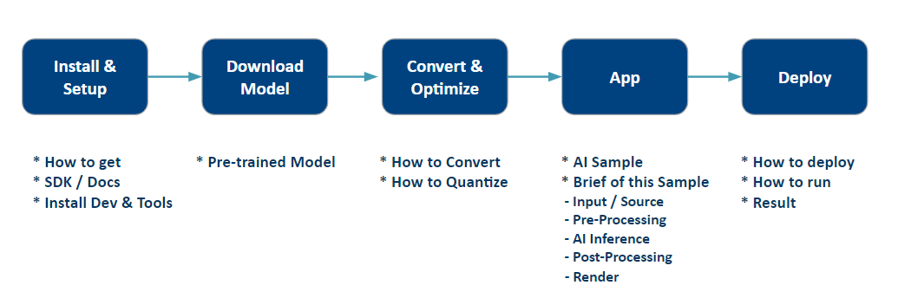

# Edge AI Workflow
The Edge AI Workflow is designed to help developers kickstart AI application development on Advantech's edge AI platforms and accelerator cards. This introductory guide provides step-by-step instructions covering from environment and tool installation, model download, conversion, quantization, application development, deployment to the target platform, and execution. It’s a comprehensive starter guide aimed at making the development and deployment of AI applications more accessible and efficient.

# AI System
| Vendor | Device |  SOC | AI Workflow | Model Conversion & Optimization | Deploy Application |
| -------- | -------- | -------- | ---- | ---- | ---- |
| Qualcomm | AOM-DK2721  | QCS640 | [How-To](ai_system/qualcomm/aom-dk2721/README.md) | [Optimize Model](ai_system/qualcomm/aom-dk2721/object_detection_demo-using-qc_snpe.md#Open_AI_Model) | [View App Guide](ai_system/qualcomm/aom-dk2721/object_detection_demo-using-qc_snpe.md#Application) |
| Intel | AFE-R360    | Core Ultra | [How-To](ai_system/intel/afe-r360/README.md)  | [Optimize Model](ai_system/intel/afe-r360/object_detection_demo-using-intel_openvino.md#Covert_Optimize) |[View App Guide](ai_system/intel/afe-r360/object_detection_demo-using-intel_openvino.md#Deploy) |
| NVIDIA | AIR-030     | Jetson AGX Orin | [How-To](ai_system/jetson/air-030/README.md)  | [Optimize Model](ai_system/jetson/air-030/object_detection_demo-using-ds7.0.md#convert-ai-model) |[View App Guide](ai_system/jetson/air-030/object_detection_demo-using-ds7.0.md#application) |
| NVIDIA | EPC-R7300   | Jetson Orin Nano   | [How-To](ai_system/jetson/epc-r7300/README.md)  | [Optimize Model](ai_system/jetson/epc-r7300/object_detection_demo-using-ds7.1.md#convert-ai-model) | [View App Guide](ai_system/jetson/epc-r7300/object_detection_demo-using-ds7.1.md#application) |
| AMD | AIMB-2210   | Ryzen 8000 Series | [How-To](ai_system/amd/aimb-2210/README.md)  | [Optimize Model](ai_system/amd/aimb-2210/object_detection_demo-using-amd_ryzenaisdk.md#download-ai-files) | [View App Guide](ai_system/amd/aimb-2210/object_detection_demo-using-amd_ryzenaisdk.md#application) |

# AI Accelerator
| Vendor | Model |  SOC | AI Workflow | Model Conversion & Optimization | Deploy Application |
| -------- | -------- | -------- | ---- | ---- | ---- |
| Hailo | EAI-1200   EAI-3300   | Hailo-8 | [How-To](ai_accelerator/hailo/eai-1200_3300/README.md) | [Optimize Model](ai_accelerator/hailo/eai-1200_3300/object_detection_demo-using-hailo.md#Model) | [View App Guide](ai_accelerator/hailo/eai-1200_3300/object_detection_demo-using-hailo.md#App) |
