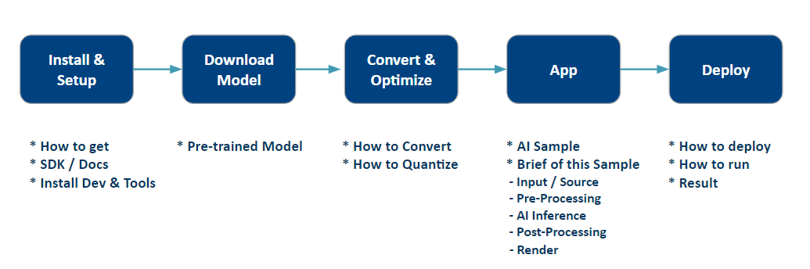

# Edge AI Workflow
The Edge AI Workflow is designed to help developers kickstart AI application development on Advantech's edge AI platforms and accelerator cards. This introductory guide provides step-by-step instructions covering from environment and tool installation, model download, conversion, quantization, application development, deployment to the target platform, and execution. It’s a comprehensive starter guide aimed at making the development and deployment of AI applications more accessible and efficient.

# AI System
| Vendor | Device |  SOC | Edge AI Workflow | Model Conversion & Optimization | Deploy Application |
| -------- | -------- | -------- | ---- | ---- | ---- |
| Qualcomm | AOM-6731  | X-Elite | [How-To](ai_system/qualcomm/aom-6731/README.md) | [Convert & Optimize](ai_system/qualcomm/aom-6731/object_detection_demo-using-qc_ai_hub.md#how-to-use-qualcomm-ai-hub-on-an-ubuntu-2204-x86_64-host-machine) | [App Guide](ai_system/qualcomm/aom-6731/object_detection_demo-using-qc_ai_hub.md#how-to-develop-on-aom-6731) |
| Qualcomm | AIR-055  | IQ9075 | [How-To](ai_system/qualcomm/air-055/README.md) | [Convert & Optimize](ai_system/qualcomm/air-055/object_detection_demo-using-qc_ai_hub.md#generate-model-via-qualcomm-ai-hub) | [App Guide](ai_system/qualcomm/air-055/object_detection_demo-using-qc_ai_hub.md#build-the-application) |
| Qualcomm | AOM-DK2721  | QCS6490 | [How-To](ai_system/qualcomm/aom-dk2721/README.md) | [Convert & Optimize](ai_system/qualcomm/aom-dk2721/linux/object_detection_demo-using-qc_snpe.md#Open_AI_Model) | [App Guide](ai_system/qualcomm/aom-dk2721/linux/object_detection_demo-using-qc_snpe.md#Application) |
| Intel | AFE-R360    | Core Ultra | [How-To](ai_system/intel/afe-r360/README.md)  | [Convert & Optimize](ai_system/intel/afe-r360/object_detection_demo-using-intel_openvino.md#Covert_Optimize) |[App Guide](ai_system/intel/afe-r360/object_detection_demo-using-intel_openvino.md#Deploy) |
| Intel | ARK-2252    | Core Ultra (Panther Lake) | [How-To](ai_system/intel/ark-2252/README.md)  | [Convert & Optimize](/ai_sdk/intel/openvino/2026_1/object_detection_with_intel_openvino_2026_1_yolov4_tf.md#model-conversion) |[App Guide](/ai_sdk/intel/openvino/2026_1/object_detection_with_intel_openvino_2026_1_yolov4_tf.md#deploy) |
| NVIDIA | AIR-030     | Jetson AGX Orin | [How-To](ai_system/jetson/air-030/README.md)  | [Convert & Optimize](ai_system/jetson/air-030/object_detection_demo-using-ds7.0.md#convert-ai-model) |[App Guide](ai_system/jetson/air-030/object_detection_demo-using-ds7.0.md#application) |
| NVIDIA | EPC-R7300   | Jetson Orin Nano   | [How-To](ai_system/jetson/epc-r7300/README.md)  | [Convert & Optimize](ai_system/jetson/epc-r7300/object_detection_demo-using-ds7.1.md#convert-ai-model) | [App Guide](ai_system/jetson/epc-r7300/object_detection_demo-using-ds7.1.md#application) |
| NVIDIA | AIR-020R   | Jetson Orin Nano   | [How-To](ai_system/jetson/air-020r/README.md)  | [Convert & Optimize](ai_system/jetson/air-020r/object_detection_demo-using-ds7.1.md#convert-ai-model) | [App Guide](ai_system/jetson/air-020r/object_detection_demo-using-ds7.1.md#application) |
| NVIDIA | AIR-075   | Jetson Thor   | [How-To](ai_system/jetson/air-075/README.md)  | [Convert & Optimize](ai_system/jetson/air-075/object_detection_demo-using-ds8.0.md#convert-ai-model) | [App Guide](ai_system/jetson/air-075/object_detection_demo-using-ds8.0.md#application) |
| AMD | AIMB-2210   | Ryzen 8000 Series | [How-To](ai_system/amd/aimb-2210/README.md)  | [Convert & Optimize](ai_system/amd/aimb-2210/object_detection_demo-using-amd_ryzenaisdk.md#download-ai-files) | [App Guide](ai_system/amd/aimb-2210/object_detection_demo-using-amd_ryzenaisdk.md#application) |

# AI Accelerator
| Vendor | Model |  SOC | AI Workflow | Model Conversion & Optimization | Deploy Application |
| -------- | -------- | -------- | ---- | ---- | ---- |
| Hailo | EAI-1200   EAI-3300   | Hailo-8 | [How-To](ai_accelerator/hailo/eai-1200_3300/README.md) | [Convert & Optimize](ai_accelerator/hailo/eai-1200_3300/object_detection_demo-using-hailo.md#Model) | [App Guide](ai_accelerator/hailo/eai-1200_3300/object_detection_demo-using-hailo.md#App) |
