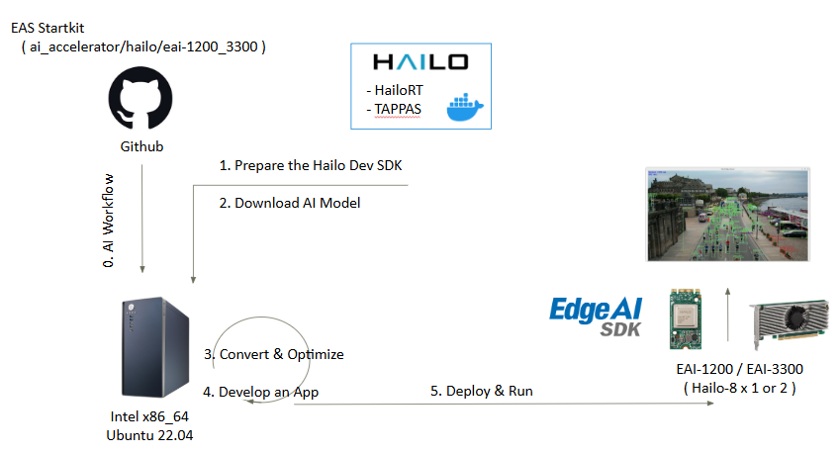
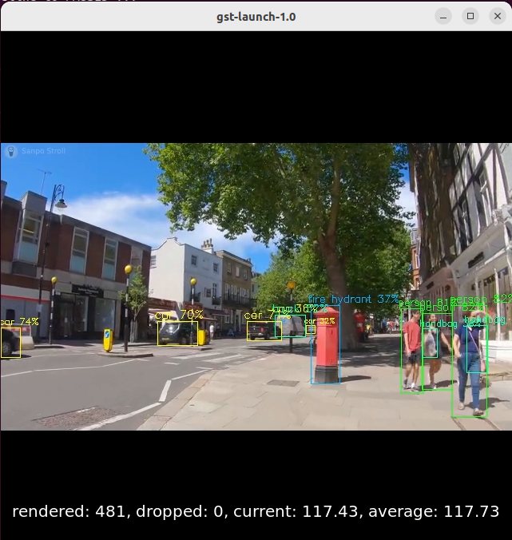

# Create an Object Detection on Hailo-8 ( EAI-1200 / EAI-3300 )

---

# Overview
This example will demonstrate how to develop an vision AI Object Detection on Hailo-8 ( EAI-1200 / EAI-3300 ) platform.
Developers can easily complete the Visual AI development by following these steps.

* Application: Objection Detection
* Model: Yolov8
* Input: Video / USB Camera




- [Pre-requirements](#Pre-requirements)
  - [Target](#Target)
  - [Development](#Development) 
- [Develop](#Develop)
  - [Convert AI Model](#Model)
  - [Application](#App) 
- [Deploy](#Deploy)
  - [Run App](#Run)

---

<a name="Pre-requirements"/>
<br/>
<br/>

# Pre-requirements
Refer to the following requirements to prepare the target and develop environment.

<a name="Target"/>

## Target
| Item | Content | Note |
| -------- | -------- | -------- |
| Platform |   EAI-1200 / EAI-3300  |  EAI-1200 tested on **AIR-150** (1x Hailo-8)<br>EAI-3300 tested on **AIMB-278** (2x Hailo-8)  |
| SOC  |   Hailo-8 |  |
| OS/Kernel |  Ubuntu 22.04 iotg |  |


<a name="Development"/>

## Development

### System requirements
| Item | Content | Note |
| -------- | -------- | -------- |
| Platform | Intel 10 ~ 13th CPU   |  x86_64    |
| OS/Kernel | Ubuntu 22.04 | * Python 3.10 |

<br/>

### Install Edge AI SDK 3.3.0
Base on **Target Environment** <br/>
Please install the corresponding version of EdgeAISDK to obtain the following development environment.
> Install :  [Edge AI SDK install link](https://ess-wiki.advantech.com.tw/view/Edge_AI_SDK/Download)

<br/>

#### AI Frameworks & Environment

| Environment    | Frameworks  | Description  | Version |
|----------------|-------------|---------------------|---------|
| **Host**       | HailoRT     | HailoRT is a production-grade, light, scalable runtime software, providing a robust library with intuitive APIs for optimized performance. Our AI SDK enables developers to build easy and fast pipelines for AI applications in production and is also suitable for evaluation and prototyping. It runs on Hailo AI Vision Processor or when utilizing Hailo AI Accelerator, it runs on the host processor and enables high throughput inferencing with one or more Hailo devices.    | 4.20.0  |
| **Docker**     | TAPPAS<br>OpenCV<br>GStreamer<br>PyGObject    | This Docker environment is built on Ubuntu 22.04 and includes TAPPAS, OpenCV, GStreamer, and PyGObject. It provides a ready-to-use platform for developing and deploying AI vision applications with the Hailo-8 accelerator. The image contains preconfigured tools and example pipelines for fast prototyping and evaluation. | TAPPAS: 3.31.0<br>OpenCV: 4.5.4<br>GStreamer: 1.20.3<br>PyGObject: 3.42.0 |
| **Docker Image** | -         | `advigw/eas-x86-hailo8:ubuntu22.04-1.0.0`   | 1.0.0   |

<br/>

---

<a name="Develop"/>
<br/>
<br/>

# Develop

The Docker container named **adv_hailo** is automatically launched by EdgeAISDK 3.3.0. <br/>
The container is started with the following command.<br/>

> ⚠️ **Note:** If Edge AI SDK 3.3.0 is successfully installed, you do **not** need to run this command manually.
```bash
docker run --rm --privileged --network host --name adv_hailo --ipc=host --device /dev/dri:/dev/dri -v /tmp/hailo_docker.xauth:/home/hailo/.Xauthority -v /tmp/.X11-unix/:/tmp/.X11-unix/ -v /dev:/dev -v /lib/firmware:/lib/firmware --group-add 44 -e DISPLAY=$DISPLAY -e XDG_RUNTIME_DIR=$XDG_RUNTIME_DIR -e hailort_enable_service=yes -v /opt/Advantech/EdgeAISuite/Accelerator/Hailo_8/tool/docker/shared_with_docker:/local/shared_with_docker -it advigw/eas-x86-hailo8:ubuntu22.04-1.0.0 /bin/bash 
```
<br/>
<br/>

<a name="Model"/>

## Convert AI Model

### How to Convert an ONNX Model to HEF Format
**Example Model : yolov8m**
<br/>
<br/>
1. Prepare a Python environment<br/>
```bash
$ python3 -m venv hailomz-env
$ source hailomz-env/bin/activate
```
2. Install required Python packages in *hailomz-env*<br/>
**Register Developer Zone** & Download python packages : [Hailo Developer Zone](https://hailo.ai/developer-zone/software-downloads/)<br/>
Choose `AI Software Suite -> HailoRT -> x86 -> Linux -> 3.10` to install `HailoRT - Python package (whl) for Python 3.10,x86_64`<br/>
Choose `AI Software Suite -> Dataflow Compiler -> x86 -> Linux -> 3.10` to install `Hailo Dataflow Compiler - Python package (whl)`
```bash
# Install System dependencies
$ sudo apt update
$ sudo apt install -y graphviz graphviz-dev build-essential

# Install python package (wheels)
$ pip install hailort-4.20.0-cp310-cp310-linux_x86_64.whl
$ pip install hailo_dataflow_compiler-3.31.0-py3-none-linux_x86_64.whl
```
3. Install the Hailo Model Zoo in *hailomz-env*<br/>
```bash
$ git clone https://github.com/hailo-ai/hailo_model_zoo.git
$ cd hailo_model_zoo; pip install -e .
```
4. Prepare your onnx model file (ex: yolov8m.onnx)<br/>
[Download Yolov8m.onnx](https://hailo-model-zoo.s3.eu-west-2.amazonaws.com/ObjectDetection/Detection-COCO/yolo/yolov8m/2023-02-02/yolov8m.zip)  ,  [More pretrained models](https://github.com/hailo-ai/hailo_model_zoo/blob/master/docs/public_models/HAILO8/HAILO8_object_detection.rst)

6. Prepare calibration dataset<br/>
Prepare a dataset of images (in .png or .jpg format) to be used for model calibration during conversion.<br/>
ex : [Download COCO Dataset](https://cocodataset.org/#download)

8. Convert the ONNX model to HEF format in *hailomz-env*<br/>
Use the hailomz tool to compile the model with the following command:
```bash
$ hailomz compile --ckpt <path_to_model>/yolov8m.onnx --hw-arch hailo8 --yaml <path_to_yaml>/yolov8m.yaml --classes 80 --calib-path <path_to_dataset>
```
* | ``--ckpt`` - path to  your ONNX file.
* | ``--yaml`` - path to your configuration YAML file.[Download yolov8m.yaml](https://github.com/hailo-ai/hailo_model_zoo/blob/master/hailo_model_zoo/cfg/networks/yolov8m.yaml)
* | ``--classes`` - adjusting the number of classes in post-processing configuration (optional).
* | ``--calib-path`` - path to a directory with your calibration images in JPEG/png format
* | The model zoo will take care of adding the input normalization to be part of the model.
> [More Model's yaml file](https://github.com/hailo-ai/hailo_model_zoo/tree/master/hailo_model_zoo/cfg/networks)

<br/>
<a name="App"/>

## Application
Sample script:
> Model : yolov8m <br/>
> Source : /local/workspace/tappas/apps/h8/gstreamer/general/detection/resources/detection.mp4 <br/>
> Device Count : Automatically detects and uses the maximum available Hailo-8 devices
```bash
# Download
$ git clone https://github.com/ADVANTECH-Corp/EdgeAI_Workflow.git

# Execute
$ cd EdgeAI_Workflow/ai_accelerator/eai-1200_3300/script
$ chmod +x hailo_detection_yolov8_video.sh
$ ./hailo_detection_yolov8_video.sh
```


<br/>

---
<br/>

<a name="Deploy"/>

# Deploy
Launch an AI application.

<a name="Run"/>

## Run App
### Objection Detection (Yolov8m)
#### Step 1 & 2: On the Host
Open a terminal on your host machine and execute these two steps. Upon running step 2, you will enter the Hailo-8 Docker container with an interactive shell.
<br/>
<br/>
1. Grant Docker Display Permission
```bash
$ xhost +local:
```
2. Launch Docker Container for Hailo-8
```bash
$ docker exec -it adv_hailo /bin/bash
```
3. Move your own Model to docker shared file
```bash
$ cd <path-of-your-convert-model>/yolov8m.hef /opt/Advantech/EdgeAISuite/Accelerator/Hailo_8/tool/docker/shared_with_docker/
```

#### Step 3 to 7: Inside the Docker Container
After completing step 2 and entering the Docker container, proceed with steps 3 through 7 inside the container to configure settings and start the inference pipeline.
<br/>
<br/>

4. Select Input Source (Camera or Video)
   
| Source | Command |
| -------- | -------- |
| USB Camera | $ input_source="/dev/video0"<br>$ source_element="v4l2src device=$input_source name=src_0 ! videoflip video-direction=horiz"   |
| Video File | $ input_source="/local/workspace/tappas/apps/h8/gstreamer/general/detection/resources/detection.mp4"<br>$ source_element="filesrc location=$input_source name=src_0 ! decodebin"   |

5. Model Configuration
```bash
$ network_name="yolov8m"
$ hef_path="/local/shared_with_docker/yolov8m.hef"

# Post-processing settings specific for yolov8m
$ postprocess_so="/local/workspace/tappas/apps/h8/gstreamer/libs/post_processes/libyolo_hailortpp_post.so"
$ json_config_path="null"
$ thresholds_str="nms-score-threshold=0.3 nms-iou-threshold=0.45 output-format-type=HAILO_FORMAT_TYPE_FLOAT32"
```
6. Pipeline Parameter Configuration
```bash
$ batch_size="1"
$ video_sink="fpsdisplaysink video-sink=xvimagesink text-overlay=true"
$ sync_pipeline=false
$ additional_parameters=""
$ device_id_prop=""
```
7. Define Hailo-8 Device Count
```bash
$ hailortcli scan | grep -c "Device:"

# Set according to the number of Hailo-8 devices detected.
# For example, EAI-1200 may have 1 device, while EAI-3300 may have 2.
$ device_count=2
```
8. Run the GStreamer Inference Pipeline
```bash
$ gst-launch-1.0 \
    $source_element ! \
    queue leaky=no max-size-buffers=30 max-size-bytes=0 max-size-time=0 ! \
    videoscale qos=false n-threads=2 ! video/x-raw, pixel-aspect-ratio=1/1 ! \
    queue leaky=no max-size-buffers=30 max-size-bytes=0 max-size-time=0 ! \
    videoconvert n-threads=2 qos=false ! \
    queue leaky=no max-size-buffers=30 max-size-bytes=0 max-size-time=0 ! \
    hailonet hef-path=$hef_path device-count=$device_count $device_id_prop batch-size=$batch_size $thresholds_str ! \
    queue leaky=no max-size-buffers=30 max-size-bytes=0 max-size-time=0 ! \
    hailofilter function-name=$network_name so-path=$postprocess_so config-path=$json_config_path qos=false ! \
    queue leaky=no max-size-buffers=30 max-size-bytes=0 max-size-time=0 ! \
    hailooverlay qos=false ! \
    queue leaky=no max-size-buffers=30 max-size-bytes=0 max-size-time=0 ! \
    videoconvert n-threads=2 qos=false ! \
    queue leaky=no max-size-buffers=30 max-size-bytes=0 max-size-time=0 ! \
    $video_sink name=hailo_display sync=$sync_pipeline $additional_parameters
```

9. Result: 

| Platform | Reference Performance |
| -------- | -------- |
| EAI-1200 | FPS : 32    |
| EAI-3300 | FPS : 118   |
<br/>



---

> See more supported parameters and usage in [this link](https://github.com/hailo-ai/tappas/tree/master/apps/h8/gstreamer/general/detection)

