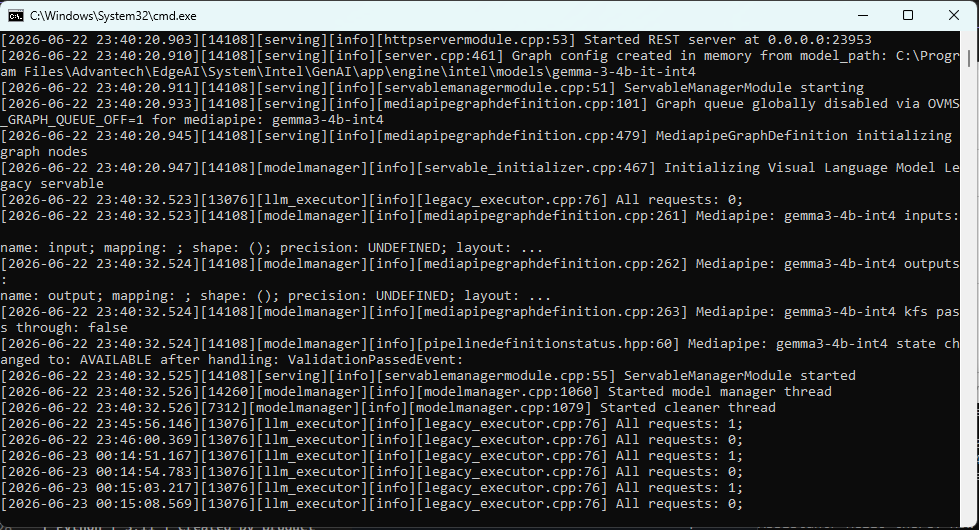
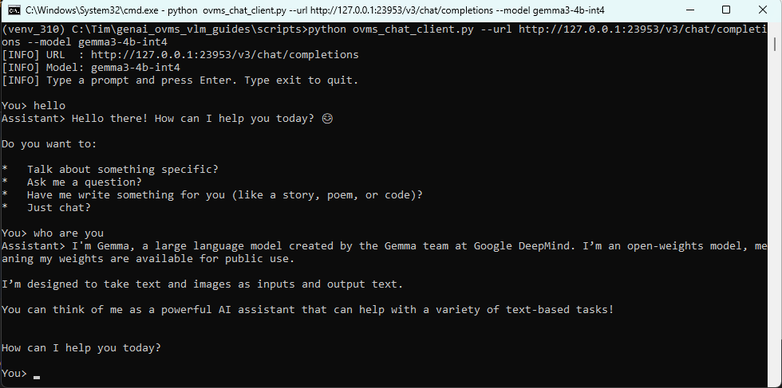

# How to convert Gemma 3 4B VLM with Intel OpenVINO and inference with OVMS

This guide demonstrates how to convert the original Hugging Face Gemma 3 4B VLM model to OpenVINO IR, then serve it with OpenVINO Model Server on an Advantech EdgeAI Intel platform.

The main flow converts the CPU / iGPU model from the original Hugging Face model. Prepared OpenVINO IR models can also be downloaded as an alternative. The NPU model is not converted in this guide; use the prepared channel-wise OpenVINO model for NPU.

- [Environment](#environment)
  - [Target](#target)
  - [Conversion Requirements](#conversion-requirements)
- [Model Preparation](#model-preparation)
  - [CPU / iGPU Model](#cpu--igpu-model)
  - [NPU Model](#npu-model)
  - [Hugging Face Access](#hugging-face-access)
- [Script Workflow](#script-workflow)
  - [Configuration](#configuration)
  - [Convert CPU / iGPU Model](#convert-cpu--igpu-model)
  - [Use Prepared Models](#use-prepared-models)
- [Deploy](#deploy)
  - [Prepare OVMS](#prepare-ovms)
  - [Run OVMS](#run-ovms)
  - [Run Chat Client](#run-chat-client)
- [Result](#result)
- [Reference](#reference)

</br>

# Environment

Base on **Edge AI SDK** product Miniconda:

```text
C:\Program Files\Advantech\EdgeAI\System\Intel\SDK\miniconda3
```

## Target

| Item | Content | Note |
| --- | --- | --- |
| Platform | Advantech EdgeAI Intel platform | CPU / iGPU / NPU |
| OS | Windows 11 | Command Prompt |
| Python | 3.11 | Created by product Miniconda |
| OpenVINO | 2026.1.0 or newer | Runtime and GenAI packages. The validated conversion environment installed OpenVINO 2026.2.1. |
| OVMS | 2026.2.0 | Official OpenVINO Model Server |

## Conversion Requirements

The main conversion flow exports the original Hugging Face model to OpenVINO IR. Prepare enough disk space and memory before running conversion.

| Item | Recommended |
| --- | --- |
| RAM | 32 GB or higher |
| Disk | 60 GB free or higher |
| Network | Required for Hugging Face model download |
| Hugging Face account | Required for gated Gemma access |

The conversion environment installs:

```text
torch / torchvision
transformers
gradio
opencv-python
optimum-intel
openvino
openvino-genai
openvino-tokenizers
nncf
huggingface_hub
pillow
requests
```

# Model Preparation

## CPU / iGPU Model

CPU and iGPU can use either a model converted by this guide or a prepared OpenVINO IR model.

| Method | Source | Default Model Path | Note |
| --- | --- | --- | --- |
| Convert from original model | `google/gemma-3-4b-it` | `C:\Advantech\GenAI\models\gemma-3-4b-it-converted-int4` | Main flow |
| Download prepared OpenVINO IR | `OpenVINO/gemma-3-4b-it-int4-ov` | User-defined | Alternative path |
| Download prepared OpenVINO IR | `Advantech-EIOT/intel_google-gemma-3-4b-it-int4` | User-defined | Alternative path |

The converted model is intended for CPU and iGPU OVMS runs:

```text
--target_device CPU
--target_device GPU
```

## NPU Model

NPU uses a prepared channel-wise INT4 OpenVINO model. This guide does not provide an NPU channel-wise conversion flow.

| Method | Source | Default Model Path | Note |
| --- | --- | --- | --- |
| Download prepared OpenVINO IR only | `OpenVINO/gemma-3-4b-it-int4-cw-ov` | User-defined | Required for NPU |
| Download prepared OpenVINO IR only | `Advantech-EIOT/intel_google-gemma-3-4b-it-int4-cw-ov` | User-defined | Required for NPU |

## Hugging Face Access

Gemma models may require Hugging Face authentication and accepted access terms.

Before downloading or converting:

1. Sign in to Hugging Face.
2. Open the model repository page and accept the required access terms.
3. Log in from the command line after the Python environment is created.

Interactive login:

```bat
set "PYTHONIOENCODING=utf-8"
C:\Advantech\GenAI\envs\gemma3_4b_convert\Scripts\hf.exe auth login
```

Token environment variable:

```bat
set "HF_TOKEN=hf_your_token_here"
```

# Script Workflow

The Gemma 3 4B scripts are located in:

```text
ai_sdk\intel\openvino\2026_1\script\genai\gemma3_4b
```

The scripts use continuous numbering so users can follow them step by step.

| Script | Purpose |
| --- | --- |
| `00_config.bat` | Common paths, model names, repository ids, OVMS path, and port |
| `01_check_env.bat` | Prints the current environment and highlights missing files |
| `02_prepare_workspace.bat` | Creates `C:\Advantech\GenAI` workspace folders |
| `03_prepare_convert_env.bat` | Creates Python 3.11 conversion environment and installs conversion packages |
| `04_download_raw_model.bat` | Downloads original Hugging Face Gemma 3 4B model |
| `05_convert_openvino_int4.bat` | Converts the raw model to OpenVINO INT4 IR |
| `06_check_converted_model.bat` | Checks converted OpenVINO model files |
| `07_check_ovms.bat` | Checks `ovms.exe` |
| `08_run_ovms_cpu.bat` | Starts OVMS on CPU |
| `09_run_ovms_igpu.bat` | Starts OVMS on iGPU |
| `10_run_ovms_npu.bat` | Starts OVMS on NPU with prepared channel-wise model |
| `11_chat_cpu_igpu.bat` | Sends a test prompt to the CPU / iGPU model |
| `12_chat_npu.bat` | Sends a test prompt to the NPU model |
| `run_all_convert.bat` | Runs workspace, environment, raw model download, conversion, and model check steps |

## Configuration

Before running setup, review:

```bat
script\genai\gemma3_4b\00_config.bat
```

Important default settings:

| Variable | Default |
| --- | --- |
| `CONDA_ROOT` | `C:\Program Files\Advantech\EdgeAI\System\Intel\SDK\miniconda3` |
| `WORKSPACE` | `C:\Advantech\GenAI` |
| `ENV_PATH` | `%WORKSPACE%\envs\gemma3_4b_convert` |
| `MODEL_ROOT` | `%WORKSPACE%\models` |
| `RAW_MODEL_ID` | `google/gemma-3-4b-it` |
| `RAW_MODEL_PATH` | `%MODEL_ROOT%\gemma-3-4b-it-raw` |
| `CONVERT_PRECISION` | `int4` |
| `CPU_IGPU_MODEL_NAME` | `gemma-3-4b-it-converted-int4` |
| `CPU_IGPU_MODEL_PATH` | `%MODEL_ROOT%\%CPU_IGPU_MODEL_NAME%` |
| `NPU_MODEL_NAME` | `gemma-3-4b-it-int4-cw-ov` |
| `NPU_MODEL_PATH` | `%MODEL_ROOT%\%NPU_MODEL_NAME%` |
| `OVMS_EXE` | `%WORKSPACE%\ovms\ovms.exe` |
| `REST_PORT` | `23953` |

If you use a prepared CPU / iGPU model instead of converting, set the model path before running OVMS:

```bat
set "CPU_IGPU_MODEL_NAME=gemma-3-4b-it-int4"
set "CPU_IGPU_MODEL_PATH=C:\Advantech\GenAI\models\gemma-3-4b-it-int4"
```

If you use a prepared NPU model, set:

```bat
set "NPU_MODEL_NAME=gemma-3-4b-it-int4-cw-ov"
set "NPU_MODEL_PATH=C:\Advantech\GenAI\models\gemma-3-4b-it-int4-cw-ov"
```

If the Edge AI SDK product already includes OVMS, the scripts also check:

```text
C:\Program Files\Advantech\EdgeAI\System\Intel\GenAI\app\engine\intel\scripts\ovms_2026_2\ovms.exe
```

## Convert CPU / iGPU Model

Open Command Prompt:

```bat
cd /d <repo>\ai_sdk\intel\openvino\2026_1
```

Check the current environment:

```bat
script\genai\gemma3_4b\01_check_env.bat
```

Prepare workspace and conversion environment:

```bat
script\genai\gemma3_4b\02_prepare_workspace.bat
script\genai\gemma3_4b\03_prepare_convert_env.bat
```

Log in to Hugging Face if required:

```bat
set "PYTHONIOENCODING=utf-8"
C:\Advantech\GenAI\envs\gemma3_4b_convert\Scripts\hf.exe auth login
```

Download the original model and convert it:

```bat
script\genai\gemma3_4b\04_download_raw_model.bat
script\genai\gemma3_4b\05_convert_openvino_int4.bat
script\genai\gemma3_4b\06_check_converted_model.bat
```

Or run the full conversion setup:

```bat
script\genai\gemma3_4b\run_all_convert.bat
```

Expected converted model files:

```text
C:\Advantech\GenAI\models\gemma-3-4b-it-converted-int4\openvino_language_model.xml
C:\Advantech\GenAI\models\gemma-3-4b-it-converted-int4\openvino_language_model.bin
C:\Advantech\GenAI\models\gemma-3-4b-it-converted-int4\openvino_text_embeddings_model.xml
C:\Advantech\GenAI\models\gemma-3-4b-it-converted-int4\openvino_vision_embeddings_model.xml
C:\Advantech\GenAI\models\gemma-3-4b-it-converted-int4\openvino_tokenizer.xml
C:\Advantech\GenAI\models\gemma-3-4b-it-converted-int4\openvino_detokenizer.xml
```

Validated conversion command used by `05_convert_openvino_int4.bat`:

```bat
C:\Advantech\GenAI\envs\gemma3_4b_convert\Scripts\optimum-cli.exe export openvino ^
  --model C:\Advantech\GenAI\models\gemma-3-4b-it-raw ^
  --task image-text-to-text ^
  C:\Advantech\GenAI\models\gemma-3-4b-it-converted-int4 ^
  --weight-format int4
```

Important notes from validation:

* `hf.exe auth login` needs `PYTHONIOENCODING=utf-8` on some Windows consoles. Without it, Hugging Face CLI may fail with `UnicodeEncodeError`.
* The official notebook command can infer the task when `--model google/gemma-3-4b-it` is used directly.
* This guide downloads the raw model first and then converts from a local folder. In that local-folder flow, `--task image-text-to-text` is required.
* `conda create` may print `SafetyError` from the EdgeAI SDK Miniconda package cache. If `python.exe` is created successfully, rerun `03_prepare_convert_env.bat` and continue package installation.
* Hugging Face may warn that `hf_xet` is not installed. The download still works through regular HTTP, but it can be slower.

## Use Prepared Models

Prepared OpenVINO IR models can be downloaded manually when you do not want to run conversion.

First make sure the conversion environment exists:

```bat
script\genai\gemma3_4b\02_prepare_workspace.bat
script\genai\gemma3_4b\03_prepare_convert_env.bat
```

CPU / iGPU prepared model:

```bat
C:\Advantech\GenAI\envs\gemma3_4b_convert\python.exe -c "from huggingface_hub import snapshot_download; snapshot_download(repo_id='OpenVINO/gemma-3-4b-it-int4-ov', local_dir=r'C:\Advantech\GenAI\models\gemma-3-4b-it-int4')"
```

Then set:

```bat
set "CPU_IGPU_MODEL_NAME=gemma-3-4b-it-int4"
set "CPU_IGPU_MODEL_PATH=C:\Advantech\GenAI\models\gemma-3-4b-it-int4"
```

NPU prepared model:

```bat
C:\Advantech\GenAI\envs\gemma3_4b_convert\python.exe -c "from huggingface_hub import snapshot_download; snapshot_download(repo_id='OpenVINO/gemma-3-4b-it-int4-cw-ov', local_dir=r'C:\Advantech\GenAI\models\gemma-3-4b-it-int4-cw-ov')"
```

Then set:

```bat
set "NPU_MODEL_NAME=gemma-3-4b-it-int4-cw-ov"
set "NPU_MODEL_PATH=C:\Advantech\GenAI\models\gemma-3-4b-it-int4-cw-ov"
```

If access is denied, confirm that you accepted the model terms on Hugging Face and logged in with `hf.exe auth login`.

# Deploy

## Prepare OVMS

Download OVMS 2026.2.0 from official OpenVINO Model Server releases:

```text
https://github.com/openvinotoolkit/model_server/releases
https://storage.openvinotoolkit.org/repositories/openvino_model_server/packages/2026.2.0/
```

Download the Windows x64 package that contains `ovms.exe`, extract it to:

```text
C:\Advantech\GenAI\ovms
```

Then verify:

```bat
script\genai\gemma3_4b\07_check_ovms.bat
```

If the extracted folder is different, set the actual OVMS path before running scripts:

```bat
set "OVMS_EXE=C:\Advantech\GenAI\ovms\ovms.exe"
```

## Run OVMS

Open one Command Prompt for OVMS and run one target device.

CPU:

```bat
script\genai\gemma3_4b\08_run_ovms_cpu.bat
```

iGPU:

```bat
script\genai\gemma3_4b\09_run_ovms_igpu.bat
```

NPU:

```bat
script\genai\gemma3_4b\10_run_ovms_npu.bat
```

The NPU script uses the prepared channel-wise INT4 model and adds NPU-specific OVMS options:

```text
--max_prompt_len 2048
--cache_size 0
--enable_prefix_caching false
```

## Run Chat Client

Open another Command Prompt and send a test prompt.

CPU / iGPU:

```bat
script\genai\gemma3_4b\11_chat_cpu_igpu.bat
```

NPU:

```bat
script\genai\gemma3_4b\12_chat_npu.bat
```

# Result

OVMS example:



Chat client example:



| Device | Model Path | OVMS Script | Chat Script | Expected Status |
| --- | --- | --- | --- | --- |
| CPU | `CPU_IGPU_MODEL_PATH` | `08_run_ovms_cpu.bat` | `11_chat_cpu_igpu.bat` | Supported after conversion or prepared model download |
| iGPU | `CPU_IGPU_MODEL_PATH` | `09_run_ovms_igpu.bat` | `11_chat_cpu_igpu.bat` | Supported after conversion or prepared model download |
| NPU | `NPU_MODEL_PATH` | `10_run_ovms_npu.bat` | `12_chat_npu.bat` | Supported with prepared channel-wise model only |

# Reference

* OpenVINO Gemma3 notebook: https://github.com/openvinotoolkit/openvino_notebooks/blob/latest/notebooks/gemma3/gemma3.ipynb
* OpenVINO Model Server releases: https://github.com/openvinotoolkit/model_server/releases
* OpenVINO GenAI: https://docs.openvino.ai/
* Hugging Face OpenVINO models: https://huggingface.co/OpenVINO
