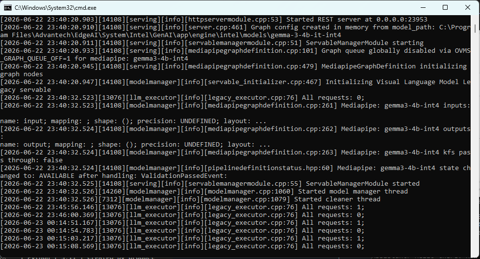
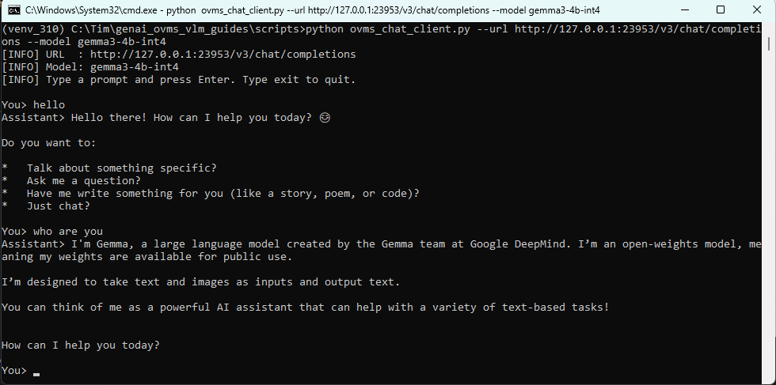

# How to convert VLM with Intel OpenVINO and inference with OVMS: gemma-4-12b

This example demonstrates how to prepare Gemma 4 12B VLM with OpenVINO and serve it with OpenVINO Model Server on CPU or iGPU.

NPU is not included in this flow. Gemma 4 12B VLM is not validated for NPU in this guide.

Gemma 4 12B starts from a raw Hugging Face model and converts it to OpenVINO INT4. The setup, conversion, and deploy commands are packaged as batch scripts under `script\genai\gemma4_12b`.

- [Environment](#environment)
  - [Target](#target)
- [Script Workflow](#script-workflow)
  - [Configuration](#configuration)
  - [Download and Convert](#download-and-convert)
- [Deploy](#deploy)
- [Result](#result)
- [Reference](#reference)

</br>

# Environment

Refer to the following requirements to prepare the target and development environment.

Base on **Edge AI SDK**

## Target

| Item | Content | Note |
| --- | --- | --- |
| Platform | Advantech EdgeAI Intel platform | CPU / iGPU |
| OS | Windows 11 | Command Prompt |
| Python | 3.11 | Created by product Miniconda |
| OpenVINO | 2026.1.0 | Runtime and GenAI packages |
| OVMS | 2026.2.0 | Official OpenVINO Model Server |
| RAM for conversion | 64 GB or higher | 16 GB edge systems are not recommended for conversion |
| Disk for conversion | 100 GB free or higher | Raw model + converted model + cache |

Base on Edge AI SDK 3.6.4 product Miniconda:

```text
C:\Program Files\Advantech\EdgeAI\System\Intel\SDK\miniconda3
```

Important:

```text
Gemma 4 12B conversion is not recommended on a 16 GB RAM edge device.
Use a higher-memory development/conversion machine, then copy the converted OpenVINO folder to the edge device.
NPU is not covered by this guide.
```

# Script Workflow

The Gemma 4 12B scripts are located in:

```text
ai_system\intel\openvino\script\genai\gemma4_12b
```

| Script | Purpose |
| --- | --- |
| `00_config.bat` | Common paths, model id, output folders, OVMS path, and port |
| `check_env.bat` | Prints the current environment and highlights missing files |
| `01_prepare_workspace.bat` | Creates `C:\Advantech\GenAI` workspace folders |
| `02_prepare_convert_env.bat` | Creates Python 3.11 environment and installs conversion packages |
| `03_download_raw_model.bat` | Downloads `google/gemma-4-12B-it` from Hugging Face |
| `04_convert_openvino_int4.bat` | Converts the raw model to OpenVINO INT4 |
| `05_check_converted_model.bat` | Checks required converted model files |
| `10_check_ovms.bat` | Checks `ovms.exe` |
| `11_run_ovms_cpu.bat` | Starts OVMS on CPU |
| `12_run_ovms_igpu.bat` | Starts OVMS on iGPU |
| `20_chat.bat` | Sends a test prompt to OVMS |
| `run_all_convert.bat` | Runs workspace, environment, raw download, conversion, and model checks |

## Configuration

Before running setup, review:

```bat
script\genai\gemma4_12b\00_config.bat
```

Default paths:

| Variable | Default |
| --- | --- |
| `CONDA_ROOT` | `C:\Program Files\Advantech\EdgeAI\System\Intel\SDK\miniconda3` |
| `WORKSPACE` | `C:\Advantech\GenAI` |
| `ENV_PATH` | `%WORKSPACE%\envs\gemma4_12b_convert` |
| `MODEL_ID` | `google/gemma-4-12B-it` |
| `RAW_MODEL` | `%WORKSPACE%\models\gemma4_12b_from_scratch\raw_model` |
| `OV_MODEL` | `%WORKSPACE%\models\gemma4_12b_from_scratch\openvino_int4` |
| `OV_MODEL_NAME` | `gemma-4-12b-it-int4` |
| `OVMS_EXE` | `%WORKSPACE%\ovms\ovms.exe` |
| `REST_PORT` | `23953` |

If the Edge AI SDK product already includes OVMS, the scripts also check:

```text
C:\Program Files\Advantech\EdgeAI\System\Intel\GenAI\app\engine\intel\scripts\ovms_2026_2\ovms.exe
```

## Download and Convert

Gemma 4 12B may require Hugging Face authentication and accepted access terms. Before downloading gated models:

```bat
cd /d <repo>\ai_system\intel\openvino
"C:\Advantech\GenAI\envs\gemma4_12b_convert\Scripts\huggingface-cli.exe" login
```

You can also set a token in the same Command Prompt:

```bat
set "HF_TOKEN=hf_your_token_here"
```

Run the full conversion flow:

```bat
cd /d <repo>\ai_system\intel\openvino
script\genai\gemma4_12b\run_all_convert.bat
```

Or run each step:

```bat
script\genai\gemma4_12b\check_env.bat
script\genai\gemma4_12b\01_prepare_workspace.bat
script\genai\gemma4_12b\02_prepare_convert_env.bat
script\genai\gemma4_12b\03_download_raw_model.bat
script\genai\gemma4_12b\04_convert_openvino_int4.bat
script\genai\gemma4_12b\05_check_converted_model.bat
```

The expected converted output folder should contain:

```text
config.json
generation_config.json
openvino_language_model.xml
openvino_language_model.bin
openvino_text_embeddings_model.xml
openvino_vision_embeddings_model.xml
openvino_tokenizer.xml
openvino_detokenizer.xml
tokenizer.json
processor_config.json
```

# Deploy

Download OVMS 2026.2.0 from official OpenVINO Model Server releases:

```text
https://github.com/openvinotoolkit/model_server/releases
https://storage.openvinotoolkit.org/repositories/openvino_model_server/packages/2026.2.0/
```

Download the Windows package, extract it to `C:\Advantech\GenAI\ovms`, then verify:

```bat
script\genai\gemma4_12b\10_check_ovms.bat
```

Open one Command Prompt for OVMS and run one target device:

```bat
script\genai\gemma4_12b\11_run_ovms_cpu.bat
script\genai\gemma4_12b\12_run_ovms_igpu.bat
```

Open another Command Prompt and run the chat client:

```bat
script\genai\gemma4_12b\20_chat.bat
```

# Result

OVMS EX:


Chat Client EX:


| Device | Model | OVMS Script | Chat Script | Expected Status |
| --- | --- | --- | --- | --- |
| CPU | `gemma-4-12b-it-int4` | `11_run_ovms_cpu.bat` | `20_chat.bat` | Supported after successful conversion |
| iGPU | `gemma-4-12b-it-int4` | `12_run_ovms_igpu.bat` | `20_chat.bat` | Supported after successful conversion |
| NPU | `gemma-4-12b-it-int4` | Not provided | Not provided | Not supported in this guide |

# Reference

* OpenVINO Model Server releases: https://github.com/openvinotoolkit/model_server/releases
* Running Gemma 4 with OpenVINO: https://medium.com/openvino-toolkit/running-gemma-4-with-openvino-building-a-multimodal-assistant-end-to-end-37a9ce74f0ca
* OpenVINO documentation: https://docs.openvino.ai/
