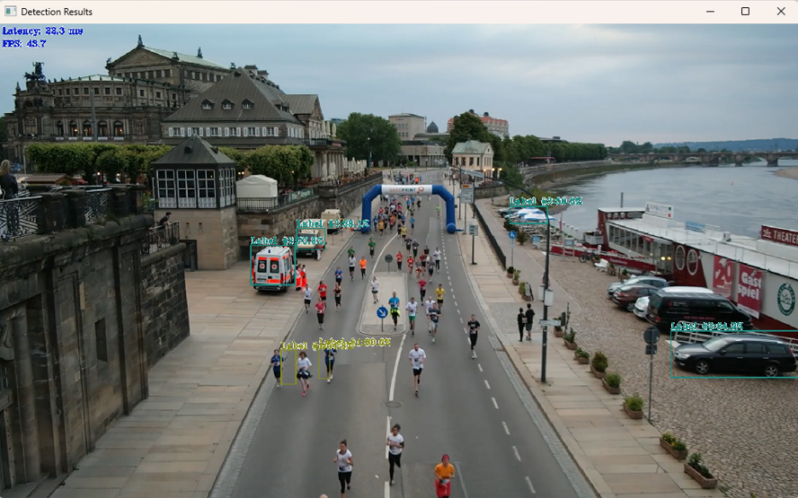

# Create an Object Detection

This example demonstrates how to prepare OpenVINO object detection models and run the Open Model Zoo Object Detection C++ demo on an Advantech EdgeAI Intel platform.

The manual commands are packaged as batch scripts under `script\object_detection`. Run the scripts from Command Prompt on Windows 11.

- [Environment](#environment)
  - [Target](#target)
  - [Model Selection](#model-selection)
  - [Model Conversion](#model-conversion)
- [Script Workflow](#script-workflow)
  - [Configuration](#configuration)
  - [Full Setup](#full-setup)
  - [Step-by-step Setup](#step-by-step-setup)
  - [YOLOv4-TF Setup](#yolov4-tf-setup)
- [Deploy](#deploy)
- [Result](#result)
- [Reference](#reference)

</br>

# Environment

Refer to the following requirements to prepare the target and development environment.

Base on **Edge AI SDK**

## Target

| Item | Content | Note |
| --- | --- | --- |
| Platform | Advantech EdgeAI Intel platform | CPU / iGPU / NPU |
| OS | Windows 11 | Command Prompt |
| Product Miniconda | `C:\Program Files\Advantech\EdgeAI\System\Intel\SDK\miniconda3` | Used to create the model conversion and runtime environments |
| Runtime conda env | `vision-runtime-py310` | Created by this guide to run the C++ demo |
| Default model | `ssd_mobilenet_v1_coco` | Public Open Model Zoo model |
| Optional model | `yolo-v4-tf` | Public Open Model Zoo YOLOv4 TensorFlow model |

## Model Selection

| Model | Architecture type | Script set | Note |
| --- | --- | --- | --- |
| `ssd_mobilenet_v1_coco` | `ssd` | Default scripts `04`, `05`, `07`-`09` | Smaller default model and faster setup |
| `yolo-v4-tf` | `yolo` | YOLO scripts `14`-`18` | Larger model; conversion includes YOLO pre-convert step |

`object_detection_demo.exe` uses the `-at` option to choose post-processing. The scripts set this automatically:

```text
ssd_mobilenet_v1_coco -> -at ssd
yolo-v4-tf            -> -at yolo
```

## Model Conversion

The model conversion flow uses Python 3.10 and legacy Open Model Zoo tools. This is intentional because `omz_converter` for these TensorFlow object detection models still uses the legacy Model Optimizer flow.

| Item | Introduction | Version |
| --- | --- | --- |
| Python | | 3.10 |
| numpy | | 1.26.x |
| OpenCV | https://github.com/opencv/opencv.git | 4.13.0 |
| open model zoo | https://github.com/openvinotoolkit/open_model_zoo/tree/releases/2026/1 | releases/2026/1 |
| OpenVINO | https://docs.openvino.ai/2026/index.html | 2026.1.0 |
| openvino-dev | Contains `omz_downloader` and `omz_converter` tools<br>https://github.com/openvinotoolkit/open_model_zoo/tree/releases/2026/1/tools/model_tools | 2024.6.0 |
| tensorflow | Required by TensorFlow model conversion and YOLOv4 pre-convert | 2.15.1 |

YOLOv4-TF conversion differs from SSD MobileNet:

| Step | `ssd_mobilenet_v1_coco` | `yolo-v4-tf` |
| --- | --- | --- |
| Download | Downloads TensorFlow SSD model assets | Downloads Darknet `yolov4.weights`, `yolov4.cfg`, and Keras converter files |
| Pre-convert | Not required | Runs OMZ `pre-convert.py` to create `yolo-v4.savedmodel` |
| Model Optimizer | Converts downloaded model to IR | Converts generated SavedModel to IR |
| Demo architecture | `-at ssd` | `-at yolo` |

The current conversion environment already installs `tensorflow==2.15.1`, `numpy`, and `openvino-dev==2024.6.0`, which cover the known YOLOv4-TF converter imports from Open Model Zoo.

</br>

# Script Workflow

The object detection scripts are located in:

```text
ai_system\intel\openvino\script\object_detection
```

| Script | Purpose |
| --- | --- |
| `00_config.bat` | Common paths, versions, model name, architecture type, and runtime settings |
| `check_env.bat` | Prints the current environment and highlights missing tools or files |
| `01_prepare_workspace.bat` | Creates `C:\Advantech\VisionAI` workspace folders |
| `02_prepare_convert_env.bat` | Creates the Python 3.10 conversion environment and installs OMZ conversion packages |
| `03_prepare_runtime_env.bat` | Creates the Python 3.10 runtime environment and installs OpenVINO 2026.1 |
| `04_download_model.bat` | Generic model download script. Defaults to `ssd_mobilenet_v1_coco` |
| `05_convert_model.bat` | Generic model conversion script. Defaults to `ssd_mobilenet_v1_coco` |
| `06_build_demo.bat` | Builds Open Model Zoo `object_detection_demo.exe` with CMake |
| `07_run_cpu.bat` | Runs default SSD model on CPU |
| `08_run_igpu.bat` | Runs default SSD model on iGPU with `-d GPU` |
| `09_run_npu.bat` | Runs default SSD model on NPU with `-d NPU` |
| `14_download_yolov4_tf.bat` | Downloads YOLOv4-TF model assets |
| `15_convert_yolov4_tf.bat` | Converts YOLOv4-TF to OpenVINO IR |
| `16_run_yolov4_cpu.bat` | Runs YOLOv4-TF on CPU |
| `17_run_yolov4_igpu.bat` | Runs YOLOv4-TF on iGPU with `-d GPU` |
| `18_run_yolov4_npu.bat` | Runs YOLOv4-TF on NPU with `-d NPU` |
| `run_all_setup.bat` | Runs default SSD setup scripts `01` through `06` |
| `run_all_yolov4_setup.bat` | Runs YOLOv4-TF setup: workspace, envs, download, convert, and build |

## Configuration

Before running setup, review:

```bat
script\object_detection\00_config.bat
```

Default paths and model settings:

| Variable | Default |
| --- | --- |
| `CONDA_ROOT` | `C:\Program Files\Advantech\EdgeAI\System\Intel\SDK\miniconda3` |
| `WORKSPACE` | `C:\Advantech\VisionAI` |
| `MODEL_NAME` | `ssd_mobilenet_v1_coco` |
| `ARCH_TYPE` | `ssd` |
| `OPENCV_DIR` | `C:\opencv\build` |
| `EDGEAI_WORKFLOW` | Auto-detected from this repository |
| `VIDEO` | `%EDGEAI_WORKFLOW%\data\video\ObjectDetection.mp4` |

If your OpenCV path is different, either edit `00_config.bat` or set the variable before running a script:

```bat
set "OPENCV_DIR=C:\opencv\build"
script\object_detection\06_build_demo.bat
```

Download OpenCV 4.13.0 from the OpenCV release page:

[Download Link OpenCV 4.13.0](https://github.com/opencv/opencv/releases/download/4.13.0/opencv-4.13.0-windows.exe)

This guide assumes OpenCV is extracted to `C:\opencv\build`. If the self-extractor creates `C:\opencv\opencv\build`, update `OPENCV_DIR` and `OPENCV_BIN` in `00_config.bat`.

## Full Setup

Open Command Prompt and run the default SSD setup:

```bat
cd /d <repo>\ai_system\intel\openvino
script\object_detection\run_all_setup.bat
```

This runs:

```text
prepare workspace -> create conversion env -> create runtime env -> download SSD -> convert SSD -> build demo
```

If any step fails, fix the reported issue and run the failed step again.

## Step-by-step Setup

Use the step-by-step flow when you want to inspect each stage.

Check the current environment:

```bat
cd /d <repo>\ai_system\intel\openvino
script\object_detection\check_env.bat
```

Prepare common workspace and environments:

```bat
script\object_detection\01_prepare_workspace.bat
script\object_detection\02_prepare_convert_env.bat
script\object_detection\03_prepare_runtime_env.bat
```

If `conda create` prints `SafetyError` messages from the product Miniconda package cache, first continue with the package checks printed by the script. If the created environment runs and package checks pass, the environment is usable. If Python or package installation fails, clean or repair the product Miniconda package cache, then run this step again.

Download and convert the default SSD model:

```bat
script\object_detection\04_download_model.bat
script\object_detection\05_convert_model.bat
```

Expected SSD model files:

```text
C:\Advantech\VisionAI\models\public\ssd_mobilenet_v1_coco\FP16\ssd_mobilenet_v1_coco.xml
C:\Advantech\VisionAI\models\public\ssd_mobilenet_v1_coco\FP16\ssd_mobilenet_v1_coco.bin
```

Build the Object Detection demo:

```bat
script\object_detection\06_build_demo.bat
```

The Object Detection demo source is located in:

```text
C:\Advantech\VisionAI\open_model_zoo\demos\object_detection_demo\cpp
```

Build requirements:

* Microsoft Visual Studio Build Tools with C++ workload
* CMake
* OpenCV C++ package
* OpenVINO C++ runtime package or another OpenVINO package that provides `OpenVINOConfig.cmake`

Expected output:

```text
C:\Advantech\VisionAI\build\omz_demos_build\intel64\Release\object_detection_demo.exe
```

If the Advantech product already includes `object_detection_demo.exe`, the run scripts can use the product executable instead:

```text
C:\Program Files\Advantech\EdgeAI\System\Intel\VisionAI\app\object_detection\object_detection_demo.exe
```

## YOLOv4-TF Setup

Run the full YOLOv4-TF setup:

```bat
cd /d <repo>\ai_system\intel\openvino
script\object_detection\run_all_yolov4_setup.bat
```

Or run only the YOLO model steps after the common workspace and environments are ready:

```bat
script\object_detection\14_download_yolov4_tf.bat
script\object_detection\15_convert_yolov4_tf.bat
```

Expected YOLOv4-TF model files:

```text
C:\Advantech\VisionAI\models\public\yolo-v4-tf\FP16\yolo-v4-tf.xml
C:\Advantech\VisionAI\models\public\yolo-v4-tf\FP16\yolo-v4-tf.bin
```

YOLOv4-TF downloads a large `yolov4.weights` file and runs an additional pre-convert stage. If conversion fails on the target machine, verify the Python conversion environment first:

```bat
C:\Advantech\VisionAI\envs\omz-py310\python.exe -m pip show tensorflow numpy openvino-dev
```

# Deploy

Launch the Object Detection demo with one of the run scripts.

Run default SSD model:

```bat
cd /d <repo>\ai_system\intel\openvino
script\object_detection\07_run_cpu.bat
script\object_detection\08_run_igpu.bat
script\object_detection\09_run_npu.bat
```

Run YOLOv4-TF model:

```bat
cd /d <repo>\ai_system\intel\openvino
script\object_detection\16_run_yolov4_cpu.bat
script\object_detection\17_run_yolov4_igpu.bat
script\object_detection\18_run_yolov4_npu.bat
```

The NPU run requires Intel NPU hardware and driver support. If the platform does not expose an OpenVINO NPU device, use CPU or iGPU.

The run scripts activate the runtime environment and add these runtime folders to `PATH`:

```text
<app folder>
%OPENCV_BIN%
%RUNTIME_ENV%\Lib\site-packages\openvino\libs
%RUNTIME_ENV%\Library\bin
```

# Result



Expected:

```text
The Object Detection demo window opens.
The video loops continuously.
Detected objects are shown with bounding boxes.
```

| Model | Device | Script | Command Option | Expected Status |
| --- | --- | --- | --- | --- |
| SSD MobileNet | CPU | `07_run_cpu.bat` | `-at ssd -d CPU` | Supported |
| SSD MobileNet | iGPU | `08_run_igpu.bat` | `-at ssd -d GPU` | Supported |
| SSD MobileNet | NPU | `09_run_npu.bat` | `-at ssd -d NPU` | Supported on platforms with Intel NPU support |
| YOLOv4-TF | CPU | `16_run_yolov4_cpu.bat` | `-at yolo -d CPU` | Supported |
| YOLOv4-TF | iGPU | `17_run_yolov4_igpu.bat` | `-at yolo -d GPU` | Supported |
| YOLOv4-TF | NPU | `18_run_yolov4_npu.bat` | `-at yolo -d NPU` | Supported on platforms with Intel NPU support |

# Reference

* Open Model Zoo demos: https://github.com/openvinotoolkit/open_model_zoo/tree/releases/2026/1/demos
* Object Detection demo: https://github.com/openvinotoolkit/open_model_zoo/tree/releases/2026/1/demos/object_detection_demo/cpp
* Open Model Zoo model tools: https://github.com/openvinotoolkit/open_model_zoo/tree/releases/2026/1/tools/model_tools
* YOLOv4-TF model: https://github.com/openvinotoolkit/open_model_zoo/tree/releases/2026/1/models/public/yolo-v4-tf
* OpenVINO device configuration: https://docs.openvino.ai/2026/get-started/install-openvino/configurations.html
