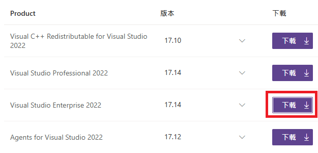
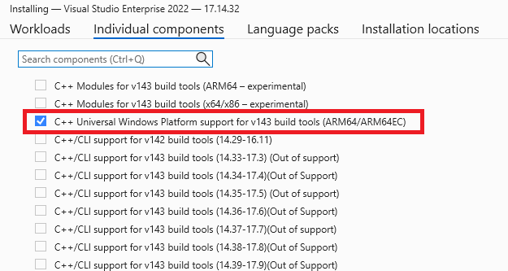
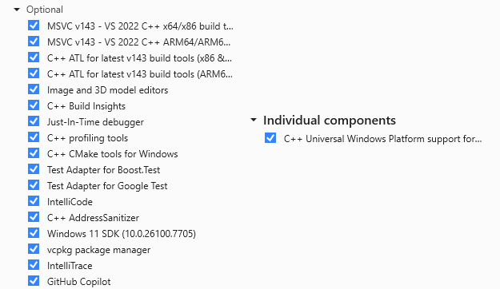
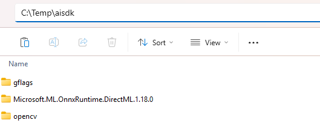
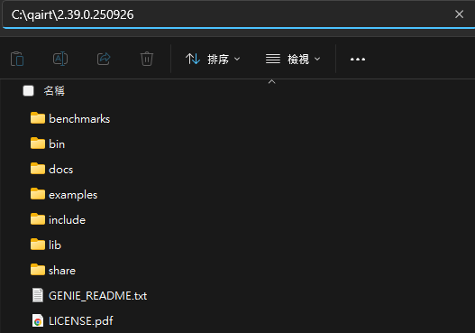
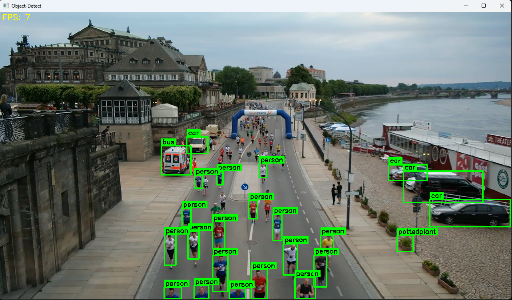
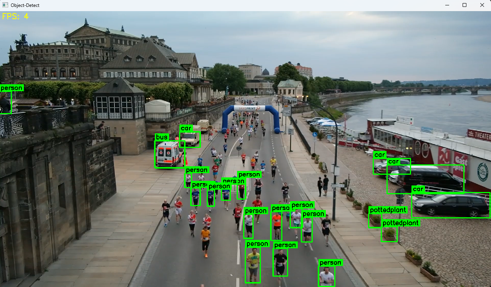
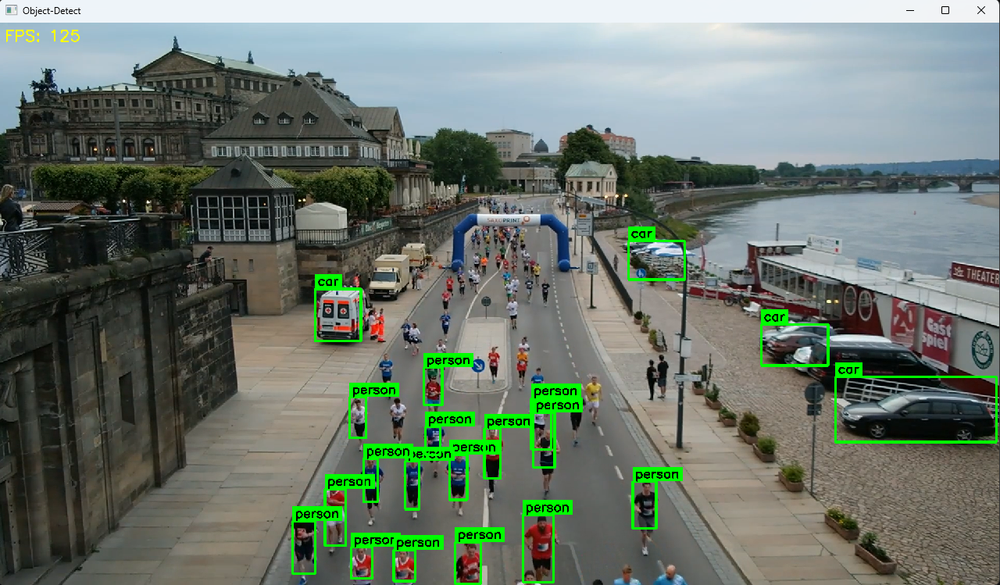

Developing an Object Detection Application on Qualcomm Dragonwing QCS6490 (Windows) Using Qualcomm AI Hub
===

This example demonstrates how to develop and deploy a Vision AI application on the Qualcomm Dragonwing QCS6490 platform using Qualcomm AI Hub.
This guide walks developers through the complete workflow, from generating the model artifacts to deploying them on a Qualcomm Dragonwing QCS6490 device.

* Application: Object Detection
* Model: YOLOv11-ONNX / YOLOv11-Quantized
* Input: Video / USB Camera  

## Table of Contents 
- [Environment](#environment) 
  - [Target](#target) 
  - [Development Environment Setup](#development-environment-setup)
    - [Setup on Ubuntu 22.04 (x86_64) host machine](#setup-on-ubuntu-2204-x86_64-host-machine)
    - [Setup on Windows 11 (x86_64) host machine](#setup-on-windows-11-x86_64-host-machine)
- [Development Flow](#development-flow) 
  - [How to Generate Models on an Ubuntu 22.04 (x86_64) host machine](#how-to-generate-models-on-an-ubuntu-2204-x86_64-host-machine) 
    - [Generate the ONNX Model for CPU / iGPU](#generate-the-onnx-model-for-cpu--igpu) 
    - [Generate the DLC Model for NPU Using Qualcomm AI Hub](#generate-the-dlc-model-for-npu-using-qualcomm-ai-hub) 
  - [How to Build the Application on a Windows 11 (x86_64) host machine](#how-to-build-the-application-on-a-windows-11-x86_64-host-machine)
    - [For CPU / iGPU](#for-cpu--igpu) 
    - [For NPU](#for-npu) 
- [Deploy](#deploy)
  - [Run on CPU / iGPU](#run-on-cpu--igpu) 
  - [Run on NPU](#run-on-npu)


# Environment
Refer to the following requirements to prepare both the target device and the development environments.


## Target
| Item | Content | Note |
| -------- | -------- | -------- |
| SOC | Qualcomm Dragonwing QCS6490 | |
| Accelerator | NPU | |
| OS/Build | Windows 11 IoT Enterprise (ARM64) | |
| SDK | Qualcomm AI Runtime SDK 2.39.0 | |

## AI Inference Framework

| AI Frameworks | Version | Description | 
| -------- | -------- | -------- | 
| SNPE     |    v2.39.0.250926   | The Qualcomm® Neural Processing SDK is a Qualcomm Snapdragon software accelerated runtime for the execution of deep neural networks. With Qualcomm® Neural Processing SDK : <br> * Execute an arbitrarily deep neural network <br> * Execute the network on the Snapdragon CPU, the Adreno GPU or the Hexagon NPU. <br> * Debug the network execution on x86 Ubuntu Linux  <br> * Convert PyTorch, TFLite, ONNX, and TensorFlow models to a Qualcomm® Neural Processing SDK Deep Learning Container (DLC) file  <br> * Quantize DLC files to 8 or 16 bit fixed point for running on the Hexagon NPU  <br> * Debug and analyze the performance of the network with Qualcomm® Neural Processing SDK tools  <br> * Integrate a network into applications and other code via C++ |


## Development Environment Setup

| Development Phase | OS | Platform | Requirements |
| :--- | :--- | :--- | :--- |
| Model Generation | Ubuntu 22.04 | x86_64 | Python 3.10 |
| App Development | Windows 11 | x86_64 | Visual Studio 2022, CMake 3.30.4 |

---

## Setup on Ubuntu 22.04 (x86_64) Host Machine

#### Step 1. System Setup & Virtual Environment
```
# Install System Dependencies
sudo apt update
sudo apt install git vim python3-pip python3.10-venv -y

# Setup Workspace and Venv
cd ~
git clone https://github.com/ADVANTECH-Corp/EdgeAI_Workflow.git
cd ~/EdgeAI_Workflow/ai_sdk/qualcomm/qairt/2.39.0.250926/windows
mkdir -p workspace
cd workspace
python3 -m venv ai-hub
source ai-hub/bin/activate

# Install Base Python Libraries
pip install qai-hub
pip install "qai-hub-models[yolov11-det]"
```

#### Step 2. Configure Qualcomm AI Hub
* Get API Token: 
  Log in to Qualcomm AI Hub and retrieve your API Token. 
  `(Text in red is a sample; do not use the actual token shown.)`

  

* Configure Tool:
   ```
   qai-hub configure --api_token <YOUR_API_TOKEN>
   ```

---
## Setup on Windows 11 (x86_64) Host Machine

#### Step 1. Install Visual Studio & CMake
* Install Git: [Git for Windows/x64 Setup](https://git-scm.com/install/windows)
* Install CMake: [CMake 3.30.4](https://cmake.org/files/v3.30/cmake-3.30.4-windows-x86_64.msi)
* Install Visual Studio 2022(with `Desktop development with C++` workload)
    * Download [Visual Studio Enterprise 2022](https://my.visualstudio.com/Downloads?q=visual%20studio%202022&wt.mc_id=o~msft~vscom~older-downloads) and install.
    
    *  Select `Desktop development with C++` workload and install.
    *  Go to `Individual components` and check:

        
    *  Ensure your installation matches:
    
        

#### Step 2. Build Dependency Libraries
* Clone Repository:
    ```
    git clone https://github.com/ADVANTECH-Corp/EdgeAI_Workflow.git
    cd "EdgeAI_Workflow\ai_sdk\qualcomm\qairt\2.39.0.250926\windows\script"
    ```

* Run Build Script:
    This downloads and builds the required dependency libraries (OpenCV 4.11 and gflags) into `"C:\temp\aisdk"`.
    ```
    .\run.bat
    ```

#### Step 3. Manual Library Setup

* Install ONNX Runtime DirectML 1.18.0:
    * Download [Microsoft.ML.OnnxRuntime.DirectML.1.18.0](https://github.com/microsoft/onnxruntime/releases/download/v1.18.0/Microsoft.ML.OnnxRuntime.DirectML.1.18.0.zip), unzip to `"C:\temp\aisdk"` and rename the folder to exactly `Microsoft.ML.OnnxRuntime.DirectML.1.18.0`.
    * Expected Result: 

       

* Qualcomm AI Runtime SDK:
    * Download: [Qualcomm AISDK 2.39.0.250926](https://qpm.qualcomm.com/#/main/tools/details/Qualcomm_AI_Runtime_Community) and Extract to `"C:\qairt\2.39.0.250926"`.

      >To download Qualcomm AI Runtime SDK from Qualcomm Package Manager, ensure that you have registered for a Qualcomm ID. If you don’t have a Qualcomm ID, you will be prompted to register. Then follow the instructions below to download and install the SDK.

    * Expected Result: 

      


---

# Development Flow

> **Note:** An active internet connection is required for the entire development flow.

The workflow consists of two main stages:

1. `Model Generation (Ubuntu x86_64 Host)`: Generate the YOLOv11 ONNX model for CPU/iGPU inference and use Qualcomm AI Hub to generate the DLC model for NPU inference.

2. `Application Development (Windows x86_64 Host)`: Compile the Windows ARM64 C++ inference applications using Visual Studio, CMake, and the Qualcomm AI Runtime SDK.

## How to Generate Models on an Ubuntu 22.04 (x86_64) host machine
### Generate the ONNX Model for CPU / iGPU
#### Step 1. Export the YOLOv11n model to yolo11n.onnx
* Activate ai-hub venv
  ```
  cd ~/EdgeAI_Workflow/ai_sdk/qualcomm/qairt/2.39.0.250926/windows/workspace
  source ai-hub/bin/activate
  ```
* Get yolo11n.onnx
  ```
  yolo export model=yolo11n.pt format=onnx opset=13 
  ```
#### Step 2. Transfer the Model to the Target Device
Copy the ONNX AI model(`yolo11n.onnx`) to target device

---

### Generate the DLC Model for NPU Using Qualcomm AI Hub

#### Step 1. Export the YOLOv11n model to yolov11_det.dlc
* Activate ai-hub venv
  ```
  cd ~/EdgeAI_Workflow/ai_sdk/qualcomm/qairt/2.39.0.250926/windows/workspace
  source ai-hub/bin/activate
  ```
* Get yolov11_det.dlc
  ```
  qai-hub-models export yolov11_det \
    --precision w8a16 \
    --target-runtime qnn_dlc \
    --chipset qualcomm-qcs6490 \
    --output-dir ~/EdgeAI_Workflow/ai_sdk/qualcomm/qairt/2.39.0.250926/windows/workspace \
    --height 320 \
    --width 320
  ```

#### Step 2. Transfer the Model to the Target Device
Copy the optimized AI model(`yolov11_det.dlc`) to target device

---

## How to Build the Application on a Windows 11 (x86_64) host machine
### For CPU / iGPU
#### Step 1. Clone repo
```
git clone https://github.com/ADVANTECH-Corp/EdgeAI_Workflow.git

cd "EdgeAI_Workflow\ai_sdk\qualcomm\qairt\2.39.0.250926\windows\code\cpu_igpu\object-detect"
```

#### Step 2. Execute `build.bat` to generate the executable
```
build.bat
```
* If the build fails, verify the directory paths defined in "CMakeLists.txt" are correct.
  ```
  set(OpenCV_DIR_INCLUDE          "C:\\Temp\\aisdk\\opencv\\include")
  set(OpenCV_DIR_LIB              "C:\\Temp\\aisdk\\opencv\\ARM64/vc17\\lib")
  set(gFLAG_DIR_INCLUDE           "C:\\Temp\\aisdk\\gflags\\mybuild\\build\\include")
  set(gFLAG_DIR_LIB               "C:\\Temp\\aisdk\\gflags\\mybuild\\build\\lib")
  set(ONNXRUNTIME_QNN_DIR_INCLUDE "C:\\Temp\\aisdk\\Microsoft.ML.OnnxRuntime.DirectML.1.18.0\\build\\native\\include")
  set(ONNXRUNTIME_QNN_DIR_LIB     "C:\\Temp\\aisdk\\Microsoft.ML.OnnxRuntime.DirectML.1.18.0\\runtimes\\win-arm64\\native")
  ```

#### Step 3. Transfer executable to Target Device
Copy the executable (`yolov11-object-cpu-igpu.exe`) to the target device

---

### For NPU
#### Step 1. Clone repo
```
git clone https://github.com/ADVANTECH-Corp/EdgeAI_Workflow.git

cd "EdgeAI_Workflow\ai_sdk\qualcomm\qairt\2.39.0.250926\windows\code\npu\ai-hub\object-detect"
```
#### Step 2.  Execute `build.bat` to generate the executable
```
build.bat
```
* If the build fails, verify the directory paths defined in "CMakeLists.txt" are correct.
  ```
  set(OpenCV_DIR_INCLUDE "C:\\Temp\\aisdk\\opencv\\include")
  set(OpenCV_DIR_LIB     "C:\\Temp\\aisdk\\opencv\\ARM64\\vc17\\lib")
  set(gFLAG_DIR_INCLUDE  "C:\\Temp\\aisdk\\gflags\\mybuild\\build\\include")
  set(gFLAG_DIR_LIB      "C:\\Temp\\aisdk\\gflags\\mybuild\\build\\lib")
  set(SNPE_SDK_DIR       "C:\\qairt\\2.39.0.250926") 
  set(SNPE_LIB_DIR       "${SNPE_SDK_DIR}\\lib\\aarch64-windows-msvc")
  set(SNPE_INCLUDE_DIR   "${SNPE_SDK_DIR}\\include\\SNPE")
  ```

#### Step 3. Transfer executable to Target Device
Copy the executable (`yolov11-object-npu-aihub.exe`) to the target device

---

# Deploy
## Run on CPU / iGPU

> Note: Please execute the following commands in a `PowerShell` terminal.

#### Step 1. Prepare required files

* Create a new folder
  ```
  mkdir "C:\temp\cpu-igpu"
  ```
* Copy `yolo11n.onnx` (refer to [Generate the ONNX Model for CPU / iGPU](#generate-the-onnx-model-for-cpu--igpu)) and `yolov11-object-cpu-igpu.exe` (refer to [For CPU / iGPU](#for-cpu--igpu)) to `"C:\temp\cpu-igpu"`.


* Copy the necessary files to `"C:\temp\cpu-igpu"`.
  ```
  Copy-Item "C:\Program Files\Advantech\EdgeAI\System\Qualcomm_QCS6490\VisionAI\app\cpu_igpu\coco.txt" -Destination "C:\temp\cpu-igpu" -Force
  Copy-Item "C:\Program Files\Advantech\EdgeAI\System\Qualcomm_QCS6490\VisionAI\app\cpu_igpu\onnxruntime.dll" -Destination "C:\temp\cpu-igpu" -Force   
  Copy-Item "C:\Program Files\Advantech\EdgeAI\System\Qualcomm_QCS6490\VisionAI\lib\*" -Destination "C:\temp\cpu-igpu" -Recurse -Force
  Copy-Item "C:\Program Files\Advantech\EdgeAI\Main\Data\video\ObjectDetection.mp4" -Destination "C:\temp\cpu-igpu" -Recurse -Force
  ```

#### Step 2. Run
* Run on CPU
  ```
  cd "C:\temp\cpu-igpu"
  ```
  * Run with USB Camera
    ```
    .\yolov11-object-cpu-igpu.exe --device=CPU --model=yolo11n.onnx --input=0
    ```
  * Run with Video File
    ```
    .\yolov11-object-cpu-igpu.exe --device=CPU --model=yolo11n.onnx --input=ObjectDetection.mp4
    ```
* Run on iGPU
  ```
  cd "C:\temp\cpu-igpu"
  ```
  * Run with USB Camera
    ```
    .\yolov11-object-cpu-igpu.exe --device=GPU --model=yolo11n.onnx --input=0
    ```
  * Run with Video File
    ```
    .\yolov11-object-cpu-igpu.exe --device=GPU --model=yolo11n.onnx --input=ObjectDetection.mp4
    ```

  * Result on CPU
  

  * Result on iGPU
  

---

## Run on NPU

> Note: Please execute the following commands in a `PowerShell` terminal.

#### Step 1. Prepare required files
* Create a new folder
  ```
  mkdir "C:\temp\npu-aihub"
  ```
* Copy `yolov11_det.dlc` to `"C:\temp\npu-aihub"`

  ```
  Copy-Item "C:\Program Files\Advantech\EdgeAI\System\Qualcomm_QCS6490\VisionAI\app\npu\yolov11n_w8a16_imgsz_320_pics1000.dlc" -Destination "C:\temp\npu-aihub" -Force
  Rename-Item "C:\temp\npu-aihub\yolov11n_w8a16_imgsz_320_pics1000.dlc" "yolov11_det.dlc"
  ```
* Copy `yolov11-object-npu-aihub.exe` (refer to [For NPU](#for-npu)) to `"C:\temp\npu-aihub"`


* Copy the necessary files to `"C:\temp\npu-aihub"`.
  ```
  Copy-Item "C:\Program Files\Advantech\EdgeAI\System\Qualcomm_QCS6490\VisionAI\app\cpu_igpu\coco.txt" -Destination "C:\temp\npu-aihub" -Force
  Copy-Item "C:\Program Files\Advantech\EdgeAI\System\Qualcomm_QCS6490\VisionAI\lib\*" -Destination "C:\temp\npu-aihub" -Recurse -Force
  Copy-Item "C:\Program Files\Advantech\EdgeAI\Main\Data\video\ObjectDetection.mp4" -Destination "C:\temp\npu-aihub" -Recurse -Force
  ```

#### Step 2. Run 
* Run on NPU 
  ```
  cd "C:\temp\npu-aihub"
  ```
  * Run with USB Camera
    ```
    .\yolov11-object-npu-aihub.exe `
    --model="yolov11_det.dlc" `
    --device=DSP `
    --labels=coco.txt `
    --conf=0.1 `
    --iou=0.45 `
    --layer-names="/Concat_identity,/Cast_identity,/ReduceMax_identity" `
    --input=0
    ```
  * Run with Video File
    ```
    .\yolov11-object-npu-aihub.exe `
    --model="yolov11_det.dlc" `
    --device=DSP `
    --labels=coco.txt `
    --conf=0.1 `
    --iou=0.45 `
    --layer-names="/Concat_identity,/Cast_identity,/ReduceMax_identity" `
    --input=ObjectDetection.mp4
    ```

  * Result
  


