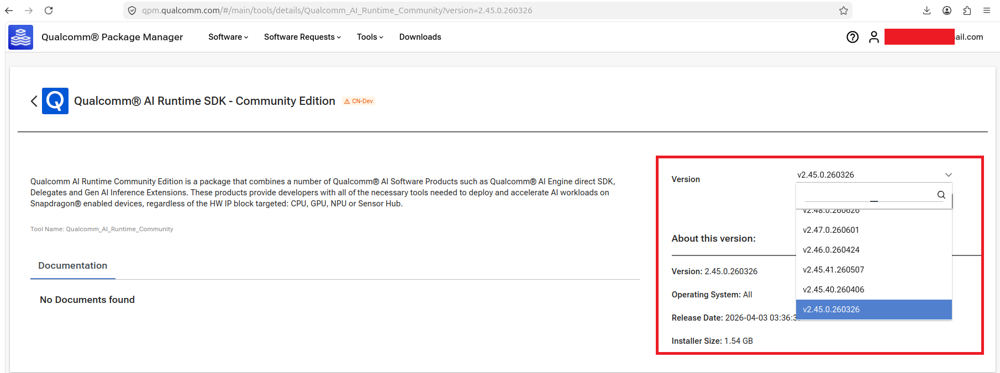

# Configure the QAIRT Version for a Computer Vision DLC Model Generated by Qualcomm AI Hub

Qualcomm AI Hub uses a specific QAIRT version when generating a `.dlc` model.
Before running the model, confirm that the corresponding QAIRT release is installed and correctly configured on the device.
This guide applies to computer vision DLC models generated through Qualcomm AI Hub.

* Application: Computer Vision
* Platform: Qualcomm IQ9075
* OS: Ubuntu 24.04


## Step 1 — Check the Model QAIRT Version

Locate the `metadata.json` file downloaded with the model artifact. Find `tool_versions` and check the `qairt` value.

Example:

```json
{
    "tool_versions": {
        "qairt": "2.45.0.260326154327"
    }
}
```

Record the QAIRT build used to generate the model.

In this example, the model metadata reports the following QAIRT build:
```text
2.45.0.260326154327
```

In this example, the matching QAIRT package available for download is:

```text
2.45.0.260326
```

## Step 2 — Check the Installed QAIRT Versions

Run:

```bash
ls /opt/qcom/aistack/qairt/
```

Example output:

```text
2.41.0.251128
```

In this example:

```text
Model QAIRT build:       2.45.0.260326154327
Installed QAIRT version: 2.41.0.251128
Required install path:   /opt/qcom/aistack/qairt/2.45.0.260326
```

The QAIRT release required by the model is not currently installed on the device.

## Step 3 — Download the Required QAIRT Release

Open the Qualcomm AI Runtime Community download page:

https://softwarecenter.qualcomm.com/catalog/item/Qualcomm_AI_Runtime_Community

> A Qualcomm account is required to download QAIRT.
>
> If you do not have a Qualcomm account, create one and sign in.



Select and download the QAIRT release corresponding to the version shown in the model metadata.

For this example, download:

```text
2.45.0.260326
```

## Step 4 — Install QAIRT on the Device

After downloading the QAIRT package, extract the complete package under:

```text
/opt/qcom/aistack/qairt/
```

For example:

```text
/opt/qcom/aistack/qairt/2.45.0.260326
```

Root permission may be required when installing files under `/opt`.

After extraction, confirm that the QAIRT installation directory directly contains directories such as `bin`, `include`, and `lib`.

Example directory structure:

```text
/opt/qcom/aistack/qairt/2.45.0.260326/
├── bin/
├── include/
└── lib/
```

## Step 5 — Configure the QAIRT Environment

The following environment configuration is for Qualcomm IQ9075:

```bash
export QAIRT_HOME="/opt/qcom/aistack/qairt/2.45.0.260326"
export QAIRT_TARGET_ARCH="aarch64-oe-linux-gcc11.2"
export QAIRT_HEXAGON_ARCH="hexagon-v73"

export PATH="${QAIRT_HOME}/bin/${QAIRT_TARGET_ARCH}:${PATH}"
export LD_LIBRARY_PATH="${QAIRT_HOME}/lib/${QAIRT_TARGET_ARCH}${LD_LIBRARY_PATH:+:${LD_LIBRARY_PATH}}"
export ADSP_LIBRARY_PATH="${QAIRT_HOME}/lib/${QAIRT_HEXAGON_ARCH}/unsigned${ADSP_LIBRARY_PATH:+:${ADSP_LIBRARY_PATH}}"
```

For another Qualcomm platform, confirm the correct target architecture and Hexagon version before configuring the environment.

The following values are specific to the IQ9075 example:

```text
Target architecture: aarch64-oe-linux-gcc11.2
Hexagon architecture: hexagon-v73
```

## Step 6 — Confirm the QAIRT Configuration

Confirm the selected QAIRT directory:

```bash
echo "${QAIRT_HOME}"
```

Expected output:

```text
/opt/qcom/aistack/qairt/2.45.0.260326
```

Then check the SNPE version:

```bash
hash -r
snpe-net-run --version
```

Confirm that the reported SNPE version corresponds to the QAIRT release required by the model.

The required QAIRT environment is now configured. You can continue with platform-specific runtime validation and execute the DLC model.
