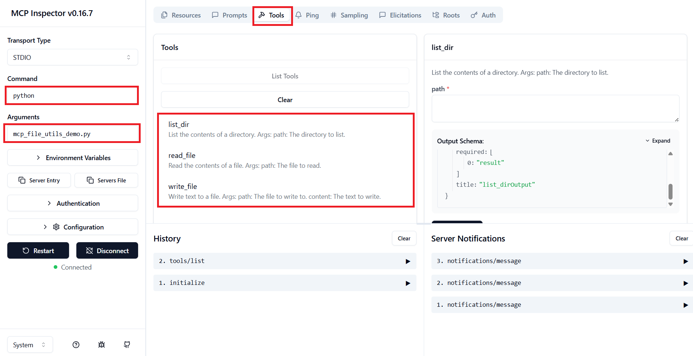
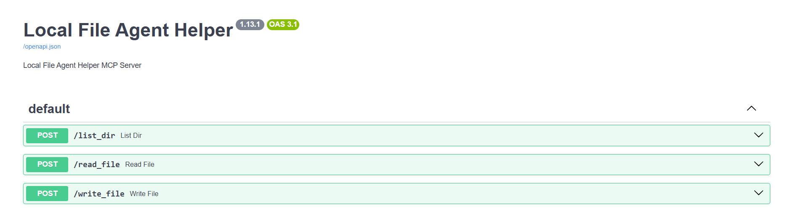
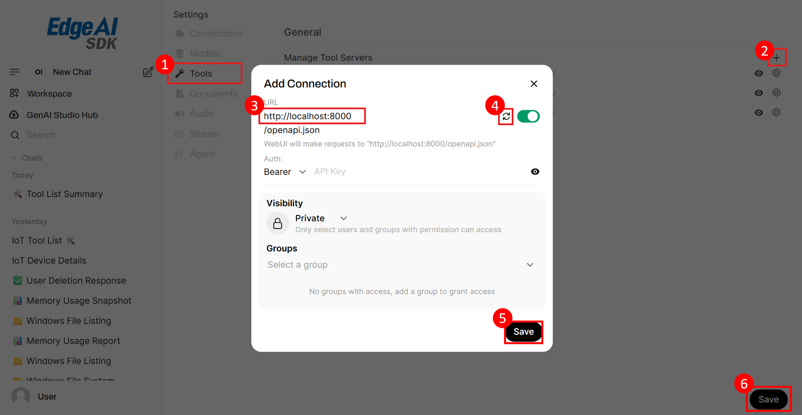
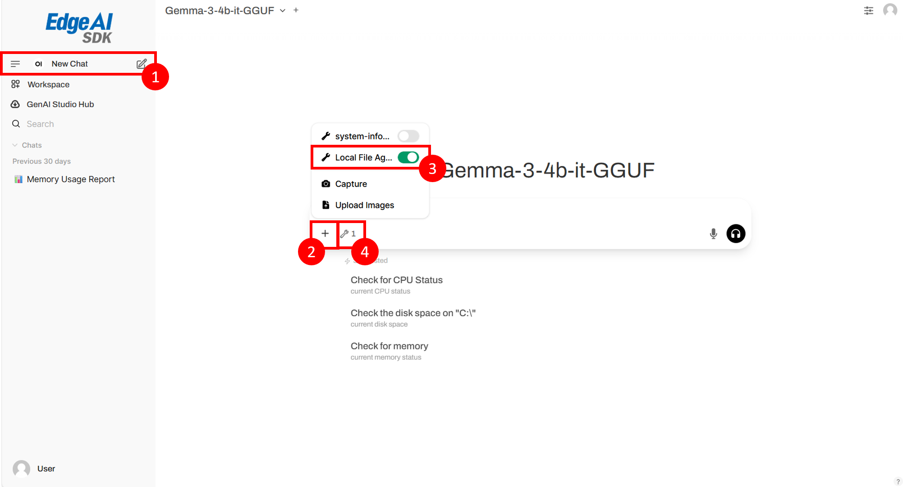

# Create a MCP Server on AIMB-2210 ( AMD / Ryzen 8000 series )

# Overview
This example will demonstrate how to develop an MCP Server on AIMB-2210 ( AMD / Ryzen 8000 series ) platform.

- [Pre-Requirements](#pre-requirements) 
  - [Target](#target)
  - [Development](#development)
       - [System Requirements](#system-requirements)
       - [Install Edge AI SDK](#install-edge-ai-sdk)
- [Develop](#develop)
  - [Create a MCP server](#create-a-mcp-server)
  - [Add the MCP server on the GenAI-Chatbot](#add-the-mcp-server-on-the-genai-chatbot)
- [Reference](#reference)

# Pre-Requirements
Refer to the following requirements to prepare the target and develop environment.


## Target
| Item | Content | Note |
| -------- | -------- | -------- |
| Platform |   AIMB-2210  |  Ryzen 8000   |
| SOC  |    Ryzen 7 PRO 8845HS  |   |
| OS/Kernel |  Windows 11 ToT  | Build 26100  |


## Development
### System Requirements
1. Miniconda (*The Edge AI SDK installation includes Miniconda*)
2. Python v3.11 ↑
3. Python Package: [requirements.txt](code/mcp/requirements.txt)
4. Node.js v22.14.0 ↑
5. npm v10.9.2 ↑

### Install Edge AI SDK 
Base on **Target Environment**  
Please install the corresponding version of EdgeAISDK to obtain the following development environment.  
Install :  [Edge AI SDK(v3.4.0) install](https://ess-wiki.advantech.com.tw/view/Edge_AI_SDK/Download) 

# Develop  

## Create a MCP server

**Example: [mcp_file_utils_demo.py](code/mcp/mcp_file_utils_demo.py)**

- Create mcp_file_utils_demo.py
   ```python
   # Import FastMCP from the mcp.server.fastmcp package
   from mcp.server.fastmcp import FastMCP
   import os
   import sys

   # Create an instance of FastMCP with the name "Local File Agent Helper"
   mcp = FastMCP("Local File Agent Helper")

   # Define a tool for the MCP server
   # This tool will list the contents of a given directory
   @mcp.tool()
   def list_dir(path: str) -> str:
      """
      List the contents of a directory.
      
      Args:
         path: The directory to list.  
      """
      # Log the execution to stderr for debugging purposes
      print(f"Executing: list_dir {path}", file=sys.stderr)
      try:
         # Get all entries (files and folders) in the directory
         entries = os.listdir(path)
         # Join them into a single string separated by newlines
         result = "\n".join(entries)
         # Log the result to stderr for debugging
         print(f"Directory contents ({path}):\n{result}", file=sys.stderr)
         return result
      except Exception as e:
         # If an error occurs, log it to stderr and return an error message
         print(f"Error listing directory {path}: {str(e)}", file=sys.stderr)
         return f"Error: {str(e)}"

   # Entry point of the program
   if __name__ == "__main__":
      # Log server startup message to stderr
      print("Starting FastMCP server...", file=sys.stderr)
      # Run the MCP server using stdio as the transport
      mcp.run(transport='stdio')
   ```
- Run the *MCP inspector* under the .py file path.
   ```
   conda activate mcp
   npx @modelcontextprotocol/inspector
   ```
- On the MCP Inspector interface, you can interact with your running MCP server and test its functionality.
  

## Add the MCP server on the GenAI-Chatbot

- Must be convert the MCP (Model Context Protocol) server into an `OpenAPI-compliant HTTP REST server`.
- Convert a MCP server to an OpenAPI server using mcpo — GitHub: https://github.com/open-webui/mcpo
  ```shell
  conda activate mcp
  mcpo --host localhost --port 8000 -- python mcp_file_utils_demo.py
  ```
- Checking the OpenAPI documentation: http://localhost:8000/docs
  

- Add the MCP server to the GenAI-Chatbot.
  
  1. Click Tools on Setting.
  2. Select "+" to add a new tool.
  3. Input URL: http://localhost:8000/
  4. Click "Sync" checking the connection.
  5. Click "Save" on Popup.
  6. Click "Save".

- Using the MCP server in GenAI-Chatbot.
   
   1. Add new chat.
   2. Click "+" button.
   3. Select tool: "Local File Agent Helper".
   4. Check show tool icon.

- Start chatting with the MCP server.

# Reference
- Documentation for Creating a MCP Server: https://modelcontextprotocol.io/quickstart/server
- MCP Inspector: https://github.com/modelcontextprotocol/inspector