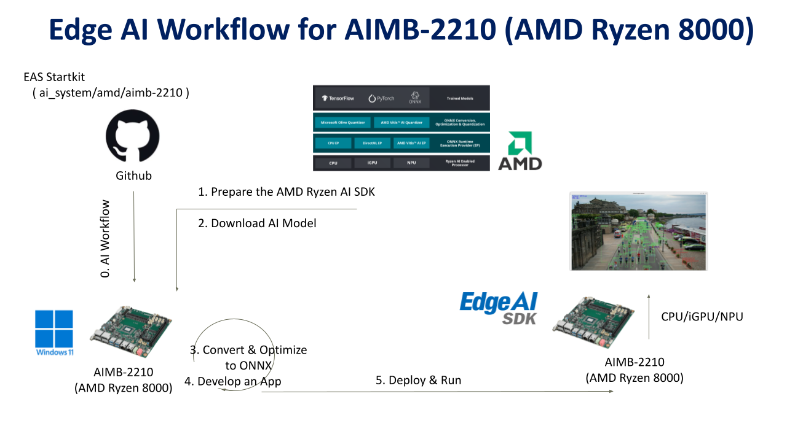
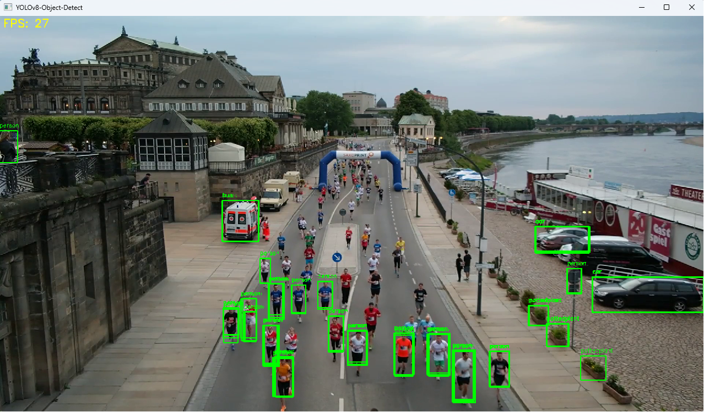
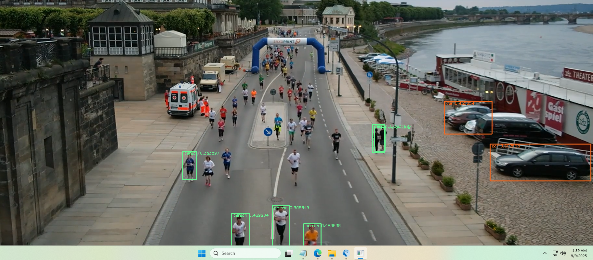

# Create an Object Detection on AIMB-2210 (AMD / Ryzen 8000 series)

---

# Overview
This example will demonstrate how to develop an vision AI Object Detection on AIMB-2210 ( AMD / Ryzen 8000 series ) platform.
Developers can easily complete the Visual AI development by following these steps.
 
* Application: Object Detection     
* Model: YoloV8 / YoloVX    
* Input: Video File / USB Camera    

    

- [Pre-Requirements](#pre-requirements) <!-- prerequisite -->
  - [Target](#target) <!-- prerequisite -->
  - [Development](#development) <!-- prerequisite -->
       - [System Requirements](#system-requirements)
       - [Install Edge AI SDK](#install-edge-ai-sdk)
       - [Frameworks](#frameworks)
- [Develop](#develop)<!-- prerequisite -->
  - [Download AI Files](#download-ai-files)<!-- prerequisite -->
  - [Build Package](#build-package)<!-- prerequisite -->
  - [Application](#application)<!-- prerequisite -->
       - [Build Library](#build-library)
       - [Prepare Files](#prepare-files)
- [Deploy](#deploy)<!-- prerequisite -->
  - [Run](#run)<!-- prerequisite -->

# Pre-Requirements
Refer to the following requirements to prepare the target and develop environment.    

## Target
| Item | Content | Note |
| -------- | -------- | -------- |
| Platform |   AIMB-2210  |  Ryzen 8000   |
| SOC  |    Ryzen 7 PRO 8845HS  |   |
| OS/Kernel |  Windows 11 IoT  | Build 26100  |
| SDK| RyzenAI SDK 1.4 |   |

## Development
### System Requirements
1. Install tool :
   - Visual Studio 2022 (with Desktop dev c++ )  
   - cmake   

### Install Edge AI SDK 
Base on **Target Environment**  
Please install the corresponding version of EdgeAISDK to obtain the following development environment.  
Install :  [Edge AI SDK(v3.4.0) install](https://ess-wiki.advantech.com.tw/view/Edge_AI_SDK/Download)  

### Frameworks 

| Frameworks  | Description  | Note | 
|----------------|-------------|---------------------| 
| RyzenAI SDK|  [Description Link](https://ryzenai.docs.amd.com/en/latest/relnotes.html#version-1-4) | version: 1.4 | 
 

 
# Develop  
The develop package is installed with the Edge AI SDK.  

 
## Download AI Files     
**Model : yolov8 (onnx) for CPU/iGPU**       
  
1. [Download .pt file Link](https://github.com/ultralytics/assets/releases/download/v8.3.0/yolov8n.pt)          
 
2. Make sure Python is installed.       

3. <To open Command Prompt (cmd) or PowerShell> :       
   python -m venv yolov8_env    
   yolov8_env\Scripts\activate    
   pip install --upgrade pip     
   pip install ultralytics onnx onnxruntime       
       
4. <onnx input shape [1, 3, 640, 640] and FP32 precision> :        

   yolo export model=yolov8n.pt format=onnx dynamic=False batch=1 half=False           
   
5. output =>  yolov8n.onnx         

## Build Package     

1. mkdir "C:\temp\git"    

 
2. build  Opencv 4.7.0 :    

cd "C:\temp\git"  
git clone https://github.com/opencv/opencv.git -b 4.7.0   
cd opencv  
mkdir mybuild  
cd mybuild  
cmake -DCMAKE_EXPORT_COMPILE_COMMANDS=ON -DBUILD_SHARED_LIBS=ON -DCMAKE_POSITION_INDEPENDENT_CODE=ON -DCMAKE_CONFIGURATION_TYPES=Release -A x64 -T host=x64 -G "Visual Studio 17 2022" -DCMAKE_INSTALL_PREFIX="C:\temp\opencv" -DCMAKE_PREFIX_PATH=".\opencv" -DCMAKE_BUILD_TYPE=Release -DBUILD_opencv_python2=OFF -DBUILD_opencv_python3=OFF -DBUILD_WITH_STATIC_CRT=OFF -DBUILD_opencv_world=ON -B build -S ../   
cmake --build build --config Release  
cmake --install build --config Release  
 

3. build gflags :   
  
cd "C:\temp\git"   
git clone https://github.com/gflags/gflags.git   
cd gflags   
mkdir mybuild   
cd mybuild   
cmake .. -DCMAKE_EXPORT_COMPILE_COMMANDS=ON -DBUILD_SHARED_LIBS=ON -DCMAKE_POSITION_INDEPENDENT_CODE=ON -DCMAKE_CONFIGURATION_TYPES=Release -A x64 -T host=x64 -G "Visual Studio 17 2022" -DCMAKE_INSTALL_PREFIX="C:\temp\gflag"  -B build -S ../   
cmake --build build --config Release   
cmake --install build --config Release   
cd ../..   

3. Prepare Files (onnxruntime ):    
- [onnxruntime Download Link](https://github.com/microsoft/onnxruntime/releases/download/v1.18.0/Microsoft.ML.OnnxRuntime.DirectML.1.18.0.zip)         
- unzip to "C:\temp" and set directory name to "Microsoft.ML.OnnxRuntime.DirectML.1.18.0"   

## Application     
### Build Source Code   

#### For CPU / iGPU   
1. git clone https://github.com/ADVANTECH-Corp/EdgeAI_Workflow.git   

2. cd "EdgeAI_Workflow\ai_system\amd\aimb-2210\code\cpu_igpu\Yolov8-Object"   
 
3. To execute : "build.bat"     

   If failed , to check the directory path of "CMakeLists.txt" existed ?    
   set(ONNXRUNTIME_DIR_INCLUDE "C:/temp/Microsoft.ML.OnnxRuntime.DirectML.1.18.0/buin-x64/native")      
   set(OpenCV_DIR_INCLUDE "C:/temp/opencv/include")       
   set(OpenCV_DIR_LIB "C:/temp/opencv/lib")        
   set(gFLAG_DIR_INCLUDE "C:/temp/gflag/include")          
   set(gFLAG_DIR_LIB "C:/temp/gflag/lib")     

 
4. output: "build\Release\yolov8-object.exe"      

#### For NPU  
1. git clone https://github.com/ADVANTECH-Corp/EdgeAI_Workflow.git       

2. cd "EdgeAI_Workflow\ai_system\amd\aimb-2210\code\npu\multi-model-source-code"       

3. Refer to : [Build Package](#build-package)         
   If failed , to check the directory path of "build.bat" existed ?                  
   set OpenCV_DIR=C:\temp\git\opencv\mybuild\build      
   
4. To execute : "build.bat"          

5. output: "bin\npu_multi_models.exe"        

# Deploy 

## Run CPU/iGPU   
### Prepare files    

   1. mkdir "C:\temp\test1"            

   2. "EdgeAI_Workflow\ai_system\amd\aimb-2210\code"  => coco.txt       

   3. "yolov8n.onnx" (refer to [Download AI Files](#download-ai-files))         

   4. Copy "coco.txt" , "yolov8n.onnx" and "yolov8-object.exe" to "C:\temp\test1"       

   5. Copy files below to "C:\temp\test1"             
      - "C:\temp\gflag\bin\gflags.dll"               
      - "C:\temp\Microsoft.ML.OnnxRuntime.DirectML.1.18.0\runtimes\win-x64\native\onnxruntime.dll"                  
      - "C:\temp\opencv\bin\opencv_videoio_ffmpeg470_64.dll"                   
      - "C:\temp\opencv\bin\opencv_world470.dll"                   

### Run  

   1. cd "C:\temp\test1"     

   2. To run CPU:
      yolov8-object.exe --device=CPU --model=yolov8n.onnx --input="test.mp4"            
      yolov8-object.exe --device=CPU --model=yolov8n.onnx --input="0"                         
               
 
   4. To run iGPU:  
      yolov8-object.exe --device=GPU --model=yolov8n.onnx --input="test.mp4"                   
      yolov8-object.exe --device=GPU --model=yolov8n.onnx --input="0"                       

       

 
## Run  NPU     
### Prepare files      

   1. mkdir "C:\temp\test2"    
   
   2. cd "C:\temp\test2"   

   2. After install "EdgeAISDK 3.4.0" ,  copy directory "bin" and "npu_modelsx4_demo" in "C:\Program Files\Advantech\EdgeAI\System\AMD_Ryzen\VisionAI\app\npu" to "C:\temp\test2"                 
          
   3. Copy file "npu_multi_models.exe"(pre-build) to "C:\temp\test2\npu_modelsx4_demo"            
  
### Run    
   1. cd "C:\temp\test2\npu_modelsx4_demo"    

   2. To run :   
      run_yolovx.bat "0"              
      run_yolovx.bat "test.mp4"         

        

