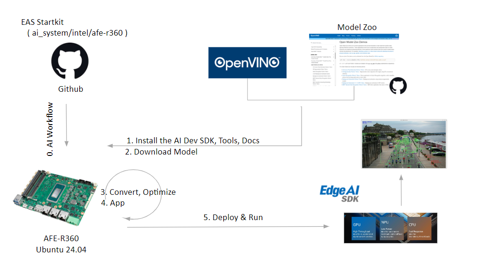

# Create an Object Detection on Hailo-8 ( EAI-1200 / EAI-3300 )
This example will demonstrate how to develop an vision AI Object Detection on Hailo-8 ( EAI-1200 / EAI-3300 ) platform.
Developers can easily complete the Visual AI development by following these steps.



- [Environment](#Environment)
  - [Target](#Target)
  - [Development](#Development) 
- [Deploy](#Deploy)
  - [Application](#Application)

<a name="Environment"/>

# Environment
Refer to the following requirements to prepare the target and develop environment.

<a name="Target"/>

## Target
| Item | Content | Note |
| -------- | -------- | -------- |
| Platform |   EAI-1200 / EAI-3300  |      |
| SOC  |   Hailo-8 |  |
| OS/Kernel |  Ubuntu 22.04 iotg |  |
| BSP | tappas | |

Base on **EdgeAI SDK 3.3.0**

<a name="Development"/>

## Development

Base on **Target Environment**

| AI Frameeorks | Version | Description |
| -------- | -------- | -------- |
| HailoRT - include HailoRT、PCIe driver、Python package(3.10) | https://hailo.ai/products/hailo-software/hailo-ai-software-suite/#sw-hailort    | 4.20.0 |
| TAPPAS  | https://hailo.ai/products/hailo-software/hailo-ai-software-suite/#sw-tappas   | 3.31.0 |
| OpenCV  | https://github.com/opencv/opencv.git  | 4.5.4 |
| Gstreamer  | https://gstreamer.freedesktop.org/index.html   | 1.20.3 |
| PyGObject  | https://pygobject.gnome.org/getting_started.html#ubuntu-logo-ubuntu-debian-logo-debian   | 3.42.0 |

<br/>

### Install docker image
- How to pull


```
 sudo docker pull advigw/eas-x86-hailo8:ubuntu22.04-1.0.0
```


<a name="Deploy"/>

# Deploy
Launch an AI application.

<a name="Application"/>

## Run Application
### Objection Detection

```
xhost +local:
```
```
docker run --rm --privileged --network host --name adv_hailo --ipc=host --device /dev/dri:/dev/dri -v /tmp/hailo_docker.xauth:/home/hailo/.Xauthority -v /tmp/.X11-unix/:/tmp/.X11-unix/ -v /dev:/dev -v /lib/firmware:/lib/firmware --group-add 44 -e DISPLAY=$DISPLAY -e XDG_RUNTIME_DIR=$XDG_RUNTIME_DIR -e hailort_enable_service=yes -v /opt/Advantech/EdgeAISuite/Accelerator/Hailo_8/tool/docker/shared_with_docker:/local/shared_with_docker:rw -it hailo_tappas:v3.31.0 /local/workspace/tappas/apps/h8/gstreamer/general/detection/detection_new.sh
```


Result:


- See more on
https://github.com/hailo-ai/tappas/tree/master/apps/h8/gstreamer/general/detection
