# Create an Object Detection on AFE-R360 ( Intel / 14th Meteor Lake )
This example will demonstrate how to develop an vision AI Object Detection on AFE-R360 ( Intel 14th Meteor Lake ) platform.
Developers can easily complete the Visual AI development by following these steps.


# Environment
## Target
| Item | Content | Note |
| -------- | -------- | -------- |
| Platform / RAM / Disk |   Intel(R) CoreTM Ultra 7 165U / 32G / 256G  |      |
| SOC | CPU、iGPU、NPU | |
| Accelerator | Intel(R) AI Boost (NPU) | NPU Driver 1.5.1 |
| OS/Kernel | * Ubuntu 24.04 (LTS) / 6.8.0 |  |
| OpenVINO | 2024.3.0 (LTS) | |


## OpenVINO 2024.3.0
- Install OpenVINO™ Runtime on Linux
https://docs.openvino.ai/2024/get-started/install-openvino/install-openvino-archive-linux.html

- How to install, setup 
Complete the installation according to the steps in the link.
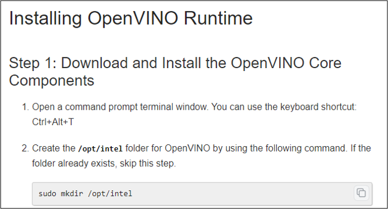
Choose the X86_64 Ubuntu 24.04 option.
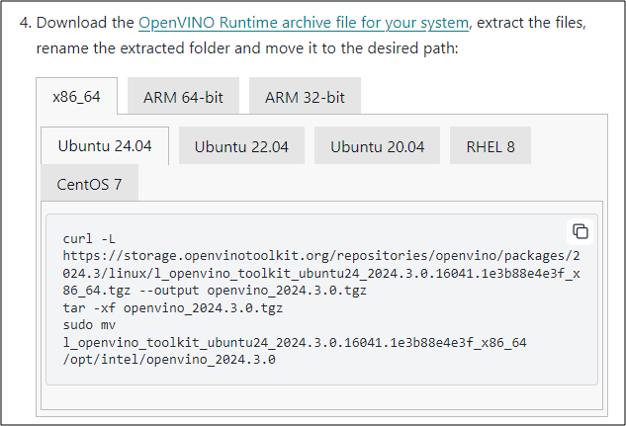

## OpenCV 4.7.0
- OpenCV source
 https://github.com/opencv/opencv.git
- How to install, setup
1. Clone on your device and check out to tag 4.7.0 .
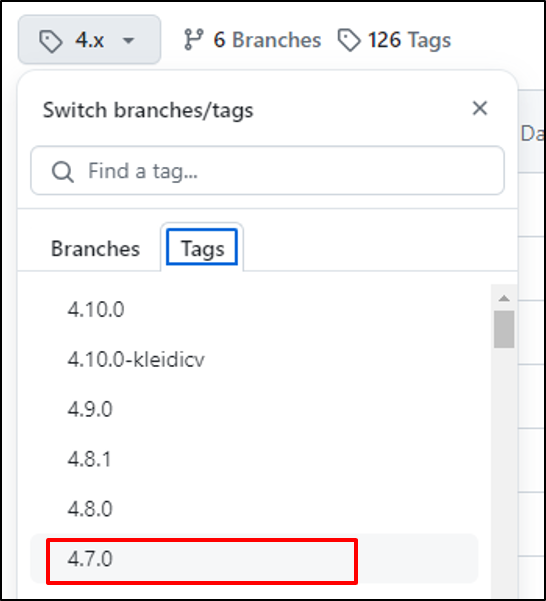
2. Following the steps below.

- Install the dependency for OpenCV :
```
sudo apt update

sudo apt install build-essential cmake git pkg-config libgtk-3-dev \
    libavcodec-dev libavformat-dev libswscale-dev libv4l-dev \
    libxvidcore-dev libx264-dev libjpeg-dev libpng-dev libtiff-dev \
    gfortran openexr libatlas-base-dev python3-dev python3-numpy \
    libtbb2 libtbb-dev libopenexr-dev \
    libgstreamer-plugins-base1.0-dev libgstreamer1.0-dev

sudo apt install ffmpeg libavformat-dev libavcodec-dev libswscale-dev
```
- make a file in where you clone
```
mkdir build_470
cd build_470
```
- Install
```
cmake -D CMAKE_BUILD_TYPE=RELEASE -D WITH_FFMPEG=ON -D CMAKE_INSTALL_PREFIX=/usr/local -D OPENCV_GENERATE_PKGCONFIG=ON ..

make -j8

```

## Application Binary
- open model zoo
https://github.com/openvinotoolkit/open_model_zoo/tree/releases/2024/3
- How to install, setup
Clone on your device and check out to tag "releases/2024/3" .
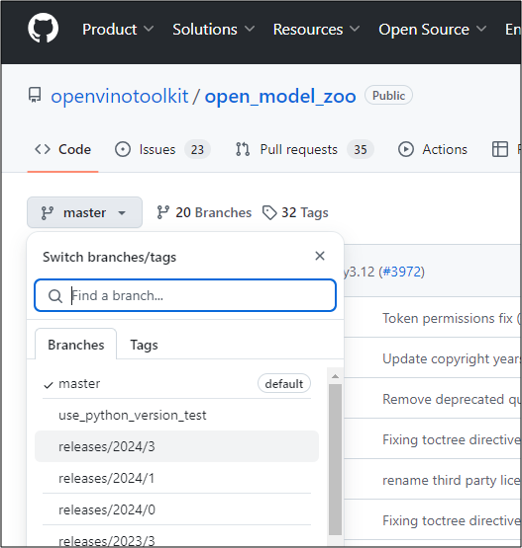
- NOTE: You must also clone https://github.com/gflags/gflags.git and place it in the following folder.
*`open_model_zoo/demos/thirdparty/gflags/`

- Following the steps below.

**Before you run build_demos, you must export to the *build_470* folder you previously created.**
```
source "/opt/intel/openvino_2024/setupvars.sh"
```
```
export OpenCV_DIR=<path>/build_470
```
```
cd open_model_zoo/demos
./build_demos.sh
```


## NPU Driver (1.5.1)
- NPU Driver
 https://github.com/intel/linux-npu-driver/releases
- How to install
Complete the installation according to the steps in the link.

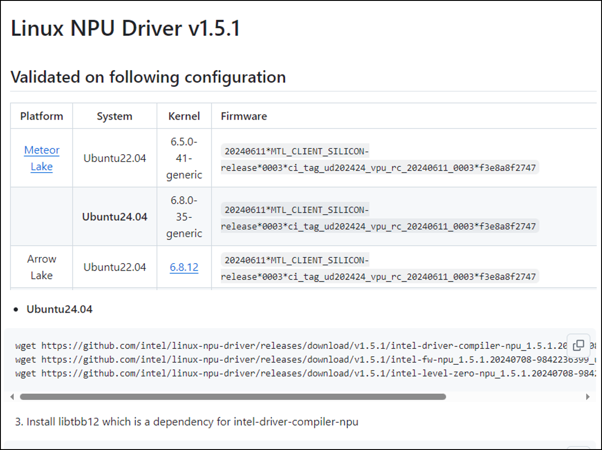


## iGPU Driver 
- iGPU Driver 
https://github.com/intel/compute-runtime/releases/tag/24.31.30508.7

- How to install
Complete the installation according to the steps in the link. 
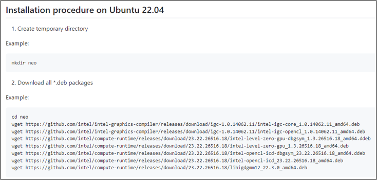

# Model
- tool : omz_downloader
https://github.com/openvinotoolkit/open_model_zoo/blob/releases/2024/3/tools/model_tools/README.md

## Objection Detection (YOLOX)
- YOLOX-OpenVINO in C++
https://github.com/Megvii-BaseDetection/YOLOX/tree/main/demo/OpenVINO/cpp
- How to obtain:
Go to the link, select YOLOX-M, and click github to download the tar file.

Open the folder, and you will see a model named "***yolox_m.xml***".

## Face Recognition (faceboxes-pytorch)
- open model zoo
https://github.com/openvinotoolkit/open_model_zoo/tree/releases/2024/3/models/public/faceboxes-pytorch
- How to obtain:
Clone open model zoo to your device, then download the model following the steps in the link.
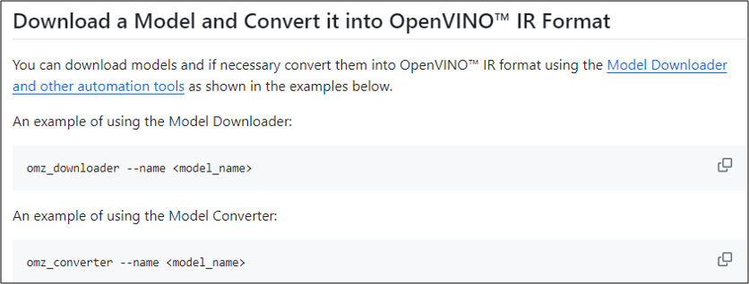
## Person Detection (person-detection-retail-0013)
- open model zoo
https://github.com/openvinotoolkit/open_model_zoo/tree/releases/2024/3/models/intel/person-detection-retail-0013
- How to obtain:
Clone open model zoo to your device, then download the model following the steps in the link.

## Pose Estimation (human-pose-estimation-0001)
- open model zoo
https://github.com/openvinotoolkit/open_model_zoo/blob/releases/2024/3/demos/human_pose_estimation_demo/cpp/README.md
- How to obtain:
Clone open model zoo to your device, then download the model following the steps in the link.


# Run benchmark
- Benchmark tools
https://docs.openvino.ai/2024/learn-openvino/openvino-samples/benchmark-tool.html
- build the benchmark binary.
```
cd /opt/intel/openvino_2024/samples/cpp
./build_samples.sh
```
- Follow the steps in the link to execute the benchmark.
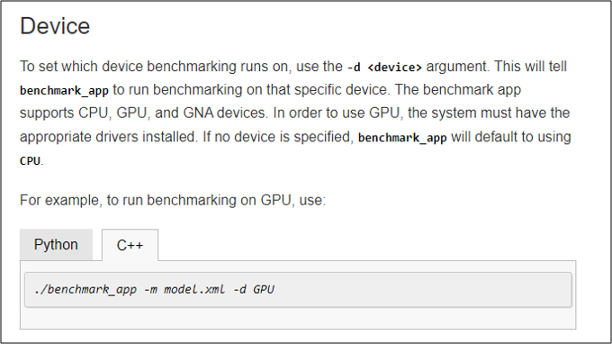

- Example for (CPU/iGPU/NPU) :

```
source "/opt/intel/openvino_2024/setupvars.sh"
```

CPU
```
cd /$HOME/openvino_cpp_samples_build/intel64/Release
./benchmark_app -m <model_path>/mobilenet-ssd.xml -d CPU -t 8
```
iGPU
```
cd /$HOME/openvino_cpp_samples_build/intel64/Release
./benchmark_app -m <model_path>/mobilenet-ssd.xml -d GPU -t 8
```
NPU
```
cd /$HOME/openvino_cpp_samples_build/intel64/Release
./benchmark_app -m <model_path>/mobilenet-ssd.xml -d NPU -t 8
```

# Run Application
## Objection Detection (object_detection_demo)
- Follow the steps in the link
https://github.com/openvinotoolkit/open_model_zoo/tree/releases/2024/3/demos/object_detection_demo/cpp
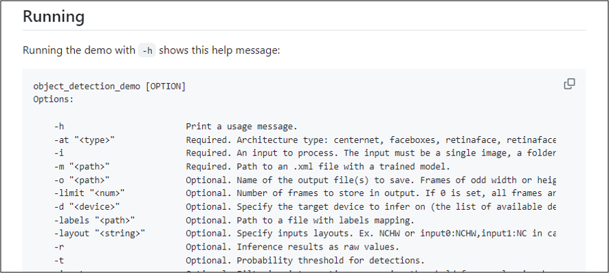
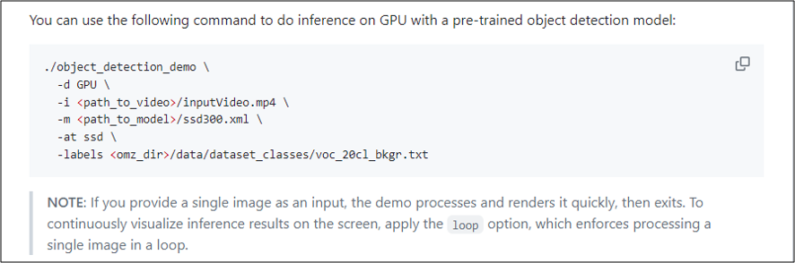
- Example
```
cd /$HOME/omz_demos_build/intel64/Release
```
```
source "/opt/intel/openvino_2024/setupvars.sh"
./object_detection_demo -m <path_to_model>/yolox.xml -d CPU -i <path_to_video>/TestVideo.mp4 -at yolox -loop
```

Result:
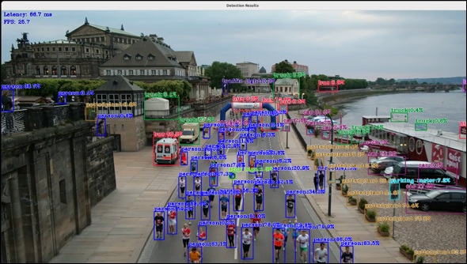

## Face Recognition (object_detection_demo)
- Follow the steps in the link
https://github.com/openvinotoolkit/open_model_zoo/tree/releases/2024/3/demos/object_detection_demo/cpp


- Example
```
cd /$HOME/omz_demos_build/intel64/Release
```
```
source "/opt/intel/openvino_2024/setupvars.sh"
./object_detection_demo -m <path_to_model>/faceboxes-pytorch.xml -d CPU -i <path_to_video>/TestVideo.mp4 -at faceboxes -loop
```

Result:
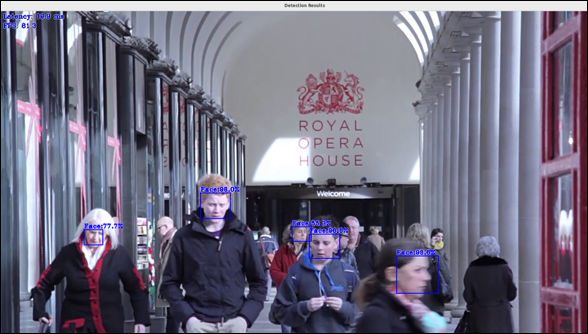

## Person Detection (object_detection_demo)
- Follow the steps in the link
https://github.com/openvinotoolkit/open_model_zoo/tree/releases/2024/3/demos/object_detection_demo/cpp


- Example
```
cd /$HOME/omz_demos_build/intel64/Release
```
```
source "/opt/intel/openvino_2024/setupvars.sh"
./object_detection_demo -m <path_to_model>/person-detection-retail-0013.xml -d GPU -i <path_to_video>/TestVideo.mp4 -at ssd -loop
```

Result:
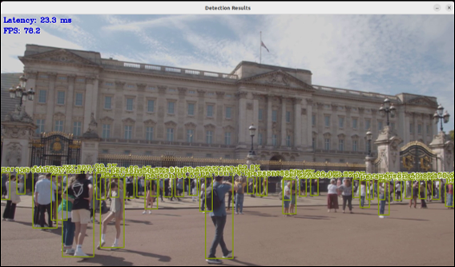

## Pose Estimation (human_pose_estimation_demo)
- Follow the steps in the link
https://github.com/openvinotoolkit/open_model_zoo/tree/releases/2024/3/demos/human_pose_estimation_demo/cpp
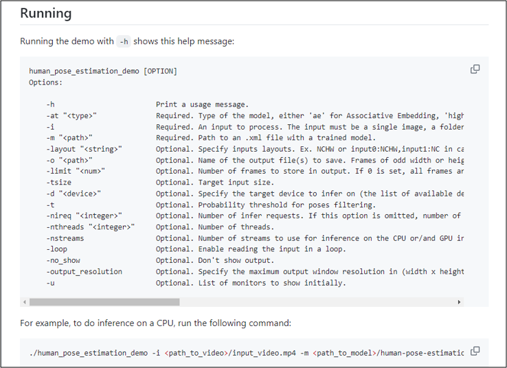
- Example
```
cd /$HOME/omz_demos_build/intel64/Release
```
```
source "/opt/intel/openvino_2024/setupvars.sh"
./human_pose_estimation_demo -i <path_to_video>/input_video.mp4 -m <path_to_model>/human-pose-estimation-0001.xml -d NPU -at openpose

```

Result:
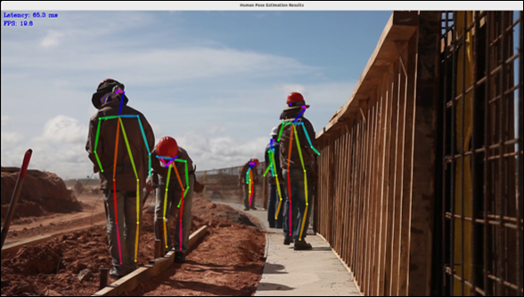

