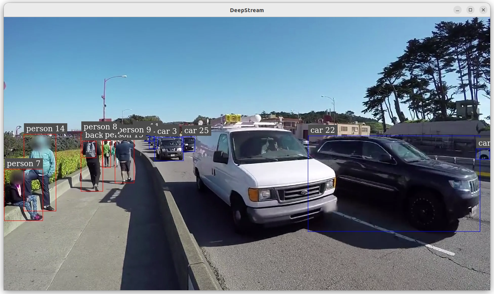

# Create an Object Detection on Jetson-Orin (AIR-030)

---

# Overview
This example will demonstrate how to develop an vision AI Object Detection on Jetosn-Orin ( AIR-030 ) platform.
Developers can easily complete the Visual AI development by following these steps.

* Application: Objection Detection
* Model: YoloV11
* Input: Video / USB Camera

- [Pre-requirements](#Pre-requirements)
  - [Target](#Target)
  - [Development](#Development) 
- [Develop](#Develop)
  - [Prepare your AI Model](#Model)
  - [App](#App) 
- [Deploy](#Deploy)
  - [Application](#Application)

---

<a name="Pre-requirements"/>
 
 

# Pre-requirements
Refer to the following requirements to prepare the target and develop environment.

<a name="Target"/>

## Target
| Item | Content | Note |
| -------- | -------- | -------- |
| Platform |   AIR-030  | Jetson-Orin   |
| SOC  |   Jetson-Orin  | AGX-Orin |
| OS/Kernel |  Ubuntu 22.04 tegra  | kernel:5.15.136 |
| SDK| JetPack 6.0 / Deepstream 7.0|   |

<a name="Development"/>

## Development

### System requirements
It's the same to [Target](#Target)
 

### Install Edge AI SDK v3.3.0
Base on **Target Environment**  
Please install the corresponding version of EdgeAISDK to obtain the following development environment.
> Install :  [Edge AI SDK install link](https://ess-wiki.advantech.com.tw/view/Edge_AI_SDK/Download)

 

#### AI Frameworks & Environment

| Frameworks  | Description  | Note | 
|----------------|-------------|---------------------| 
| JetPack    |  [Description Link](https://developer.nvidia.com/embedded/jetpack) | version: 6.0 | 
| Deepstream |  DeepStream SDK delivers a complete streaming analytics toolkit for AI based video and image understanding and multi-sensor processing. This container is for NVIDIA Enterprise GPUs. |  Docker image : nvcr.io/nvidia/deepstream:7.0-samples-multiarch|
   
 

---

<a name="Develop"/>
 
 

# Develop
 
The Docker container named **nvcr.io/nvidia/deepstream:7.0-samples-multiarch** is automatically launched after installing EdgeAISDK v3.3.0.  
The container is started with the following command. 
 
<a name="Model"/>

## Prepare your AI Model 
**Model : yolo11m**
 
 

1. Download yolo11m.pt:
   The [source model link](https://github.com/ultralytics/assets/releases/download/v8.3.0/yolo11m.pt)
 
2. Convert pt to onnx :
    **Install the required package for YOLO11**
    $pip install ultralytics
    **Export a YOLO11m PyTorch model to ONNX format**
    $yolo export model=yolo11m.pt format=onnx # creates 'yolo11m.onnx'
    
Note: The reference [pt to onnx](https://docs.ultralytics.com/zh/integrations/onnx/#supported-deployment-options)

      
<a name="App"/>

## Build libray for yolo11
 
1. **Get repository**
   **Host shell**
   $git clone https://github.com/marcoslucianops/DeepStream-Yolo.git
   $cd DeepStream-Yolo
 
2. **Compile the lib with container** 
   $docker run -it --rm --runtime=nvidia --network=host -e NVIDIA_DRIVER_CAPABILITIES=compute,utility,video,graphics --gpus all --privileged -e DISPLAY=$DISPLAY -v ./DeepStream-Yolo:/DeepStream-Yolo -v /tmp/.X11-unix:/tmp/.X11-unix -v /etc/X11:/etc/X11 nvcr.io/nvidia/deepstream:7.0-samples-multiarch
    
   **Docker shell**
   $cd /DeepStream-Yolo
   $apt-get install build-essential
   $/opt/nvidia/deepstream/deepstream/user_additional_install.sh 
   $export CPATH=/usr/local/cuda-12.2/targets/aarch64-linux/include:$CPATH
   $export LD_LIBRARY_PATH=/usr/local/cuda-12.2/targets/aarch64-linux/lib:$LD_LIBRARY_PATH
   $export PATH=/usr/local/cuda-12.2/bin:$PATH
   $export CUDA_VER=12.2
   $make -C nvdsinfer_custom_impl_Yolo clean && make -C nvdsinfer_custom_impl_Yolo
   **libnvdsinfer_custom_impl_Yolo.so in directory "nvdsinfer_custom_impl_Yolo"**
 
 
 

---
 

<a name="Deploy"/>

# Deploy

 
 **Prepare files (Host shell)**
 1. $mkdir object-detect-deepstream 
 2. $git clone https://github.com/ADVANTECH-Corp/EdgeAI_Workflow.git
 3. copy files: /EdgeAI_Workflow/ai_system/jetson/air-030/script/labels.txt
                /EdgeAI_Workflow/ai_system/jetson/air-030/script/deepstream_app_config_yoloV11.txt
                /EdgeAI_Workflow/ai_system/jetson/air-030/script/config_infer_primary_yolo11.txt
    to directory "object-detect-deepstream"
   
 4. copy yolo11m.onnx (pre-build) and directory "DeepStream-Yolo/nvdsinfer_custom_impl_Yolo" (libnvdsinfer_custom_impl_Yolo.so has existed) 
    to directory "object-detect-deepstream" 
   
 5. object-detect-deepstream included files/directory: nvdsinfer_custom_impl_Yolo / config_infer_primary_yolo11.txt / deepstream_app_config_yoloV11.txt / labels.txt / yolo11m.onnx
<a name="Application"/>

## Run Application
### Objection Detection (Yolo11m)
 
 6. $cd object-detect-deepstream
 7. $xhost +
 8. $docker run -it --rm --runtime=nvidia --network=host -e NVIDIA_DRIVER_CAPABILITIES=compute,utility,video,graphics --gpus all --privileged -e DISPLAY=$DISPLAY -v $(pwd):/DeepStream-Yolo -v /tmp/.X11-unix:/tmp/.X11-unix -v /etc/X11:/etc/X11 nvcr.io/nvidia/deepstream:7.0-samples-multiarch
 
 **Docker shell**
 9.  $cd /DeepStream-Yolo
 10. $deepstream-app -c deepstream_app_config_yoloV11.txt
 **Note: Trying to create engine from model files**
 **If there is no *.engine file , it will generate *.engine file at first time.**
  
#### 
 
  
 

---

>
