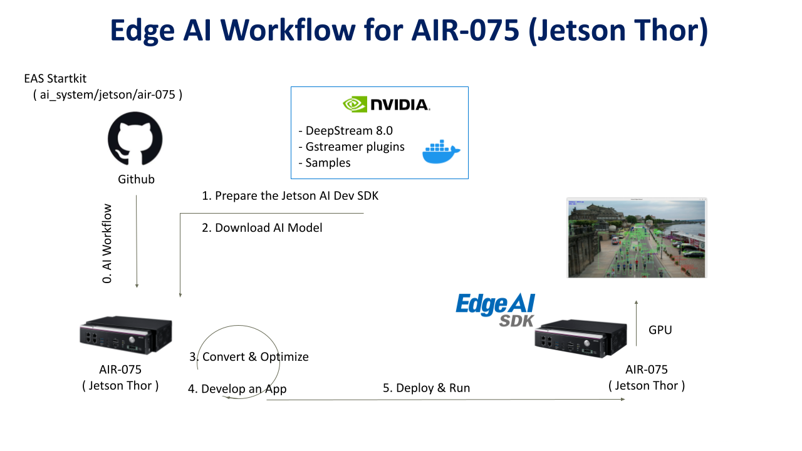
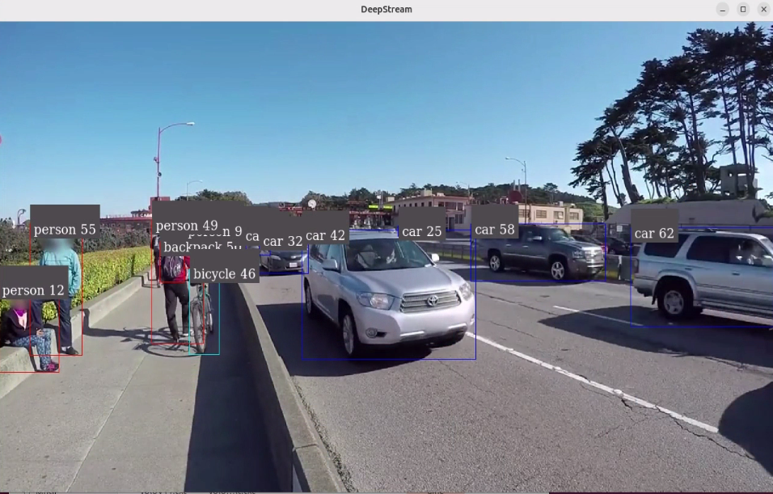

# Create an Object Detection on Jetson-Orin (AIR-075)

---

# Overview
This example will demonstrate how to develop an vision AI Object Detection on Jetosn-Orin ( AIR-075 ) platform.  
Developers can easily complete the Visual AI development by following these steps.  

* Application: Objection Detection  
* Model: YoloV11  
* Input: Video / USB Camera  




- [Pre-Requirements](#pre-requirements) <!-- prerequisite -->
  - [Target](#target) <!-- prerequisite -->
  - [Development](#development) <!-- prerequisite -->
       - [System Requirements](#system-requirements)
       - [Install Edge AI SDK](#install-edge-ai-sdk)
       - [Frameworks](#frameworks)
- [Develop](#develop)<!-- prerequisite -->
  - [Convert AI Model](#convert-ai-model)<!-- prerequisite -->
  - [Application](#application)<!-- prerequisite -->
       - [Build Library](#build-library)
       - [Prepare Files](#prepare-files)
- [Deploy](#deploy)<!-- prerequisite -->
  - [Run](#run)<!-- prerequisite -->

 

# Pre-Requirements
Refer to the following requirements to prepare the target and develop environment.    


## Target
| Item | Content | Note |
| -------- | -------- | -------- |
| Platform |   AIR-075  | Jetson-Orin   |
| SOC  |   Jetson-Orin  | Thor |
| OS/Kernel |  Ubuntu 24.04   | kernel:6.8.12-tegra |
| SDK| JetPack 7.1 / Deepstream 8.0|   |

 

## Development
### System Requirements
It's the same to [Target](#Target)  


### Install Edge AI SDK 
Base on **Target Environment**  
Please install the corresponding version of EdgeAISDK to obtain the following development environment.  
Install :  [Edge AI SDK(AIR-075) install](https://docs.edge-ai-sdk.advantech.com/docs/Hardware/AI_System/Nvidia/Jetson%20Thor/AIR-075#Ub2404_jp7.1)  


### Frameworks 

| Frameworks  | Description  | Note | 
|----------------|-------------|---------------------| 
| JetPack    |  [Description Link](https://developer.nvidia.com/embedded/jetpack) | version: 7.1 | 
| Deepstream |  DeepStream SDK delivers a complete streaming analytics toolkit for AI based video and image understanding and multi-sensor processing. This container is for NVIDIA Enterprise GPUs. |  Docker image : nvcr.io/nvidia/deepstream:8.0-samples-multiarch|
   
 
 
# Develop  
 
The Docker container named **nvcr.io/nvidia/deepstream:8.0-samples-multiarch** is automatically launched after installing EdgeAISDK.  
The container is started with the following command.  


## Convert AI Model 
**Model : yolo11m**   

1. Download [yolo11m.pt link](https://github.com/ultralytics/assets/releases/download/v8.3.0/yolo11m.pt)  
   
  
2. Install the required package for YOLO11 :  
   **Create virtual environment**  
   ```bash
   python3 -m venv convert_onnx  
   source convert_onnx/bin/activate  
   ```
   
   **In virtual environment**  
   ```bash
   pip install ultralytics 
   ``` 
   
   
3. Convert pt to onnx  
   **Export a PyTorch model to ONNX format(creates 'yolo11m.onnx')**  
   **Note: The reference [pt to onnx](https://docs.ultralytics.com/zh/integrations/onnx/#supported-deployment-options)**  
   **In virtual environment and go to yolo11m.pt of directory**  
   ```bash
   yolo export model=yolo11m.pt format=onnx
   ```  


## Application   
### Build Library    

**Host shell**  

1. **Get repository**  
```bash
git clone https://github.com/marcoslucianops/DeepStream-Yolo.git  
``` 

2. **Compile the lib with container**  
   **Be with the "DeepStream-Yolo" in the same directory**  
```bash
docker run -it --rm --runtime=nvidia --network=host \
  -e NVIDIA_DRIVER_CAPABILITIES=compute,utility,video,graphics \
  --gpus all --privileged \
  -e DISPLAY=$DISPLAY \
  -v ./DeepStream-Yolo:/DeepStream-Yolo \
  -v /tmp/.X11-unix:/tmp/.X11-unix \
  -v /etc/X11:/etc/X11 \
  nvcr.io/nvidia/deepstream:8.0-triton-multiarch
``` 

**Docker shell**  
```bash
cd /DeepStream-Yolo  

apt-get install build-essential  

/opt/nvidia/deepstream/deepstream/user_additional_install.sh  

export CPATH=/usr/local/cuda-13.0/targets/aarch64-linux/include:$CPATH  

export LD_LIBRARY_PATH=/usr/local/cuda-13.0/targets/aarch64-linux/lib:$LD_LIBRARY_PATH  

export PATH=/usr/local/cuda-13.0/bin:$PATH  

export CUDA_VER=13.0 

make -C nvdsinfer_custom_impl_Yolo clean && make -C nvdsinfer_custom_impl_Yolo  
**libnvdsinfer_custom_impl_Yolo.so in directory "nvdsinfer_custom_impl_Yolo" after make successfully**  
``` 
   
## Prepare Files
  **Host shell**  
  
 1. $mkdir object-detect-deepstream  
 
 2. $git clone https://github.com/ADVANTECH-Corp/EdgeAI_Workflow.git  
 
 3. copy files below to directory "object-detect-deepstream"  
    a. /EdgeAI_Workflow/ai_system/jetson/air-075/script/labels.txt  
    b. /EdgeAI_Workflow/ai_system/jetson/air-075/script/deepstream_app_config_yoloV11_video.txt (input:video file)  
    c. /EdgeAI_Workflow/ai_system/jetson/air-075/script/deepstream_app_config_yoloV11_usb-camera.txt (input:usb-camera)  
    d. /EdgeAI_Workflow/ai_system/jetson/air-075/script/config_infer_primary_yolo11.txt  
    e. /EdgeAI_Workflow/ai_system/jetson/air-075/script/run_yolo11.sh  
                      
 4. copy yolo11m.onnx (pre-build) and directory "DeepStream-Yolo/nvdsinfer_custom_impl_Yolo" (libnvdsinfer_custom_impl_Yolo.so has existed) to directory "object-detect-deepstream"  
 
 5. object-detect-deepstream included files/directory:  
 ```
object-detect-deepstream/
├── run_yolo11.sh                                      # Prepare Files
├── deepstream_app_config_yoloV11_video.txt            # Prepare Files
├── deepstream_app_config_yoloV11_usb-camera.txt       # Prepare Files
├── config_infer_primary_yolo11.txt                    # Prepare Files
├── labels.txt                                         # Prepare Files
├── yolo11m.onnx                                       # Convert AI Model
├── model_b1_gpu0_fp32.engine                          # Run, generated by DeepStream/TensorRT on first run, optional
└── nvdsinfer_custom_impl_Yolo/                        # Build Library
    └── libnvdsinfer_custom_impl_Yolo.so
 ```
 
 
 
# Deploy 
## Run
  
 **Host shell**  
 Refer to [Prepare Files](#prepare-files)  
 ```bash
 cd object-detect-deepstream 
 ``` 

  **Input is video file**  
 ```bash
 ./run_yolo11.sh  
 ```

  **Input is /dev/video0 (usb-camera)**  
 ```bash
 ./run_yolo11.sh "camera"  
 ```

 **Note: Trying to create engine from model files**  
 **Note: If there is no "engine file",it will generate    "engine file" at first time**  
 
 
 


 

