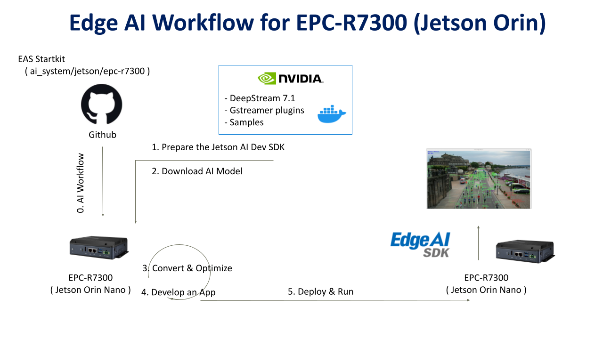
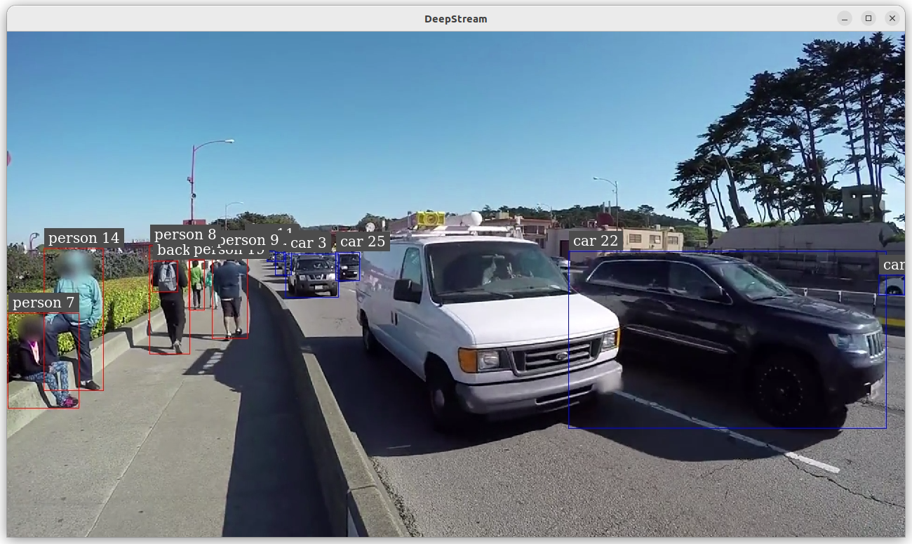

# Create an Object Detection on Jetson-Orin (EPC-R7300)

---

# Overview
This example will demonstrate how to develop an vision AI Object Detection on Jetosn-Orin ( EPC-R7300 ) platform.  
Developers can easily complete the Visual AI development by following these steps.  

* Application: Objection Detection  
* Model: YoloV11  
* Input: Video / USB Camera  

- [Pre-Requirements](#pre-requirements) <!-- prerequisite -->
  - [Target](#target) <!-- prerequisite -->
  - [Development](#development) <!-- prerequisite -->
       - [System Requirements](#system-requirements)  
       - [Install Edge AI SDK](#install-edge-ai-sdk)
       - [Frameworks](#frameworks)
- [Develop](#develop)<!-- prerequisite -->
  - [Convert AI Model](#convert-ai-model)<!-- prerequisite -->
  - [Application](#application)<!-- prerequisite -->
       - [Build Library](#build-library)
       - [Prepare Files](#prepare-files)
- [Deploy](#deploy)<!-- prerequisite -->
  - [Run](#run)<!-- prerequisite -->

 

# Pre-Requirements
Refer to the following requirements to prepare the target and develop environment.    

## Target
| Item | Content | Note |
| -------- | -------- | -------- |
| Platform |   EPC-R7300  | Jetson-Orin   |
| SOC  |   Jetson-Orin  | NX/Nano |
| OS/Kernel |  Ubuntu 22.04 tegra  | kernel:5.15.148 |
| SDK| JetPack 6.2 / Deepstream 7.1|   |

 

## Development
### System Requirements
It's the same to [Target](#Target)  

### Install Edge AI SDK 
Base on **Target Environment**  
Please install the corresponding version of EdgeAISDK to obtain the following development environment.  
Install :  [Edge AI SDK(v3.3.0) install](https://ess-wiki.advantech.com.tw/view/Edge_AI_SDK/Download)  

### Frameworks 

| Frameworks  | Description  | Note | 
|----------------|-------------|---------------------| 
| JetPack    |  [Description Link](https://developer.nvidia.com/embedded/jetpack) | version: 6.2 | 
| Deepstream |  DeepStream SDK delivers a complete streaming analytics toolkit for AI based video and image understanding and multi-sensor processing. This container is for NVIDIA Enterprise GPUs. |  Docker image : nvcr.io/nvidia/deepstream:7.1-samples-multiarch|
   
 
 
# Develop  
 
The Docker container named **nvcr.io/nvidia/deepstream:7.1-samples-multiarch** is automatically launched after installing EdgeAISDK.  
The container is started with the following command.   

## Convert AI Model 
**Model : yolo11m**   

1. Download [yolo11m.pt link](https://github.com/ultralytics/assets/releases/download/v8.3.0/yolo11m.pt)  
   
2. Convert pt to onnx :  
   **Install the required package for YOLO11**  
   $pip install ultralytics  

   **Export a PyTorch model to ONNX format(creates 'yolo11m.onnx')**  
   **Note: The reference [pt to onnx](https://docs.ultralytics.com/zh/integrations/onnx/#supported-deployment-options)**  
   $yolo export model=yolo11m.pt format=onnx  

## Application   
### Build Library      
1. **Get repository**  
**Host shell**  
$git clone https://github.com/marcoslucianops/DeepStream-Yolo.git  
$cd DeepStream-Yolo  

2. **Compile the lib with container**  
$docker run -it --rm --runtime=nvidia --network=host -e NVIDIA_DRIVER_CAPABILITIES=compute,utility,video,graphics --gpus all --privileged -e DISPLAY=$DISPLAY -v ./DeepStream-Yolo:/DeepStream-Yolo -v /tmp/.X11-unix:/tmp/.X11-unix -v /etc/X11:/etc/X11 nvcr.io/nvidia/deepstream:7.1-samples-multiarch  

**Docker shell**  

$cd /DeepStream-Yolo  

$apt-get install build-essential  

$/opt/nvidia/deepstream/deepstream/user_additional_install.sh  

$export CPATH=/usr/local/cuda-12.6/targets/aarch64-linux/include:$CPATH  

$export LD_LIBRARY_PATH=/usr/local/cuda-12.6/targets/aarch64-linux/lib:$LD_LIBRARY_PATH  

$export PATH=/usr/local/cuda-12.6/bin:$PATH  

$export CUDA_VER=12.6  

$make -C nvdsinfer_custom_impl_Yolo clean && make -C nvdsinfer_custom_impl_Yolo  
**libnvdsinfer_custom_impl_Yolo.so in directory "nvdsinfer_custom_impl_Yolo" after make successfully**  
   
   
### Prepare Files
  **Host shell**  
  
 1. $mkdir object-detect-deepstream  
 
 2. $git clone https://github.com/ADVANTECH-Corp/EdgeAI_Workflow.git  
 
 3. copy files: /EdgeAI_Workflow/ai_system/jetson/epc-r7300/script/labels.txt  
                /EdgeAI_Workflow/ai_system/jetson/epc-r7300/script/deepstream_app_config_yoloV11_video.txt (input:video file)  
                /EdgeAI_Workflow/ai_system/jetson/epc-r7300/script/deepstream_app_config_yoloV11_usb-camera.txt (input:usb-camera)  
                /EdgeAI_Workflow/ai_system/jetson/epc-r7300/script/config_infer_primary_yolo11.txt  
                /EdgeAI_Workflow/ai_system/jetson/epc-r7300/script/run_yolo11.sh  
                to directory "object-detect-deepstream"        
 4. copy yolo11m.onnx (pre-build) and directory "DeepStream-Yolo/nvdsinfer_custom_impl_Yolo" (libnvdsinfer_custom_impl_Yolo.so has existed) to directory "object-detect-deepstream"  
 
 5. object-detect-deepstream included files/directory: nvdsinfer_custom_impl_Yolo / config_infer_primary_yolo11.txt /deepstream_app_config_yoloV11_video.txt / deepstream_app_config_yoloV11_usb-camera.txt / labels.txt / run_yolo11.sh / yolo11m.onnx    
 
 
 
# Deploy 
## Run
  
 **Host shell**  
 Refer to [Prepare Files](#prepare-files)  
 $cd object-detect-deepstream  

  **Input is video file**  
=> $ ./run_yolo11.sh  

  **Input is /dev/video0 (usb-camera)**  
 => $ ./run_yolo11.sh "camera"  

 **Note: Trying to create engine from model files**  
 **Note: If there is no "engine file",it will generate    "engine file" at first time**   
 
 
 

 
