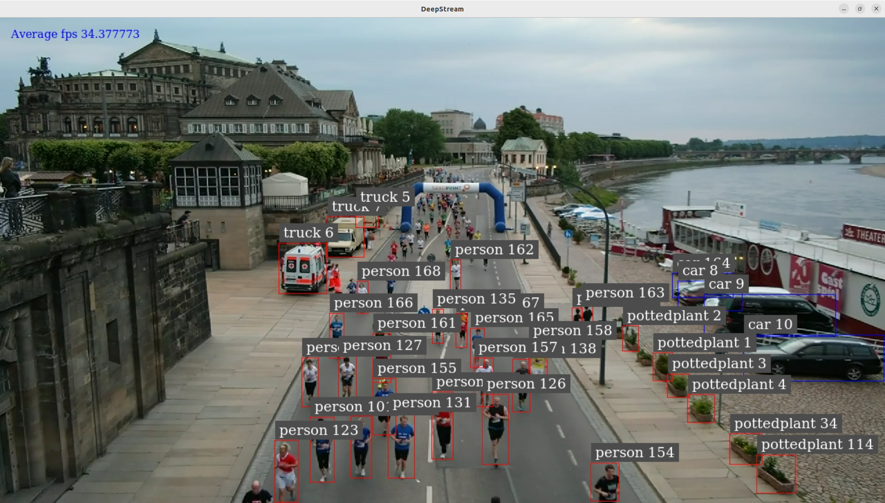

# Create an Object Detection on Jetson-Orin (AIR-030)

---

# Overview
This example will demonstrate how to develop an vision AI Object Detection on Jetosn-Orin ( AIR-030 ) platform.
Developers can easily complete the Visual AI development by following these steps.

* Application: Objection Detection
* Model: YoloV11
* Input: Video / USB Camera

- [Pre-requirements](#Pre-requirements)
  - [Target](#Target)
  - [Development](#Development) 
- [Develop](#Develop)
  - [Prepare your AI Model](#Model)
  - [App](#App) 
- [Deploy](#Deploy)
  - [Application](#Application)

---

<a name="Pre-requirements"/>
 
 

# Pre-requirements
Refer to the following requirements to prepare the target and develop environment.

<a name="Target"/>

## Target
| Item | Content | Note |
| -------- | -------- | -------- |
| Platform |   AIR-030  | Jetson-Orin   |
| SOC  |   Jetson-Orin  | AGX-Orin |
| OS/Kernel |  Ubuntu 22.04 tegra  | kernel:5.15.136 |
| SDK| JetPack 6.0 / Deepstream 7.0|   |

<a name="Development"/>

## Development

### System requirements
It's the same to [Target](#Target)
 

### Install Edge AI SDK v3.3.0
Base on **Target Environment**  
Please install the corresponding version of EdgeAISDK to obtain the following development environment.
> Install :  [Edge AI SDK install link](https://ess-wiki.advantech.com.tw/view/Edge_AI_SDK/Download)

 

#### AI Frameworks & Environment

| Frameworks  | Description  | Note | 
|----------------|-------------|---------------------| 
| JetPack    |  [Description Link](https://developer.nvidia.com/embedded/jetpack) | version: 6.0 | 
| Deepstream |  DeepStream SDK delivers a complete streaming analytics toolkit for AI based video and image understanding and multi-sensor processing. This container is for NVIDIA Enterprise GPUs. |  Docker image : nvcr.io/nvidia/deepstream:7.0-samples-multiarch|
   
 

---

<a name="Develop"/>
 
 

# Develop

The Docker container named **nvcr.io/nvidia/deepstream:7.0-samples-multiarch** is automatically launched after installing EdgeAISDK v3.3.0.  
The container is started with the following command. 
 
<a name="Model"/>

## Prepare your AI Model 
**Model : yolo11m**
 
 

1. Download yolo11m.pt:
   The [source model link] (https://github.com/ultralytics/assets/releases/download/v8.3.0/yolo11m.pt)
 
2. Conver pt to onnx :
   # Install the required package for YOLO11
    $pip install ultralytics
   # Export a YOLO11n PyTorch model to ONNX format
    $yolo export model=yolo11m.pt format=onnx # creates 'yolo11m.onnx'
    
Note: The reference [pt to onnx] https://docs.ultralytics.com/zh/integrations/onnx/#supported-deployment-options

      
<a name="App"/>

## App
Sample app: 
 

 

---
 

<a name="Deploy"/>

# Deploy
Launch an AI application.

<a name="Application"/>

## Run Application
### Objection Detection (Yolo11m)
#### 
 
 
 
 
 

---

>
