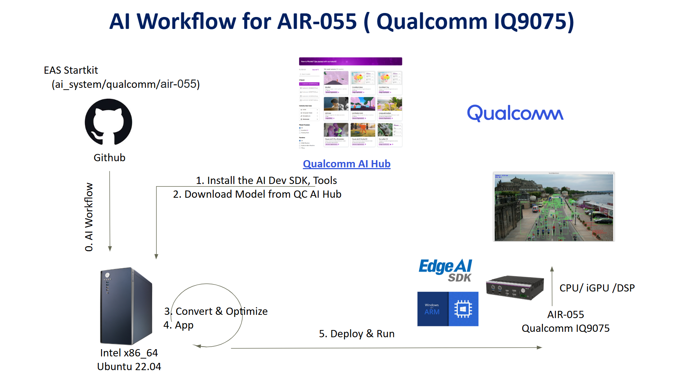
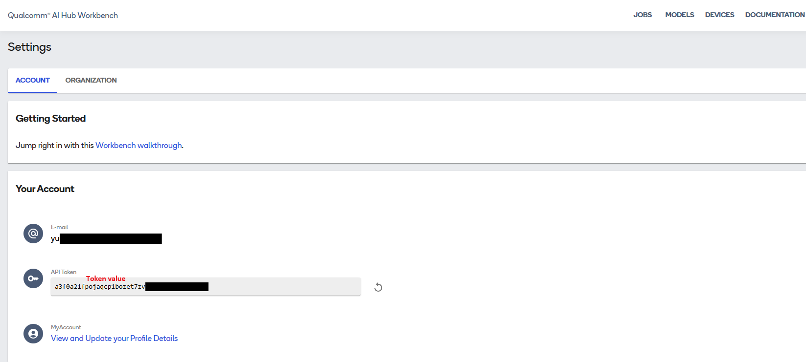

Developing an Object Detection Model on AIR-055 (Qualcomm/IQ9075) Using Qualcomm AI-Hub
===

This example demonstrates how to develop a vision AI model using the Qualcomm AI-Hub on the AIR-055 (Qualcomm IQ9075) platform.
This guide walks developers through the complete workflow for building a Vision AI application—from model generation to deployment on the AIR-055 device.


* Application: Object Detection
* Model: YOLOv11-Quantized
* Input: Video / USB Camera  



## Table of Contents

- [Environment](#environment)
  - [Target](#target)
  - [System Setup on AIR-055](#system-setup-on-air-055)
  - [Install Edge AI SDK](#install-edge-ai-sdk)
- [Development Flow](#development-flow)
  - [Generate Model via Qualcomm AI Hub](#generate-model-via-qualcomm-ai-hub)
  - [Build the Application](#build-the-application)
- [Execution](#execution)
  - [Run on CPU](#run-on-cpu)
  - [Run on iGPU](#run-on-igpu)
  - [Run on NPU](#run-on-npu)

# Environment

Refer to the following requirements to prepare both the target device and the development environments.

## Target

| Item | Content | Note |
| -------- | -------- | -------- |
| SOC | Qualcomm IQ9075 ||
| Accelerator | NPU | |
| OS/Build | Ubuntu 24.04.3 LTS| |
| SDK |  Qualcomm AI Runtime SDK 2.41.0  | |

## AI Inference Framework

| AI Frameworks | Version | Description |
| -------- | -------- | -------- |
| SNPE     |    v2.41.0.251128   | The Qualcomm® Neural Processing SDK is a Qualcomm Snapdragon software accelerated runtime for the execution of deep neural networks. With Qualcomm® Neural Processing SDK : <br> * Execute an arbitrarily deep neural network <br> * Execute the network on the Snapdragon CPU, the Adreno GPU or the Hexagon NPU. <br> * Debug the network execution on Ubuntu Linux  <br> * Convert PyTorch, TFLite, ONNX, and TensorFlow models to a Qualcomm® Neural Processing SDK Deep Learning Container (DLC) file  <br> * Quantize DLC files to 8 or 16 bit fixed point for running on the Hexagon NPU  <br> * Debug and analyze the performance of the network with Qualcomm® Neural Processing SDK tools  <br> * Integrate a network into applications and other code via C++ |

---

## System Setup on AIR-055

##### Step 1. System Setup & Virtual Environment

```
# Install System Dependencies
sudo apt update
sudo apt install git vim python3-pip python3.12-venv -y

# Restore kernel upgrade limitation
sudo rm -f /etc/apt/preferences.d/adv_disable_kernel_upgrade
sudo apt update

sudo apt install  build-essential cmake -y 
cat <<EOF | sudo tee /etc/apt/preferences.d/adv_disable_kernel_upgrade > /dev/null
Package: linux-*
Pin: release o=Ubuntu
Pin-Priority: -1

Package: linux-*
Pin: release a=now
Pin-Priority: 1001
EOF

# Install opencv and gflags
cd ~
git clone https://github.com/ADVANTECH-Corp/EdgeAI_Workflow.git
cd ~/EdgeAI_Workflow/ai_system/qualcomm/air-055/script
chmod +x ./run.sh
./run.sh

# Setup Workspace and Venv
cd  ~/EdgeAI_Workflow/ai_system/qualcomm/air-055
mkdir -p ai-hub
cd ai-hub
python3 -m venv ai-hub
source ai-hub/bin/activate

# Install Base Python Libraries
pip install qai-hub==0.48.0
pip install "qai-hub-models[yolov11-det]"==0.50.2
```

##### Step 2. Configure Qualcomm AI Hub

* Get API Token:
  Log in to Qualcomm AI Hub and retrieve your API Token.
  `(Text in red is a sample; do not use the actual token shown.)`

  

* Configure Tool:
  ```
  qai-hub configure --api_token <YOUR_API_TOKEN>
  ```

##### Step 3. Patch Quantization Code

* Modify the quantization sampling logic in the installed library.

  ```
  vim ~/EdgeAI_Workflow/ai_system/qualcomm/air-055/ai-hub/ai-hub/lib/python3.12/site-packages/qai_hub_models/utils/quantization.py
  ```

* Modify line 177 of `quantization.py` to read:
  ```
  num_samples = int(num_samples or dataset.default_num_calibration_samples())
  ```

### Install Edge AI SDK

* Base on Target Environment
* Please install the corresponding version of EdgeAISDK to obtain the following development environment.  
* Install :  Edge AI SDK(v3.6.1)
<!-- * Install :  [Edge AI SDK(v3.6.1) install](https://happy-coast-0a2494f00.2.azurestaticapps.net/docs/Hardware/AI_System/Qualcomm/AOM-DK2721-Windows)   -->

# Development Flow

> Note: An active internet connection is required for the entire development flow.

The recommended workflow is:

1. **Model Generation**: Use Qualcomm AI Hub to export the YOLOv11 model as a quantized `DLC` file.

2. **Application Build**: Build the Linux sample application.

## Generate Model via Qualcomm AI Hub

<!-- The Edge AI SDK on the target device already includes a pre-quantized DLC model. No manual generation is required. -->
##### Step 1. Export the YOLOv11n model to a quantized DLC

* Activate ai-hub venv
  ```
  cd ~/EdgeAI_Workflow/ai_system/qualcomm/air-055/ai-hub
  source ai-hub/bin/activate
  ```

* Export `yolov11_det.dlc`
  ```
  python3 -m qai_hub_models.models.yolov11_det.export \
    --quantize w8a16 \
    --target-runtime qnn_dlc \
    --chipset qualcomm-qcs9075 \
    --output-dir ~/EdgeAI_Workflow/ai_system/qualcomm/air-055/ai-hub \
    --height 320 \
    --width 320 \
    --num-calibration-samples 1000
  ```

##### Step 2. Confirm the generated model location

The exported model **yolov11_det.dlc** will be generated on the same `AIR-055` device, for example path:

```
~/EdgeAI_Workflow/ai_system/qualcomm/air-055/ai-hub/yolov11_det-qnn_dlc-w8a16/yolov11_det.dlc
```

---

## Build the Application

##### Step 1. Execute `build.sh` to generate the executable

```
cd ~/EdgeAI_Workflow/ai_system/qualcomm/air-055/code/AI-Hub/object-detect

chmod +x build.sh
./build.sh
```

- If the build fails, check the paths below:
  ```
  set(OpenCV_DIR_INCLUDE "${HOME_DIR}/aisdk/opencv/include" "${HOME_DIR}/aisdk/opencv/include/opencv4")
  set(OpenCV_DIR_LIB     "${HOME_DIR}/aisdk/opencv/lib")
  set(gFLAG_DIR_INCLUDE  "${HOME_DIR}/aisdk/gflags/include")
  set(gFLAG_DIR_LIB      "${HOME_DIR}/aisdk/gflags/lib")
  set(SNPE_SDK_DIR       "/opt/qcom/aistack/qairt/2.41.0.251128")
  set(SNPE_PLATFORM_STR  "aarch64-oe-linux-gcc11.2")
  set(SNPE_LIB_DIR       "${SNPE_SDK_DIR}/lib/${SNPE_PLATFORM_STR}")
  set(SNPE_INCLUDE_DIR   "${SNPE_SDK_DIR}/include/SNPE")
  ```

##### Step 2. Confirm the build output

After a successful build, the executable will be generated at:

```
~/EdgeAI_Workflow/ai_system/qualcomm/air-055/code/AI-Hub/object-detect/build/yolov11-object
```

---

# Execution

### Step 1. Prepare required files

* Create a new folder
  ```
  mkdir ~/yolov11-object
  ```

* Copy `yolov11_det.dlc`, `yolov11-object`, and the required files to `~/yolov11-object`
  ```
  cp ~/EdgeAI_Workflow/ai_system/qualcomm/air-055/ai-hub/yolov11_det-qnn_dlc-w8a16/yolov11_det.dlc ~/yolov11-object
  cp ~/EdgeAI_Workflow/ai_system/qualcomm/air-055/code/AI-Hub/object-detect/build/yolov11-object ~/yolov11-object
  cp /opt/Advantech/EdgeAI/System/Qualcomm_IQ9/VisionAI/app/exe/coco.txt ~/yolov11-object
  cp -r /opt/Advantech/EdgeAI/System/Qualcomm_IQ9/VisionAI/lib ~/yolov11-object/lib
  cp /opt/Advantech/EdgeAI/Main/Data/video/ObjectDetection.mp4 ~/yolov11-object
  ```

### Step 2. Run

- Launch the container:

  ```
  cd ~/yolov11-object

  xhost + 

  docker run --rm -it -e DISPLAY=$DISPLAY \
    --name ubuntu_2404_iq9 \
    -w /yolov11-object \
    -v /opt/qcom/aistack/qairt/2.41.0.251128:/opt/qcom/aistack/qairt/2.41.0.251128 \
    -v /tmp/.X11-unix:/tmp/.X11-unix \
    -v $(pwd):/yolov11-object \
    --privileged \
    -v /sys/:/sys/ \
    -v /run/:/run/ \
    --device=/dev/video0 \
    --device=/dev/video1 \
    ubuntu_2404:iq9 /bin/bash
  ```

- Set the environment variables inside the container:

  ```
  export QAIRT_ROOT="/opt/qcom/aistack/qairt/2.41.0.251128/lib"
  export ADSP_LIBRARY_PATH="${QAIRT_ROOT}/hexagon-v73/unsigned"
  export LD_LIBRARY_PATH="${QAIRT_ROOT}/aarch64-oe-linux-gcc11.2:/yolov11-object/lib:${LD_LIBRARY_PATH}"
  export PATH="${QAIRT_ROOT}/aarch64-oe-linux-gcc11.2:${PATH}"
  ```
##### Run on CPU

- Run with USB Camera:
  ```
  ./yolov11-object \
    --model="yolov11_det.dlc" \
    --input=0 \
    --layer-names="/Concat,/Cast,/ReduceMax" \
    --conf=0.1 \
    --iou=0.45 \
    --device=CPU
  ```

- Run with Video File:
  ```
  ./yolov11-object \
    --model="yolov11_det.dlc" \
    --input=/yolov11-object/ObjectDetection.mp4 \
    --layer-names="/Concat,/Cast,/ReduceMax" \
    --conf=0.1 \
    --iou=0.45 \
    --device=CPU
  ```
- Result
  

##### Run on iGPU

- Run with USB Camera:
  ```
  ./yolov11-object \
    --model="yolov11_det.dlc" \
    --input=0 \
    --layer-names="/Concat,/Cast,/ReduceMax" \
    --conf=0.1 \
    --iou=0.45 \
    --device=GPU
  ```

- Run with Video File:
  ```
  ./yolov11-object \
    --model="yolov11_det.dlc" \
    --input=/yolov11-object/ObjectDetection.mp4 \
    --layer-names="/Concat,/Cast,/ReduceMax" \
    --conf=0.1 \
    --iou=0.45 \
    --device=GPU
  ```
- Result
  

##### Run on NPU

- Run with USB Camera:
  ```
  ./yolov11-object \
    --model="yolov11_det.dlc" \
    --input=0 \
    --layer-names="/Concat,/Cast,/ReduceMax" \
    --conf=0.1 \
    --iou=0.45 \
    --device=DSP
  ```

- Run with Video File:
  ```
  ./yolov11-object \
    --model="yolov11_det.dlc" \
    --input=/yolov11-object/ObjectDetection.mp4 \
    --layer-names="/Concat,/Cast,/ReduceMax" \
    --conf=0.1 \
    --iou=0.45 \
    --device=DSP
  ```
- Result
  
