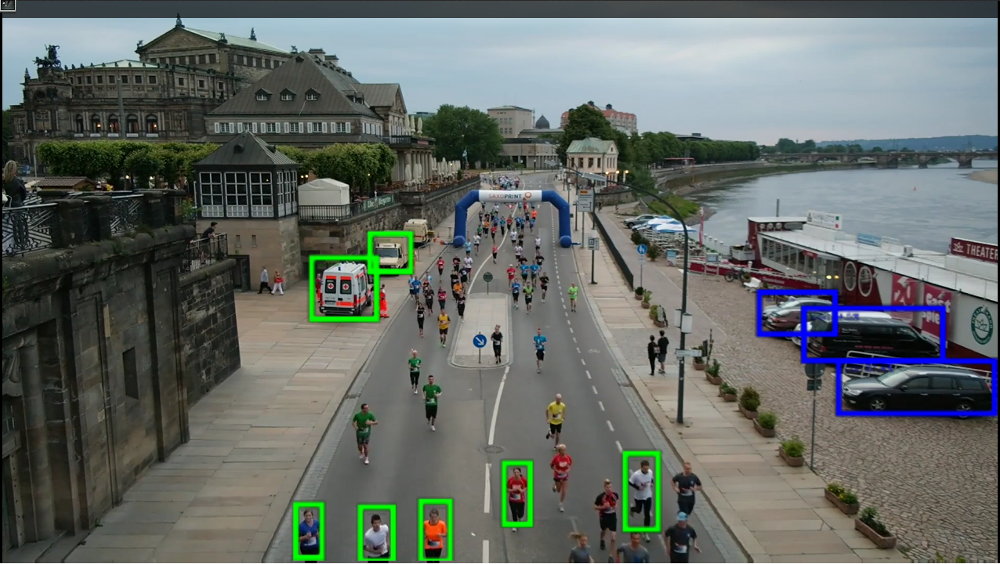
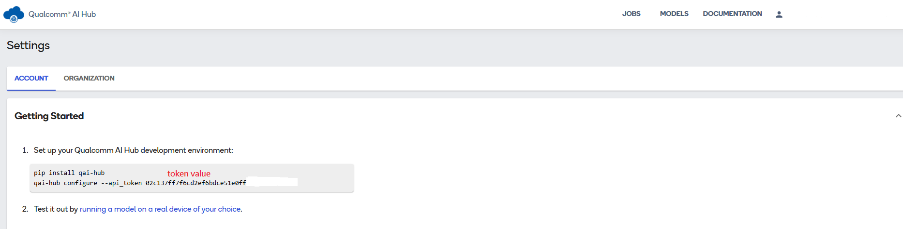

# Create an Object Detection on AOM-2721 ( Qualcomm/QCS6490 )
This example will demonstrate how to develop an vision AI Object Detection on AOM-2721 ( Qualcomm QCS6490 ) platform.
Developers can easily complete the Visual AI development by following these steps.

* Application: Objection Detection
* Model: Yolo
* Input: Video / USB Camera

# Table of Contents
- [Environment](#Environment)
  - [Target](#Target)
  - [Development](#Development) 
- [Develop Flow](#DevelopFlow)
  - [Qualcomm AI Hub](#QC_AI_Hub)
  - [Open AI Model](#Open_AI_Model)
- [Deploy](#Deploy)
  - [Application](#Application)

<a name="Environment"/>

# Environment
Refer to the following requirements to prepare the target and develop environment.

<a name="Target"/>

## Target
| Item | Content | Note |
| -------- | -------- | -------- |
| Platform / RAM / Disk |  Arm64 Cortex-A55    |      |
| SOC | Qualcomm QCS6490 | |
| Accelerator | DSP | |
| OS/Kernel | LE/QIRP1.1 Yocto-4.0 / 6.6.28 | |
| BSP | 2721A1AIM38LIV11033 | |

AI Inference Framework

| AI Frameworks | Version | Description | 
| -------- | -------- | -------- | 
| SNPE     | v2.20.0.240223    | The Qualcomm® Neural Processing SDK is a Qualcomm Snapdragon software accelerated runtime for the execution of deep neural networks. With Qualcomm® Neural Processing SDK :   * Execute an arbitrarily deep neural network   * Execute the network on the Snapdragon CPU, the Adreno GPU or the Hexagon DSP.   * Debug the network execution on x86 Ubuntu Linux    * Convert PyTorch, TFLite, ONNX, and TensorFlow models to a Qualcomm® Neural Processing SDK Deep Learning Container (DLC) file    * Quantize DLC files to 8 or 16 bit fixed point for running on the Hexagon DSP    * Debug and analyze the performance of the network with Qualcomm® Neural Processing SDK tools    * Integrate a network into applications and other code via C++ or Java |
| Gstreamer     |  1.16.3   | GStreamer is a library for constructing graphs of media-handling components. The applications it supports range from simple Ogg/Vorbis playback, audio/video streaming to complex audio (mixing) and video (non-linear editing) processing. |

<a name="Development"/>

## Development
System requirements
| Item | Content | Note |
| -------- | -------- | -------- |
| Platform | Intel 10 ~ 13th CPU   |  x86_64    |
| OS/Kernel | Ubuntu 20.04 | * Python 3.8 |

AI Development SDK 
| Item | Introduction |  Install |
| -------- | -------- | -------- |
|   SNPE   |  Qualcomm Snapdragon software accelerated runtime for the execution of deep neural networks (for inference) with SNPE, users can:Convert Caffe, Caffe2, TensorFlow, PyTorch and TFLite models to a SNPE deep learning container (DLC) fileQuantize DLC files to 8bit/16bit fixed point for execution on the Qualcomm® Hexagon™ DSP/HVX HTA Integrate a network into applications and other code via C++ or Java Execute the network on the Snapdragon CPU, the Qualcomm® AdrenoTM GPU, or the Hexagon DSP with HVX* and HMX* support, Execute an arbitrarily deep neural network Debug the network model execution on x86 Ubuntu Linux Debug and analyze the performance of the network model with SNPE tools Benchmark a network model for different targets  |     

How to intsll the SNPE on x86_x64 host machine
1. Sign Up Qualcomm Account My Account (qualcomm.com): https://myaccount.qualcomm.com/signup

2. Download and Install Qualcomm Package Manager 3: https://qpm.qualcomm.com/#/main/tools/details/QPM3

3. Download and Install Qualcomm® AI Engine Direct SDK: https://qpm.qualcomm.com/#/main/tools/details/qualcomm_ai_engine_direct

4. Download and Install Qualcomm® Neural Processing SDK: https://qpm.qualcomm.com/#/main/tools/details/qualcomm_neural_processing_sdk

5. Install ML frameworks:
    - pip install onnx==1.11.0
    - pip install tensorflow==2.10.1
    - pip install torch==1.13.1"

<a name="DevelopFlow"/>

# Develop Flow
Follow these steps on the development platform (x86_64) to obtain a pre-trained AI model from the Qualcomm AI Hub or an open AI model, then optimize and convert it for the AOM-2721 (QCS6490) device.  
 
<a name="Open_AI_Model"/>

## Open AI Model 
- 1. Download Model (pt) 
     [yolov5n.pt](https://github.com/ultralytics/yolov5/releases/download/v7.0/yolov5n.pt)
     on https://github.com/ultralytics/yolov5
     
- 2. Convert (pt -> onnx)  
     - step-1: git clone https://github.com/ultralytics/yolov5
     - step-2: cd yolov5
     - step-3: pip install -r requirements.txt   
     - step-4: python export.py --weights yolov5n.pt --include onnx

- 3. Convert & Optimize (onnx -> dlc), Refer to document below: 
      - step-1: To download file: [Reference Document Link](https://docs.qualcomm.com/bundle/publicresource/KBA-240222225148_REV_1_Quick_Start_Demo_of_SNPE_Yolov5_in_6490.pdf)
      - step-2: To execute the step1 to step6 of the download file. 
     
 
<a name="Deploy"/>

# Deploy
Copy the optimized AI model to target device and  launch an AI application with gstream pipeline.

<a name="Application"/>

## Application
| Device   | Command  | Introduction  |
| -------- | -------- | ------------- |
| AOM-2721 |   gst-launch-1.0 -e qtivcomposer name=mixer sink_1::dimensions="<1920,1080>" ! queue ! waylandsink sync=true fullscreen=false x=10 y=10 width=1280 height=720 v4l2src device="/dev/video0"  ! tee name=t ! queue ! mixer. t. ! queue ! qtimlvconverter mean="<0.0, 0.0, 0.0>" sigma="<0.003921, 0.003921, 0.003921>" ! queue ! qtimlsnpe delegate=dsp model="yolov5n-quant.dlc" layers="< Conv_266, Conv_232, Conv_198 >" ! queue ! qtimlvdetection threshold=51.0 results=10 module=yolov5 labels="yolov5.labels" ! video/x-raw,width=480,height=270 ! queue ! mixer. | Run on dsp (usb camera) |
| AOM-2721 | gst-launch-1.0 -e qtivcomposer name=mixer sink_1::dimensions="<1920,1080>" ! queue ! waylandsink sync=true fullscreen=false x=10 y=10 width=1280 height=720 filesrc  location="file.mp4" ! qtdemux ! queue ! h264parse ! v4l2h264dec capture-io-mode=5 output-io-mode=5 ! queue ! tee name=t ! queue ! mixer.  t. ! queue ! qtimlvconverter mean="<0.0, 0.0, 0.0>" sigma="<0.003921, 0.003921, 0.003921>" ! queue ! qtimlsnpe delegate=dsp model="yolov5n-quant.dlc" layers="< Conv_266, Conv_232, Conv_198 >" ! queue !  qtimlvdetection threshold=51.0 results=10 module=yolov5 labels="yolov5.labels" ! video/x-raw,width=480,height=270 ! queue ! mixer. | Run on dsp (video file) |
## Result

 
 
# Qualcomm AI Hub Models Run on AOM-2721(Qualcomm/QCS6490)

This example will demonstrate how to develop an vision AI model from Qualcomm AI Hub on AOM-2721 ( Qualcomm QCS6490 ) platform.
Developers can easily complete the Visual AI development by following these steps.

 Application: Objection Detection
* Model: YOLOv8-Detection-Quantized
* Input: Video / USB Camera  

# Table of Contents
- [Environment](#Environment-AI-Hub)
  - [Target](#Target-AI-Hub)
  - [Development](#Development-AI-Hub) 
  - [AI Hub On Host](#How-To-Use-AI-Hub)
- [Deploy](#Deploy-AI-Hub)
  - [Application](#Application-AI-Hub)

<a name="Environment-AI-Hub"/>

# Environment
Refer to the following requirements to prepare the target and develop environment.

<a name="Target-AI-Hub"/>

## Target
| Item | Content | Note |
| -------- | -------- | -------- |
| Platform / RAM / Disk |  Arm64 Cortex-A55    |      |
| SOC | Qualcomm QCS6490 | |
| Accelerator | DSP | |
| OS/Kernel | LE/QIRP1.1 Yocto-4.0 / 6.6.28 | |
| BSP |  qcs6490aom2721a1  | |

AI Inference Framework

| AI Frameworks | Version | Description | 
| -------- | -------- | -------- | 
| SNPE     |    v2.20.0.240223  | The Qualcomm® Neural Processing SDK is a Qualcomm Snapdragon software accelerated runtime for the execution of deep neural networks. With Qualcomm® Neural Processing SDK :   * Execute an arbitrarily deep neural network   * Execute the network on the Snapdragon CPU, the Adreno GPU or the Hexagon DSP.   * Debug the network execution on x86 Ubuntu Linux    * Convert PyTorch, TFLite, ONNX, and TensorFlow models to a Qualcomm® Neural Processing SDK Deep Learning Container (DLC) file    * Quantize DLC files to 8 or 16 bit fixed point for running on the Hexagon DSP    * Debug and analyze the performance of the network with Qualcomm® Neural Processing SDK tools    * Integrate a network into applications and other code via C++ or Java |
| Gstreamer     |  1.20.7   | GStreamer is a library for constructing graphs of media-handling components. The applications it supports range from simple Ogg/Vorbis playback, audio/video streaming to complex audio (mixing) and video (non-linear editing) processing. |

<a name="Development-AI-Hub"/>

## Development
System requirements
| Item | Content | Note |
| -------- | -------- | -------- |
| Platform | Intel 10 ~ 13th CPU   |  x86_64    |
| OS/Kernel | Ubuntu 22.04 | * Python 3.10 |

<a name="How-To-Use-AI-Hub"/>

### How to use the AI-Hub on x86_x64 host machine
1. * Sign Up / Login  (Qualcomm AI Hub) 
    https://app.aihub.qualcomm.com/

2. * To get token (**red color / it's sample and not for real**) 
     

3. * Install AI-Hub Tool:
     sudo apt install git
     sudo apt install python3-pip -y
     sudo pip install qai-hub
  
4. * Install AI-Hub Model: 
     qai-hub configure --api_token  **token-value**     # refer to step 2
     pip install "qai-hub-models[yolov8-det-quantized]"
     python3 -m qai_hub_models.models.yolov8_det_quantized.export

5. * Get Model (.tflite)
   -> build/yolov8_det_quantized/yolov8_det_quantized.tflite

6. * Create label file 
     ****** save contents below to **coco_labels.txt** ******
      person
      bicycle
      car
      motorcycle
      airplane
      bus
      train
      truck
      boat
      traffic light
      fire hydrant
      stop sign
      parking meter
      bench
      bird
      cat
      dog
      horse
      sheep
      cow
      elephant
      bear
      zebra
      giraffe
      backpack
      umbrella
      handbag
      tie
      suitcase
      frisbee
      skis
      snowboard
      sports ball
      kite
      baseball bat
      baseball glove
      skateboard
      surfboard
      tennis racket
      bottle
      wine glass
      cup
      fork
      knife
      spoon
      bowl
      banana
      apple
      sandwich
      orange
      broccoli
      carrot
      hot dog
      pizza
      donut
      cake
      chair
      couch
      potted plant
      bed
      dining table
      toilet
      tv
      laptop
      mouse
      remote
      keyboard
      cell phone
      microwave
      oven
      toaster
      sink
      refrigerator
      book
      clock
      vase
      scissors
      teddy bear
      hair drier
      toothbrush

 
 
 
<a name="Deploy-AI-Hub"/>

# Deploy
Copy the optimized AI model (yolov8_det_quantized.tflite is created based on previous step) to target device and  launch an AI application with gstream pipeline.

<a name="Application-AI-Hub"/>

## Application
| Device   | Command  | Introduction  |
| -------- | -------- | ------------- |
| AOM-2721 | gst-launch-1.0 -e v4l2src device="/dev/video2" ! queue ! tee name=split split. ! queue ! qtivcomposer name=mixer sink_1::dimensions="<640,480>" sink_1::alpha=0.5 ! queue ! waylandsink fullscreen=false width=1280 height=720 split. ! queue ! qtivtransform ! video/x-raw (memory:GBM\),format=NV12,width=640,height=480 ! qtimlvconverter ! queue ! qtimltflite delegate=external external-delegate-path=libQnnTFLiteDelegate.so external-delegate-options="QNNExternalDelegate,backend_type=htp;" model=yolov8_det_quantized.tflite ! queue ! qtimlvdetection threshold=10.0 results=10 module=yolov8 labels=coco_labels.txt constants="YOLOv8,q-offsets=<20.0, 0.0, 0.0>,q-scales=<3.1391797, 0.0037510, 1.0>;" ! video/x-raw,format=BGRA,width=640,height=360 ! queue ! mixer. | Run on dsp (usb camera) |
| AOM-2721 | gst-launch-1.0 -e filesrc location="ObjectDetection.mp4" ! qtdemux ! queue ! h264parse ! v4l2h264dec capture-io-mode=5 output-io-mode=5 ! queue ! tee name=split split. ! queue ! qtivcomposer name=mixer sink_1::dimensions="<640,480>" sink_1::alpha=0.5 ! queue ! waylandsink fullscreen=false width=1280 height=720 split. ! queue ! qtivtransform ! video/x-raw\(memory:GBM\),format=NV12,width=640,height=480 ! qtimlvconverter ! queue ! qtimltflite delegate=external external-delegate-path=libQnnTFLiteDelegate.so external-delegate-options="QNNExternalDelegate,backend_type=htp;" model=yolov8_det_quantized.tflite ! queue ! qtimlvdetection threshold=31.0 results=5 module=yolov8 labels=coco_labels.txt constants="YOLOv8,q-offsets=<20.0, 0.0, 0.0>,q-scales=<3.1391797,0.0037510, 1.0>;" ! video/x-raw,format=BGRA,width=640,height=360 ! queue ! mixer. | Run on dsp (video file) |

## Result

  
