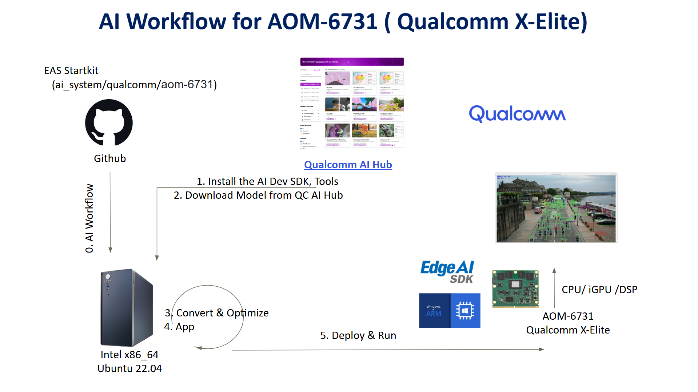
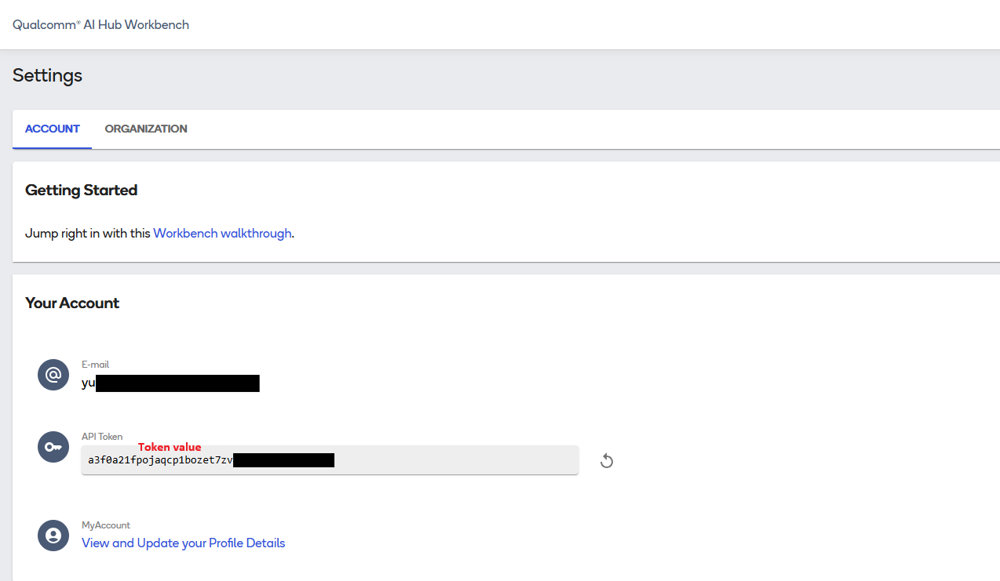
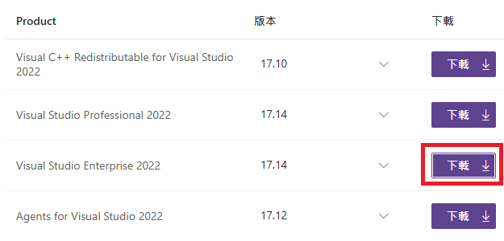
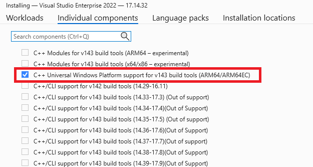
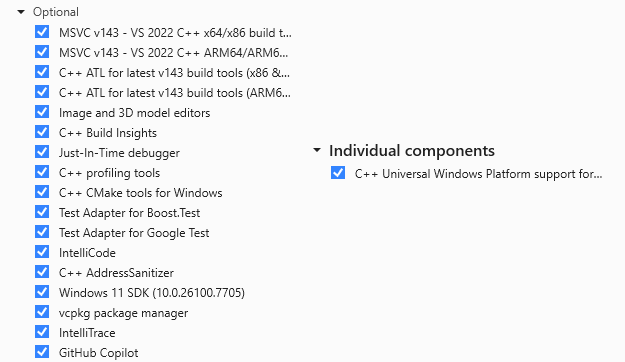
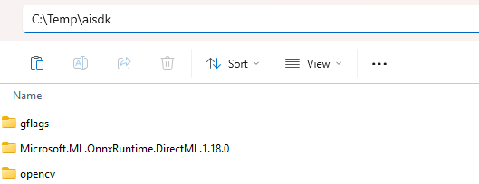
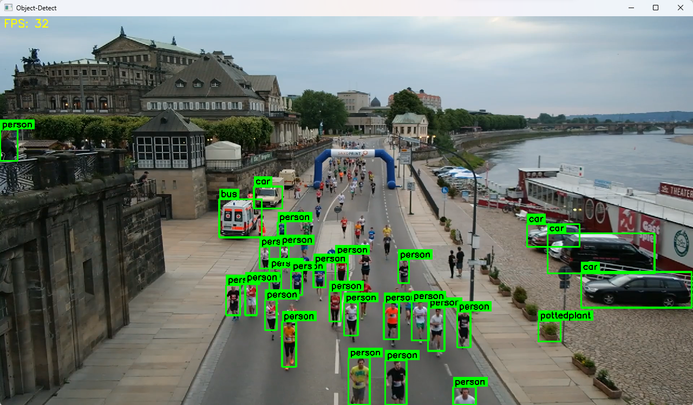
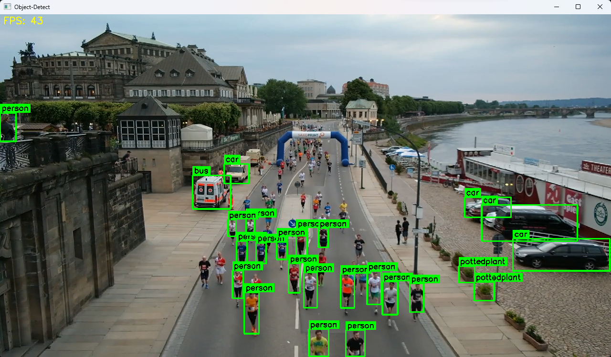
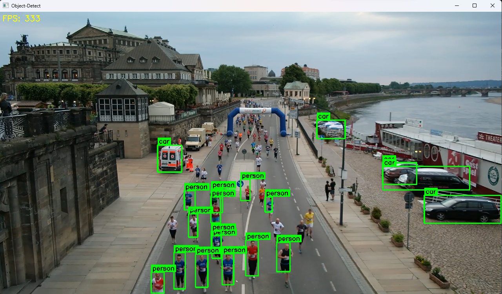

Developing an Object Detection Model on AOM-6731 (Qualcomm/X-Elite) using Qualcomm AI-Hub
===
This example demonstrates how to develop a vision AI model using the Qualcomm AI-Hub on the AOM-6731 (Qualcomm X-Elite) platform.
This guide walks developers through the complete workflow for building a Vision AI application—from model generation to deployment on the AOM-6731 device.

* Application: Object Detection
* Model: YOLOv11-ONNX / YOLOv11-Quantized
* Input: Video / USB Camera  


## Table of Contents 
- [Environment](#environment) 
  - [Target](#target) 
  - [Development Environment Setup](#development-environment-setup)
    - [Setup on Ubuntu 22.04 (x86_64) host machine](#setup-on-ubuntu-2204-x86_64-host-machine)
    - [Setup on AOM-6731](#setup-on-aom-6731)
    - [Install Edge AI SDK ](#install-edge-ai-sdk)
- [Development Flow](#development-flow) 
  - [How to use Qualcomm AI Hub on an Ubuntu 22.04 (x86_64) host machine](#how-to-use-qualcomm-ai-hub-on-an-ubuntu-2204-x86_64-host-machine) 
    - [Get the ONNX model for CPU/iGPU](#get-the-onnx-model-for-cpuigpu) 
    - [Get the DLC model for NPU](#get-the-dlc-model-for-npu) 
  - [How to Develop on AOM-6731](#how-to-develop-on-aom-6731) 
    - [For CPU / iGPU](#for-cpu--igpu) 
    - [For NPU](#for-npu) 
- [Deploy](#deploy)
  - [Run CPU / iGPU](#run-cpuigpu) 
  - [Run NPU](#run-npu)

# Environment
Refer to the following requirements to prepare both the target device and the development environments.


## Target
| Item | Content | Note |
| -------- | -------- | -------- |
| SOC | Qualcomm X-Elite ||
| Accelerator | NPU | |
| OS/Build | Windows 11 IoT Enterprise(ARM64) | |
| SDK |  Qualcomm AI Runtime SDK 2.43.0  | |

## AI Inference Framework

| AI Frameworks | Version | Description | 
| -------- | -------- | -------- | 
| SNPE     |    v2.43.0.260128   | The Qualcomm® Neural Processing SDK is a Qualcomm Snapdragon software accelerated runtime for the execution of deep neural networks. With Qualcomm® Neural Processing SDK : <br> * Execute an arbitrarily deep neural network <br> * Execute the network on the Snapdragon CPU, the Adreno GPU or the Hexagon NPU. <br> * Debug the network execution on x86 Ubuntu Linux  <br> * Convert PyTorch, TFLite, ONNX, and TensorFlow models to a Qualcomm® Neural Processing SDK Deep Learning Container (DLC) file  <br> * Quantize DLC files to 8 or 16 bit fixed point for running on the Hexagon NPU  <br> * Debug and analyze the performance of the network with Qualcomm® Neural Processing SDK tools  <br> * Integrate a network into applications and other code via C++ |


## Development Environment Setup

| Development Phase | OS | Platform | Requirements |
| :--- | :--- | :--- | :--- |
| Model Generation | Ubuntu 22.04 | x86_64 (Intel 10~13th) | Python 3.10 |

---

## System Setup on Ubuntu 22.04 (x86_64) Host Machine

##### Step 1. System Setup & Virtual Environment

```
# Install System Dependencies
sudo apt update
sudo apt install git vim python3-pip python3.10-venv -y


# Setup Workspace and Venv
cd ~
git clone https://github.com/ADVANTECH-Corp/EdgeAI_Workflow.git
cd  ~/EdgeAI_Workflow/ai_system/qualcomm/aom-6731
mkdir -p ai-hub
cd ai-hub
python3 -m venv ai-hub
source ai-hub/bin/activate

# Install Base Python Libraries
pip install qai-hub
pip install "qai-hub-models[yolov11-det]"
```
##### Step 2. Configure Qualcomm AI Hub
* Get API Token: 
  Log in to Qualcomm AI Hub and retrieve your API Token. 
  `(Text in red is a sample; do not use the actual token shown.)`

  

* Configure Tool:
   ```
   qai-hub configure --api_token <YOUR_API_TOKEN>
   ```

---
## System Setup on AOM-6731

##### Step 1. Install Visual Studio & CMake
* Install Git: [Git for Windows/x64 Setup](https://git-scm.com/install/windows)
* Install CMake: [CMake 3.30.4](https://cmake.org/files/v3.30/cmake-3.30.4-windows-arm64.msi)
* Install Visual Studio 2022(with `Desktop development with C++` workload)
    * Download [Visual Studio Enterprise 2022](https://my.visualstudio.com/Downloads?q=visual%20studio%202022&wt.mc_id=o~msft~vscom~older-downloads) and install.
    
    *  Select `Desktop development with C++` workload and install.
    *  Go to `Individual components` and check:

        
    *  Ensure your installation matches:
    
        

##### Step 2. Build Dependency Libraries
* Clone Repository:
    ```
    git clone https://github.com/ADVANTECH-Corp/EdgeAI_Workflow.git
    cd "EdgeAI_Workflow\ai_system\qualcomm\aom-6731\script"
    ```
* Run Build Script:
    This downloads and builds the required dependency libraries (OpenCV 4.11 and gflags) into `"C:\temp\aisdk"`.
    ```
    .\run.bat
    ```

##### Step 3. Manual Library Setup

* Install ONNX Runtime DirectML 1.18.0:
    * Download [Microsoft.ML.OnnxRuntime.DirectML.1.18.0](https://github.com/microsoft/onnxruntime/releases/download/v1.18.0/Microsoft.ML.OnnxRuntime.DirectML.1.18.0.zip), unzip to `"C:\temp\aisdk"` and rename the folder to exactly `Microsoft.ML.OnnxRuntime.DirectML.1.18.0`.
* Expected Result: 

    


### Install Edge AI SDK

* Base on Target Environment
* Please install the corresponding version of EdgeAISDK to obtain the following development environment.  
* Install :  [Edge AI SDK(v3.6.3) install](https://docs.edge-ai-sdk.advantech.com/docs/Hardware/AI_System/Qualcomm/X-Elite/AOM-6731#Win11_snpe243)  

---

# Development Flow

>Note: An active internet connection is required for the entire development flow.
## How to use Qualcomm AI Hub on an Ubuntu 22.04 (x86_64) host machine
### Get the ONNX model for CPU/iGPU
##### Step 1. Convert the YOLOv11n model to yolo11n.onnx
* Activate ai-hub venv
  ```
  cd  ~/EdgeAI_Workflow/ai_system/qualcomm/aom-6731/ai-hub
  source ai-hub/bin/activate
  ```
* Get yolo11n.onnx
  ```
  yolo export model=yolo11n.pt format=onnx opset=13 
  ```
##### Step 2. Transfer the Model to the Target Device
Copy the ONNX AI model(`yolo11n.onnx`) to target device

---

### Get the DLC model for NPU
<!-- The Edge AI SDK on the target device already includes a pre-quantized DLC model. No manual generation is required. -->

##### Step 1. Convert the YOLOv11n model to yolov11_det.dlc
* Activate ai-hub venv
  ```
  cd  ~/EdgeAI_Workflow/ai_system/qualcomm/aom-6731/ai-hub
  source ai-hub/bin/activate
  ```
* Get yolov11_det.dlc
  ```
  python3 -m qai_hub_models.models.yolov11_det.export \
    --quantize float \
    --target-runtime qnn_dlc \
    --chipset qualcomm-snapdragon-x-elite \
    --output-dir ~/EdgeAI_Workflow/ai_system/qualcomm/aom-6731/ai-hub \
    --height 320 \
    --width 320
  ```

##### Step 2. Transfer the Model to the Target Device
Copy the optimized AI model(`yolov11_det.dlc`) to target device

---

## How to Develop on AOM-6731

### For CPU/iGPU

##### Step 1. Clone repo
```
git clone https://github.com/ADVANTECH-Corp/EdgeAI_Workflow.git

cd "EdgeAI_Workflow\ai_system\qualcomm\AOM-6731\code\cpu_igpu\object-detect"
```
##### Step 2. Execute `build.bat` to generate the executable
```
build.bat
```
* If the build fails, verify the directory paths defined in "CMakeLists.txt" are correct.
  ```
  set(OpenCV_DIR_INCLUDE          "C:\\Temp\\aisdk\\opencv\\include")
  set(OpenCV_DIR_LIB              "C:\\Temp\\aisdk\\opencv\\ARM64/vc17\\lib")
  set(gFLAG_DIR_INCLUDE           "C:\\Temp\\aisdk\\gflags\\mybuild\\build\\include")
  set(gFLAG_DIR_LIB               "C:\\Temp\\aisdk\\gflags\\mybuild\\build\\lib")
  set(ONNXRUNTIME_QNN_DIR_INCLUDE "C:\\Temp\\aisdk\\Microsoft.ML.OnnxRuntime.DirectML.1.18.0\\build\\native\\include")
  set(ONNXRUNTIME_QNN_DIR_LIB     "C:\\Temp\\aisdk\\Microsoft.ML.OnnxRuntime.DirectML.1.18.0\\runtimes\\win-arm64\\native")
  ```

##### Step 3. Confirm the build output
After a successful build, the executable will be generated at:

```
EdgeAI_Workflow\ai_system\qualcomm\AOM-6731\code\cpu_igpu\object-detect\build\Release\yolov11-object-cpu-igpu.exe
```


---

### For NPU
##### Step 1. Clone repo
```
git clone https://github.com/ADVANTECH-Corp/EdgeAI_Workflow.git

cd "EdgeAI_Workflow\ai_system\qualcomm\AOM-6731\code\npu\object-detect"
```
##### Step 2.  Execute `build.bat` to generate the executable
```
build.bat
```
* If the build fails, verify the directory paths defined in "CMakeLists.txt" are correct.
  ```
  set(OpenCV_DIR_INCLUDE "C:\\Temp\\aisdk\\opencv\\include")
  set(OpenCV_DIR_LIB     "C:\\Temp\\aisdk\\opencv\\ARM64\\vc17\\lib")
  set(gFLAG_DIR_INCLUDE  "C:\\Temp\\aisdk\\gflags\\mybuild\\build\\include")
  set(gFLAG_DIR_LIB      "C:\\Temp\\aisdk\\gflags\\mybuild\\build\\lib")
  set(SNPE_SDK_DIR       "C:\\qairt\\2.43.0.260128") 
  set(SNPE_LIB_DIR       "${SNPE_SDK_DIR}\\lib\\aarch64-windows-msvc")
  set(SNPE_INCLUDE_DIR   "${SNPE_SDK_DIR}\\include\\SNPE")
  ```

##### Step 3. Confirm the build output
After a successful build, the executable will be generated at:

```
EdgeAI_Workflow\ai_system\qualcomm\AOM-6731\code\npu\object-detect\build\Release\yolov11-object-npu-aihub.exe
```
---

# Deploy

### Run CPU/iGPU

> Note: Please execute the following commands in a `PowerShell` terminal.

##### Step 1. Prepare required files

* Create a new folder
  ```
  mkdir "C:\temp\cpu-igpu"
  ```
* Copy `yolo11n.onnx` (refer to [Get the ONNX model for CPU/iGPU](#get-the-onnx-model-for-cpuigpu)) and `yolov11-object-cpu-igpu.exe` (refer to [For CPU/iGPU](#for-cpuigpu)) to `"C:\temp\cpu-igpu"`


* Copy the necessary files to `"C:\temp\cpu-igpu"`.
  ```
  Copy-Item "C:\Program Files\Advantech\EdgeAI\System\Qualcomm_XElite\VisionAI\app\cpu_igpu\coco.txt" -Destination "C:\temp\cpu-igpu" -Force
  Copy-Item "C:\Program Files\Advantech\EdgeAI\System\Qualcomm_XElite\VisionAI\app\cpu_igpu\onnxruntime.dll" -Destination "C:\temp\cpu-igpu" -Force   
  Copy-Item "C:\Program Files\Advantech\EdgeAI\System\Qualcomm_XElite\VisionAI\lib\*" -Destination "C:\temp\cpu-igpu" -Recurse -Force
  Copy-Item "C:\Program Files\Advantech\EdgeAI\Main\Data\video\ObjectDetection.mp4" -Destination "C:\temp\cpu-igpu" -Recurse -Force
  ```

##### Step 2. Run
* Run on CPU
  ```
  cd "C:\temp\cpu-igpu"
  ```
  * Run with USB Camera
    ```
    .\yolov11-object-cpu-igpu.exe  --device CPU --model .\yolov11n.onnx --input 0
    ```
  * Run with Video File
    ```
    .\yolov11-object-cpu-igpu.exe  --device CPU --model .\yolov11n.onnx --input .\ObjectDetection.mp4
    ```
* Run on iGPU
  ```
  cd "C:\temp\cpu-igpu"
  ```
  * Run with USB Camera
    ```
    .\yolov11-object-cpu-igpu.exe  --device GPU --model .\yolov11n.onnx --input 0
    ```
  * Run with Video File
    ```
    .\yolov11-object-cpu-igpu.exe  --device GPU --model .\yolov11n.onnx --input .\ObjectDetection.mp4
    ```

  * Result on CPU
  

  * Result on iGPU
  

---

### Run NPU

> Note: Please execute the following commands in a `PowerShell` terminal.

##### Step 1. Prepare required files
* Create a new folder
  ```
  mkdir "C:\temp\npu-aihub"
  ```
* Copy `yolov11_det.dlc` to `"C:\temp\npu-aihub"`
  ```
  Copy-Item "C:\Program Files\Advantech\EdgeAI\System\Qualcomm_XElite\VisionAI\app\npu\yolov11n-imgsz_320-float-2_43.dlc" -Destination "C:\temp\npu-aihub" -Force
  Rename-Item "C:\temp\npu-aihub\yolov11n-imgsz_320-float-2_43.dlc" "yolov11_det.dlc"
  ```
* Copy `yolov11-object-npu-aihub.exe` (refer to [For NPU](#for-npu)) to `"C:\temp\npu-aihub"`


* Copy the necessary files to `"C:\temp\npu-aihub"`.
  ```
  Copy-Item "C:\Program Files\Advantech\EdgeAI\System\Qualcomm_XElite\VisionAI\app\cpu_igpu\coco.txt" -Destination "C:\temp\npu-aihub" -Force
  Copy-Item "C:\Program Files\Advantech\EdgeAI\System\Qualcomm_XElite\VisionAI\lib\*" -Destination "C:\temp\npu-aihub" -Recurse -Force
  Copy-Item "C:\Program Files\Advantech\EdgeAI\Main\Data\video\ObjectDetection.mp4" -Destination "C:\temp\npu-aihub" -Recurse -Force
  ```


##### Step 2. Run 
* Set the environment variables
  ```
  Set-ExecutionPolicy Bypass -Scope Process -Force 
  . "C:\Qualcomm\AIStack\QAIRT\2.43.0.260128\bin\envsetup.ps1"
  ```

* Run on NPU 
  ```
  cd "C:\temp\npu-aihub"
  ```
  * Run with USB Camera
    ```
    .\yolov11-object-npu-aihub.exe `
    --model .\yolov11_det.dlc `
    --device DSP `
    --labels .\coco.txt `
    --conf 0.1 `
    --iou 0.45 `
    --layer-names "/Concat,/Cast,/ReduceMax" `
    --input 0
    ```
  * Run with Video File
    ```
    .\yolov11-object-npu-aihub.exe `
    --model .\yolov11_det.dlc `
    --device DSP `
    --labels .\coco.txt `
    --conf 0.1 `
    --iou 0.45 `
    --layer-names "/Concat,/Cast,/ReduceMax" `
    --input .\ObjectDetection.mp4
    ```

  * Result
  


