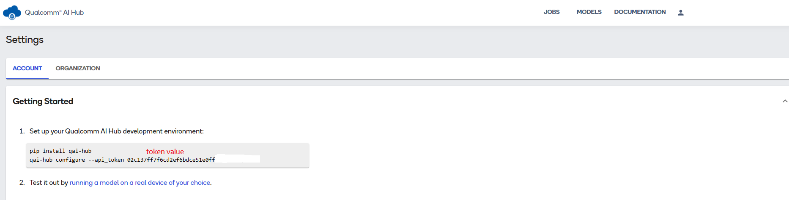
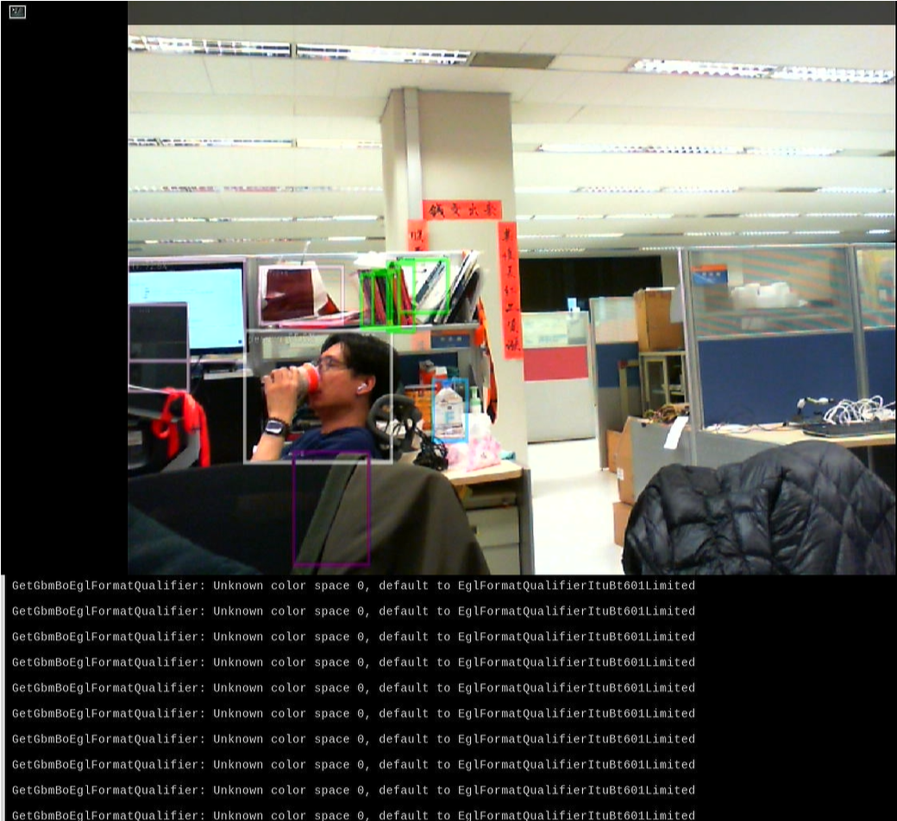

# Create an Object Detection Demo on AOM-DK2721(Qualcomm/QCS6490) using Qualcomm AI Hub

This example will demonstrate how to develop an vision AI model from Qualcomm AI Hub on AOM-DK2721 ( Qualcomm QCS6490 ) platform.
Developers can easily complete the Visual AI development by following these steps.

 Application: Objection Detection
* Model: YOLOv8-Detection-Quantized
* Input: Video / USB Camera  

# Table of Contents
- [Environment](#Environment-AI-Hub)
  - [Target](#Target-AI-Hub)
  - [Development](#Development-AI-Hub)
- [Develop Flow](#DevelopFlow)
  - [AI Hub On Host](#How-To-Use-AI-Hub)
- [Deploy](#Deploy-AI-Hub)
  - [Application](#Application-AI-Hub)

<a name="Environment-AI-Hub"/>

# Environment
Refer to the following requirements to prepare the target and develop environment.

<a name="Target-AI-Hub"/>

## Target
| Item | Content | Note |
| -------- | -------- | -------- |
| Platform / RAM / Disk |  Arm64 Cortex-A55    |      |
| SOC | Qualcomm QCS6490 | |
| Accelerator | DSP | |
| OS/Kernel | LE/QIRP1.1 Yocto-4.0 / 6.6.28 | |
| BSP |  qcs6490aom2721a1  | |

AI Inference Framework

| AI Frameworks | Version | Description | 
| -------- | -------- | -------- | 
| SNPE     |    v2.20.0.240223  | The Qualcomm® Neural Processing SDK is a Qualcomm Snapdragon software accelerated runtime for the execution of deep neural networks. With Qualcomm® Neural Processing SDK :   * Execute an arbitrarily deep neural network   * Execute the network on the Snapdragon CPU, the Adreno GPU or the Hexagon DSP.   * Debug the network execution on x86 Ubuntu Linux    * Convert PyTorch, TFLite, ONNX, and TensorFlow models to a Qualcomm® Neural Processing SDK Deep Learning Container (DLC) file    * Quantize DLC files to 8 or 16 bit fixed point for running on the Hexagon DSP    * Debug and analyze the performance of the network with Qualcomm® Neural Processing SDK tools    * Integrate a network into applications and other code via C++ or Java |
| Gstreamer     |  1.20.7   | GStreamer is a library for constructing graphs of media-handling components. The applications it supports range from simple Ogg/Vorbis playback, audio/video streaming to complex audio (mixing) and video (non-linear editing) processing. |

<a name="Development-AI-Hub"/>

## Development
System requirements
| Item | Content | Note |
| -------- | -------- | -------- |
| Platform | Intel 10 ~ 13th CPU   |  x86_64    |
| OS/Kernel | Ubuntu 22.04 | * Python 3.10 |

<a name="DevelopFlow"/>

# Develop Flow
Follow these steps on the development platform (x86_64) to obtain a pre-trained AI model from the Qualcomm AI Hub, then optimize and convert it for the AOM-DK2721 (QCS6490) device.  

<a name="How-To-Use-AI-Hub"/>

## How to use the AI-Hub on x86_x64 host machine
Step 1. Sign Up / Login  (Qualcomm AI Hub)  
     https://app.aihub.qualcomm.com/

Step 2. To get token (**red color / it's sample and not for real**)   
     

Step 3. Install AI-Hub Tool: 
    $ sudo apt install git  
    $ sudo apt install python3-pip -y  
    $ sudo pip install qai-hub  
  
Step 4. Install AI-Hub Model: 
    $ qai-hub configure --api_token  **token-value(refer to Step 2)**  
    $ pip install "qai-hub-models[yolov8-det]"  
    $ python3 -m qai_hub_models.models.yolov8_det.export --quantize w8a8  

Step 5. Get Model (.tflite) 
    $ build/yolov8_det/yolov8_det.tflite  

Step 6. To re-name  (.tflite) 
    $ mv yolov8_det.tflite yolov8_det_quantized.tflite

Step 7. To get label file: 
    $ git clone https://github.com/ADVANTECH-Corp/EdgeAI_Workflow.git  
    => EdgeAI_Workflow/ai_system/qualcomm/aom-dk2721/labels/coco_labels.txt  
 
<a name="Deploy-AI-Hub"/>

# Deploy
Copy the optimized AI model (yolov8_det_quantized.tflite is created based on previous step) to target device and  launch an AI application with gstream pipeline.

<a name="Application-AI-Hub"/>

## Application
| Device   | Command  | Introduction  |
| -------- | -------- | ------------- |
| AOM-DK2721 | export XDG_RUNTIME_DIR=/dev/socket/weston && export WAYLAND_DISPLAY=wayland-1   source /opt/qcom/qirp-sdk/qirp-setup.sh   gst-launch-1.0 -e v4l2src device="/dev/video2" ! queue ! tee name=split split. ! queue ! qtivcomposer name=mixer sink_1::dimensions="<640,480>" sink_1::alpha=0.5 ! queue ! waylandsink fullscreen=false width=1280 height=720 split. ! queue ! qtivtransform ! video/x-raw (memory:GBM\),format=NV12,width=640,height=480 ! qtimlvconverter ! queue ! qtimltflite delegate=external external-delegate-path=libQnnTFLiteDelegate.so external-delegate-options="QNNExternalDelegate,backend_type=htp;" model=yolov8_det_quantized.tflite ! queue ! qtimlvdetection threshold=10.0 results=10 module=yolov8 labels=coco_labels.txt constants="YOLOv8,q-offsets=<20.0, 0.0, 0.0>,q-scales=<3.1391797, 0.0037510, 1.0>;" ! video/x-raw,format=BGRA,width=640,height=360 ! queue ! mixer. | Run on dsp (usb camera) |
| AOM-DK2721 | export XDG_RUNTIME_DIR=/dev/socket/weston && export WAYLAND_DISPLAY=wayland-1   source /opt/qcom/qirp-sdk/qirp-setup.sh   gst-launch-1.0 -e filesrc location="ObjectDetection.mp4" ! qtdemux ! queue ! h264parse ! v4l2h264dec capture-io-mode=5 output-io-mode=5 ! queue ! tee name=split split. ! queue ! qtivcomposer name=mixer sink_1::dimensions="<640,480>" sink_1::alpha=0.5 ! queue ! waylandsink fullscreen=false width=1280 height=720 split. ! queue ! qtivtransform ! video/x-raw\(memory:GBM\),format=NV12,width=640,height=480 ! qtimlvconverter ! queue ! qtimltflite delegate=external external-delegate-path=libQnnTFLiteDelegate.so external-delegate-options="QNNExternalDelegate,backend_type=htp;" model=yolov8_det_quantized.tflite ! queue ! qtimlvdetection threshold=31.0 results=5 module=yolov8 labels=coco_labels.txt constants="YOLOv8,q-offsets=<20.0, 0.0, 0.0>,q-scales=<3.1391797,0.0037510, 1.0>;" ! video/x-raw,format=BGRA,width=640,height=360 ! queue ! mixer. | Run on dsp (video file) |

## Download Script Files 
   To get applications for script files.  
   
   $ git clone https://github.com/ADVANTECH-Corp/EdgeAI_Workflow.git  

   ### prerequisite 
   1. yolov8_det_quantized.tflite : in the working directory
   2. coco_labels.txt : in the working directory
      
   To run with usb-camera  
   => EdgeAI_Workflow/ai_system/qualcomm/aom-dk2721/script/yolov8_cam_ai_hub.sh  
   
   To run with video files (Any mp4 files named "ObjectDetection.mp4" in the working directory)  
   => EdgeAI_Workflow/ai_system/qualcomm/aom-dk2721/script/yolov8_videofile_ai_hub.sh  

## Result (usb camera)
 
