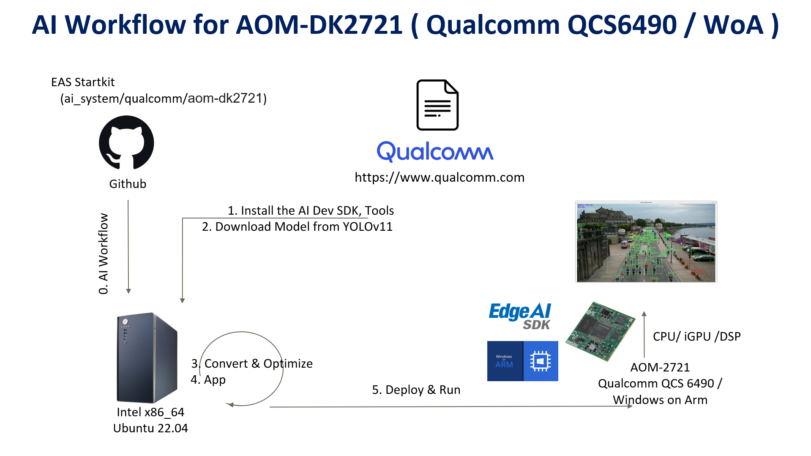
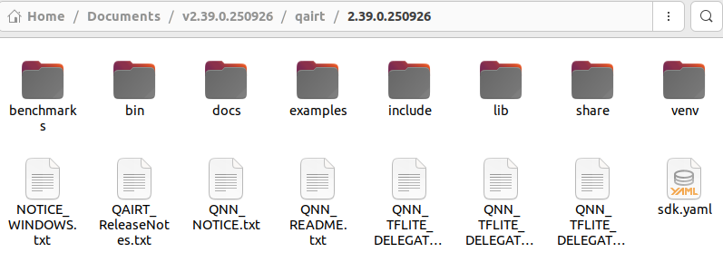
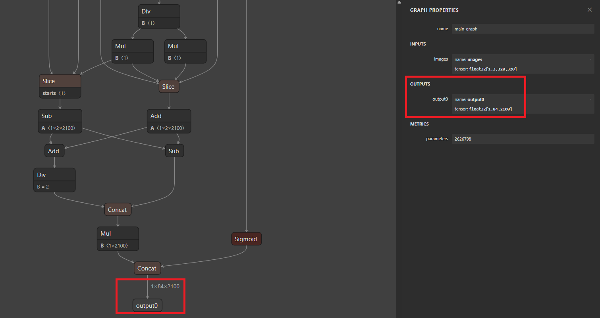
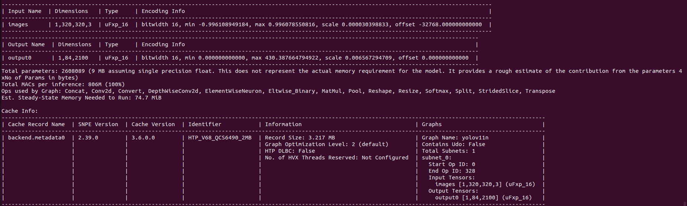
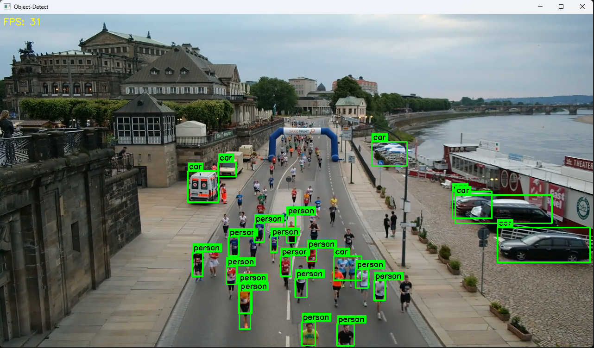

Developing an Object Detection Model on AOM-DK2721 (Qualcomm/QCS6490) using Qualcomm SNPE
===
This example demonstrates how to develop a vision AI model using the Qualcomm SNPE on the AOM-DK2721 (Qualcomm QCS6490) platform.
Developers can easily complete the Vision AI development by following these steps.

* Application: Object Detection
* Model: YOLOv11-ONNX / YOLOv11-Quantized
* Input: Video / USB Camera  


## Table of Contents 

- [Environment](#environment) 
  - [Target](#target) 
  - [Development Environment Setup](#development-environment-setup)
    - [Setup on Ubuntu 22.04 (x86_64) host machine](#setup-on-ubuntu-2204-x86_64-host-machine)
    - [Setup on Windows 11 (x86_64) host machine](#setup-on-windows-11-x86_64-host-machine)
- [Development Flow](#development-flow) 
  - [How to use Qualcomm SNPE on an Ubuntu 22.04 (x86_64) host machine](#how-to-use-qualcomm-snpe-on-an-ubuntu-2204-x86_64-host-machine) 
    - [Get the ONNX model for CPU/iGPU](#get-the-onnx-model-for-cpuigpu) 
    - [Get the DLC model for NPU](#get-the-dlc-model-for-npu) 
  - [How to Develop on a Windows 11 (x86_64) host machine](#how-to-develop-on-a-windows-11-x86_64-host-machine) 
    - [For CPU / iGPU](#for-cpu--igpu) 
    - [For NPU](#for-npu) 
- [Deploy](#deploy)
  - [Install Edge AI SDK ](#install-edge-ai-sdk)
  - [Run CPU / iGPU](#run-cpuigpu) 
  - [Run NPU](#run-npu)


# Environment

Refer to the following requirements to prepare the target and develop environments.


## Target

| Item | Content | Note |
| -------- | -------- | -------- |
| SOC | Qualcomm QCS6490 | |
| Accelerator | NPU | |
| OS/Build | Windows 11 IoT Enterprise(ARM64) | |
| SDK |  Qualcomm AI Runtime SDK 2.39.0  | |

## AI Inference Framework

| AI Frameworks | Version | Description | 
| -------- | -------- | -------- | 
| SNPE     |    v2.39.0.250926   | The Qualcomm® Neural Processing SDK is a Qualcomm Snapdragon software accelerated runtime for the execution of deep neural networks. With Qualcomm® Neural Processing SDK : <br> * Execute an arbitrarily deep neural network <br> * Execute the network on the Snapdragon CPU, the Adreno GPU or the Hexagon NPU. <br> * Debug the network execution on x86 Ubuntu Linux  <br> * Convert PyTorch, TFLite, ONNX, and TensorFlow models to a Qualcomm® Neural Processing SDK Deep Learning Container (DLC) file  <br> * Quantize DLC files to 8 or 16 bit fixed point for running on the Hexagon NPU  <br> * Debug and analyze the performance of the network with Qualcomm® Neural Processing SDK tools  <br> * Integrate a network into applications and other code via C++ |


## Development Environment Setup

| Development Phase | OS | Platform |Requirements|
| -------- | -------- | -------- | -------- |
| Model Generation | Ubuntu 22.04   | x86_64 (Intel 10~13th) | Python 3.10 |
| App Development  | Windows 11     | x86_64 (Intel 10~13th) | Visual Studio 2022,CMake 3.30.4|

---

#### Setup on Ubuntu 22.04 (x86_64) Host Machine
##### Step 1. System Setup & Virtual Environment
 ```
  # Install System Dependencies
  sudo apt update
  sudo apt install git python3-pip vim -y

  # Setup Workspace and Venv
  mkdir -p ~/snpe
  cd ~/snpe
  python3 -m venv snpe
  source snpe/bin/activate

  # Install Base Python Libraries
  pip install ultralytics==8.3.216 \
  fiftyone==1.11.0 \
  onnx==1.12.0 \
  onnxruntime==1.17.1 \
  onnxsim==0.4.36 \
  numpy==1.26.4 \
  opencv-python==4.6.0.66 \
  opencv-python-headless==4.6.0.66
  ```

##### Step 2. Download [Qualcomm AISDK 2.39.0.250926](https://qpm.qualcomm.com/#/main/tools/details/Qualcomm_AI_Runtime_Community)  and extract it to `"~/Documents"`

> To download Qualcomm AI Runtime SDK from Qualcomm Package Manager, ensure that you have registered for a Qualcomm ID. If you don’t have a Qualcomm ID, you will be prompted to register. Then follow the instructions below to download and install the SDK.



#### Setup on Windows 11 (x86_64) Host Machine

##### Step 1. Install Visual Studio & CMake
* Install Git: [Git for Windows/x64 Setup](https://git-scm.com/install/windows)
* Install CMake: [CMake 3.30.4](https://cmake.org/files/v3.30/cmake-3.30.4-windows-x86_64.msi)
* Install Visual Studio 2022(with `Desktop development with C++` workload)
    * Download [Visual Studio Enterprise 2022](https://my.visualstudio.com/Downloads?q=visual%20studio%202022&wt.mc_id=o~msft~vscom~older-downloads) and install.
    
    *  Select `Desktop development with C++` workload and install.
    *  Go to `Individual components` and check:

        
    *  Ensure your installation matches:
    
        

##### Step 2. Build Dependency Libraries
* Clone Repository:
    ```
    git clone https://github.com/ADVANTECH-Corp/EdgeAI_Workflow.git
    cd "EdgeAI_Workflow\ai_system\qualcomm\aom-dk2721\windows\script"
    ```
* Run Build Script:
    This will install OpenCV 4.11, gflags, into `"C:\temp\aisdk"`.
    ```
    .\run.bat
    ```

##### Step 3. Manual Library Setup

* Install ONNX Runtime DirectML 1.18.0:
    * Download [Microsoft.ML.OnnxRuntime.DirectML.1.18.0](https://github.com/microsoft/onnxruntime/releases/download/v1.18.0/Microsoft.ML.OnnxRuntime.DirectML.1.18.0.zip), unzip to `"C:\temp\aisdk"` and rename the folder to exactly `Microsoft.ML.OnnxRuntime.DirectML.1.18.0`.
    * Expected Result: 

       
* Qualcomm AI Runtime SDK:
    * Download: [Qualcomm AISDK 2.39.0.250926](https://qpm.qualcomm.com/#/main/tools/details/Qualcomm_AI_Runtime_Community) and Extract to `"C:\qairt\2.39.0.250926"`.

      >To download Qualcomm AI Runtime SDK from Qualcomm Package Manager, ensure that you have registered for a Qualcomm ID. If you don’t have a Qualcomm ID, you will be prompted to register. Then follow the instructions below to download and install the SDK.

    * Expected Result: 

      

---


# Development Flow
>Note: An active internet connection is required for the entire development flow.

Follow these steps on the development platform (x86_64) to prepare a pre-trained AI model and use the Qualcomm SNPE toolchain to optimize and convert it for the AOM-DK2721 (QCS6490) device.

The development workflow follows a cross-platform approach to leverage Qualcomm SNPE-based tools for model optimization and a Windows environment for application development. The process consists of three main stages:

1. `Model Generation (Ubuntu Host)`: Use Qualcomm SNPE tools on Linux to convert and optimize the YOLOv11 model into ONNX (for CPU/iGPU) or DLC (for NPU) formats.

2. `Application Development (Windows Host)`: Compile the C++ inference application using Visual Studio and the Qualcomm AI Runtime SDK.


## How to use Qualcomm SNPE on an Ubuntu 22.04 (x86_64) host machine

### Get the ONNX model for CPU/iGPU

##### Step 1. Convert the YOLOv11n model to yolov11n.onnx

```
cd ~/snpe
source snpe/bin/activate

mkdir -p ~/yolov11n
cd ~/yolov11n
yolo export model=yolo11n.pt format=onnx opset=13 
```
##### Step 2. Transfer the Model to the Target Device

Copy the ONNX AI model(`yolo11n.onnx`) to target device


---

### Get the DLC model for NPU

##### Step 1. Set Qualcomm AISDK

```
cd ~/Documents/v2.39.0.250926/qairt/2.39.0.250926
export SNPE_ROOT=`pwd`
source ${SNPE_ROOT}/bin/envsetup.sh
cd ~/snpe
source snpe/bin/activate
```

##### Step 2. Convert the YOLOv11n model to yolo11n.onnx
```
yolo export model=yolo11n.pt format=onnx opset=13 imgsz=320
```
>Use [Netron](https://netron.app/) to check the model’s output node name (YOLOv11 uses **output0** by default; other models may use different names). 
This name is required for the application to correctly parse the inference results.

  

##### Step 3. Download calibration images and generate a random input list

* Build `get_coco_val.py` and `generate_random_input.py`
  * Clone repo
    ```
    git clone https://github.com/ADVANTECH-Corp/EdgeAI_Workflow.git
    cd EdgeAI_Workflow/ai_system/qualcomm/aom-dk2721/windows/code/npu/SNPE
    ```
  * Copy `get_coco_val.py` and `generate_random_input.py` to `"~/snpe"`
    ```
    mv get_coco_val.py ~/snpe/get_coco_val.py
    mv generate_random_input.py ~/snpe/generate_random_input.py
    cd ~/snpe
    ```
* Execute the following command to generate a dataset of 1,000 COCO images (320x320).
  ```
  python get_coco_val.py
  ```

* Execute the following command to generate a random input list.
  > If you are using YOLOv11, no changes are required. 
  > For other models, update the output name in `line 10` of` generate_random_input.py` (replace the default `output0`).
  ```
  python generate_random_input.py 
  ```

##### Step 4. Convert ONNX to dlc
> If you are using YOLOv11, no changes are required. 
> For other models, replace `output0` in the `--out_node` parameter with the correct output name.
```
${SNPE_ROOT}/bin/x86_64-linux-clang/snpe-onnx-to-dlc  -i yolo11n.onnx \
--out_node output0 \
-o yolov11n.dlc
```

##### Step 7. Quantize DLC model

```
${SNPE_ROOT}/bin/x86_64-linux-clang/snpe-dlc-quantize --input_dlc yolov11n.dlc \
 --input_list img_list.txt \
 --use_enhanced_quantizer \
 --use_adjusted_weights_quantizer \
 --optimizations cle --axis_quant \
 --enable_htp --htp_socs QCS6490 --override_params \
 --act_bitwidth 16 --weights_bitwidth 8 --output_dlc yolov11n-quant.dlc
```

##### Step 8. Check DLC model info

```
${SNPE_ROOT}/bin/x86_64-linux-clang/qairt-dlc-info -i yolov11n-quant.dlc
```



---

## How to Develop on a Windows 11 (x86_64) Host Machine

### For CPU/iGPU

##### Step 1. Clone repo
```
git clone https://github.com/ADVANTECH-Corp/EdgeAI_Workflow.git

cd "EdgeAI_Workflow\ai_system\qualcomm\aom-dk2721\windows\code\cpu_igpu\object-detect"
```

##### Step 2. Execute `build.bat` to generate the executable

```
build.bat
```
* If the build fails, verify the directory paths defined in "CMakeLists.txt" are correct.
  ```
  set(OpenCV_DIR_INCLUDE          "C:\\Temp\\aisdk\\opencv\\include")
  set(OpenCV_DIR_LIB              "C:\\Temp\\aisdk\\opencv\\ARM64/vc17\\lib")
  set(gFLAG_DIR_INCLUDE           "C:\\Temp\\aisdk\\gflags\\mybuild\\build\\include")
  set(gFLAG_DIR_LIB               "C:\\Temp\\aisdk\\gflags\\mybuild\\build\\lib")
  set(ONNXRUNTIME_QNN_DIR_INCLUDE "C:\\Temp\\aisdk\\Microsoft.ML.OnnxRuntime.DirectML.1.18.0\\build\\native\\include")
  set(ONNXRUNTIME_QNN_DIR_LIB     "C:\\Temp\\aisdk\\Microsoft.ML.OnnxRuntime.DirectML.1.18.0\\runtimes\\win-arm64\\native")
  ```

##### Step 3. Transfer executable to Target Device

Copy the executable (`yolov11-object-cpu-igpu.exe`) to the target device

---

### For NPU

##### Step 1. Clone repo

```
git clone https://github.com/ADVANTECH-Corp/EdgeAI_Workflow.git

cd "EdgeAI_Workflow\ai_system\qualcomm\aom-dk2721\windows\code\npu\SNPE\object-detect"
```

##### Step 2.  Execute `build.bat` to generate the executable

```
build.bat
```
* If the build fails, verify the directory paths defined in "CMakeLists.txt" are correct.
  ```
  set(OpenCV_DIR_INCLUDE "C:\\Temp\\aisdk\\opencv\\include")
  set(OpenCV_DIR_LIB     "C:\\Temp\\aisdk\\opencv\\ARM64\\vc17\\lib")
  set(gFLAG_DIR_INCLUDE  "C:\\Temp\\aisdk\\gflags\\mybuild\\build\\include")
  set(gFLAG_DIR_LIB      "C:\\Temp\\aisdk\\gflags\\mybuild\\build\\lib")
  set(SNPE_SDK_DIR       "C:\\qairt\\2.39.0.250926") 
  set(SNPE_LIB_DIR       "${SNPE_SDK_DIR}\\lib\\aarch64-windows-msvc")
  set(SNPE_INCLUDE_DIR   "${SNPE_SDK_DIR}\\include\\SNPE")
  ```

##### Step 3. Transfer executable to Target Device

Copy the executable (`yolov11-object-npu-snpe.exe`) to the target device

---

# Deploy on Target Device(QCS6490)

### Install Edge AI SDK 

* Base on Target Environment
* Please install the corresponding version of EdgeAISDK to obtain the following development environment.  
* Install :  [Edge AI SDK(v3.5.0) install](https://happy-coast-0a2494f00.2.azurestaticapps.net/docs/Hardware/AI_System/Qualcomm/)  

### Run CPU/iGPU

> Note: Please execute the following commands in a `PowerShell` terminal.

##### Step 1. Prepare required files

* Create a new folder
  ```
  mkdir "C:\temp\cpu-igpu"
  ```
* Copy `yolo11n.onnx` (refer to [Get the ONNX model for CPU/iGPU](#get-the-onnx-model-for-cpuigpu)) and `yolov11-object-cpu-igpu.exe` (refer to [For CPU/iGPU](#for-cpuigpu)) to `"C:\temp\cpu-igpu"`

* After installing `EdgeAISDK 3.5.0`, please copy the necessary files to `"C:\temp\cpu-igpu"`.
  ```
  Copy-Item "C:\Program Files\Advantech\EdgeAI\System\Qualcomm_QCS6490\VisionAI\app\cpu_igpu\coco.txt" -Destination "C:\temp\cpu-igpu" -Force
  Copy-Item "C:\Program Files\Advantech\EdgeAI\System\Qualcomm_QCS6490\VisionAI\app\cpu_igpu\onnxruntime.dll" -Destination "C:\temp\cpu-igpu" -Force   
  Copy-Item "C:\Program Files\Advantech\EdgeAI\System\Qualcomm_QCS6490\VisionAI\lib\*" -Destination "C:\temp\cpu-igpu" -Recurse -Force
  Copy-Item "C:\Program Files\Advantech\EdgeAI\Main\Data\video\ObjectDetection.mp4" -Destination "C:\temp\cpu-igpu" -Recurse -Force
  ```

##### Step 2. Run

* Run on CPU
  ```
  cd "C:\temp\cpu-igpu"
  ```
  * Run with USB Camera
    ```
    .\yolov11-object-cpu-igpu.exe --device=CPU --model=yolo11n.onnx --input=0
    ```
  * Run with Video File
    ```
    .\yolov11-object-cpu-igpu.exe --device=CPU --model=yolo11n.onnx --input=ObjectDetection.mp4
    ```
* Run on iGPU
  ```
  cd "C:\temp\cpu-igpu"
  ```
  * Run with USB Camera
    ```
    .\yolov11-object-cpu-igpu.exe --device=GPU --model=yolo11n.onnx --input=0
    ```
  * Run with Video File
    ```
    .\yolov11-object-cpu-igpu.exe --device=GPU --model=yolo11n.onnx --input=ObjectDetection.mp4
    ```

  * Result on CPU

    

  * Result on iGPU

    

---

### Run NPU

##### Step 1. Prepare required files

> Note: Please execute the following commands in a `PowerShell` terminal.
* Create a new folder
  ```
  mkdir "C:\temp\npu-snpe"
  ```
* Copy `yolov11n-quant.dlc` (refer to [Get the DLC model for NPU](#get-the-dlc-model-for-npu)) and `yolov11-object-npu-snpe.exe` (refer to [For NPU](#for-npu)) to `"C:\temp\npu-snpe"`

* After installing `EdgeAISDK 3.5.0`, please copy the necessary files to `"C:\temp\npu-snpe"`.
  ```
  Copy-Item "C:\Program Files\Advantech\EdgeAI\System\Qualcomm_QCS6490\VisionAI\app\cpu_igpu\coco.txt" -Destination "C:\temp\npu-snpe" -Force
  Copy-Item "C:\Program Files\Advantech\EdgeAI\System\Qualcomm_QCS6490\VisionAI\lib\*" -Destination "C:\temp\npu-snpe" -Recurse -Force
  Copy-Item "C:\Program Files\Advantech\EdgeAI\Main\Data\video\ObjectDetection.mp4" -Destination "C:\temp\npu-snpe" -Recurse -Force
  ```


##### Step 2. Run 

* Run on NPU 
  ```
  cd "C:\temp\npu-snpe"
  ```
  * Run with USB Camera
    ```
    .\yolov11-object-npu-snpe.exe `
    --model="yolov11n-quant.dlc" `
    --device=DSP `
    --labels=coco.txt `
    --conf=0.1 `
    --iou=0.45 `
    --layer-names="/model.23/Concat_5" `
    --input=0
    ```
  * Run with Video File
    ```
    .\yolov11-object-npu-snpe.exe `
    --model="yolov11n-quant.dlc" `
    --device=DSP `
    --labels=coco.txt `
    --conf=0.1 `
    --iou=0.45 `
    --layer-names="/model.23/Concat_5" `
    --input=ObjectDetection.mp4
    ```
  * Result

    


